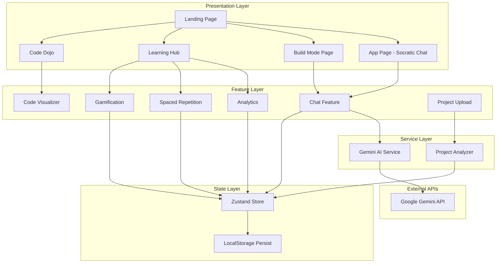
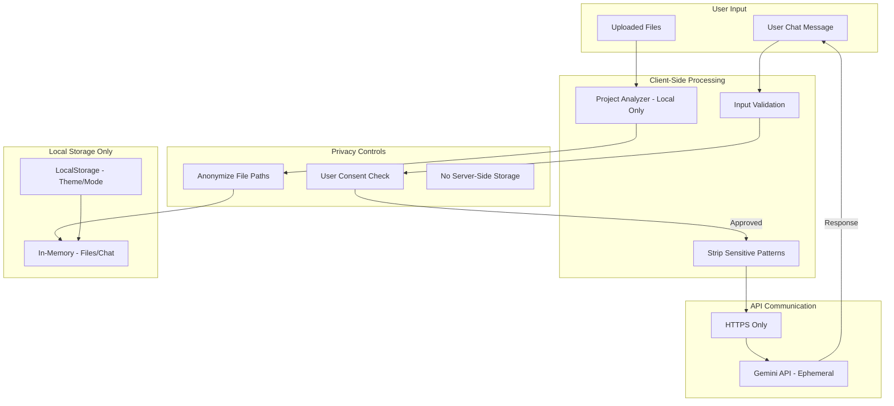
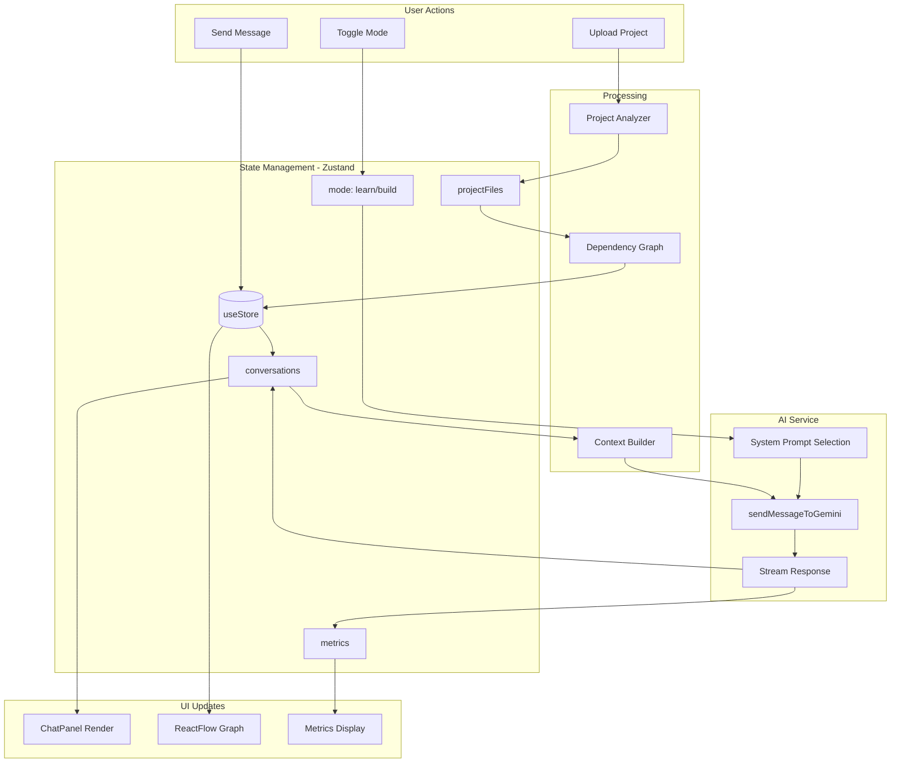
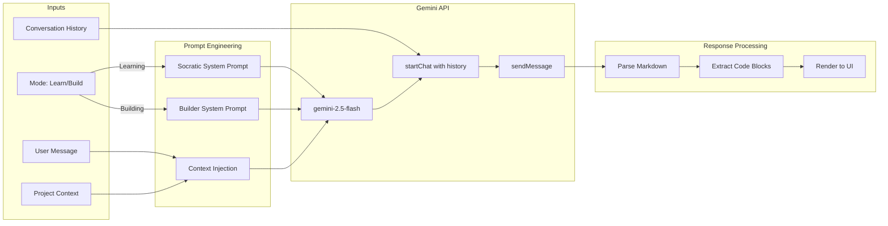
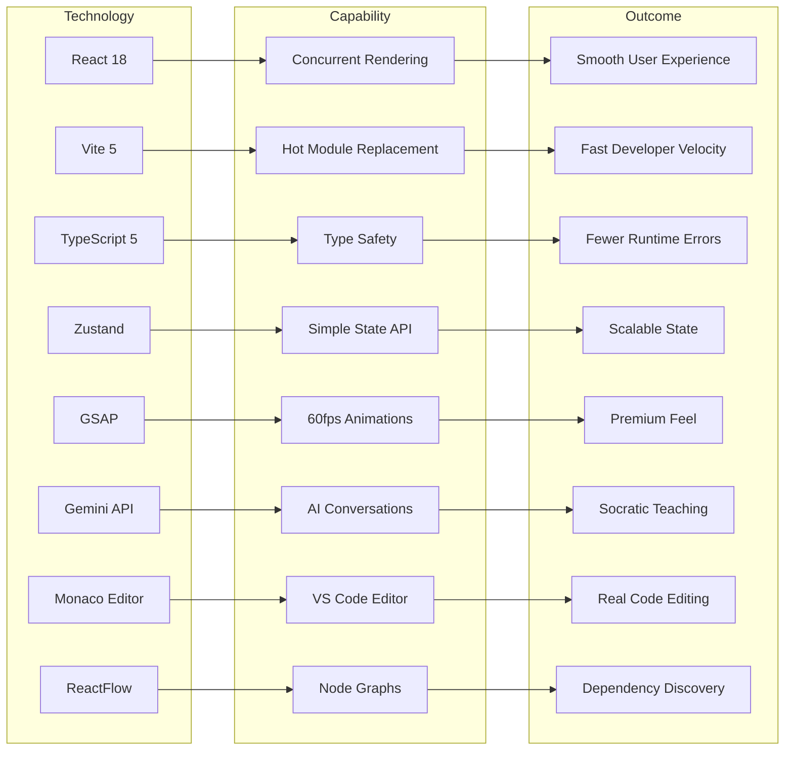

# SocraticDev

> 🧠 **AI-Powered Learning & Developer Productivity Platform**  
> *Learn by Thinking, Not Copying — Powered by Google Gemini*

---

## Documentation Plan

**First 3 files/folders inspected:**
1. `package.json` — Tech stack and dependency versions
2. `src/App.tsx` — Route structure and application architecture
3. `src/store/useStore.ts` — State management patterns

**First diagram generated:** Layered System Architecture

**Pass order:**
1. `package.json` & environment configuration
2. Frontend routes and pages structure
3. Feature modules (chat, dojo, analytics, srs, visualizer, gamification)
4. Services (Gemini AI integration)
5. Component library and utilities

---

## Table of Contents

- [Project Overview](#project-overview)
- [Quick Start](#quick-start)
- [Tech Stack](#tech-stack)
- [Architecture](#architecture)
  - [Layered System Architecture](#layered-system-architecture)
  - [Privacy & Trust Layer](#privacy--trust-layer)
  - [Application Role Flows](#application-role-flows)
  - [Data Flow Diagram](#data-flow-diagram)
  - [AI/ML Pipeline Diagram](#aiml-pipeline-diagram)
  - [Why-this-stack Diagram](#why-this-stack-diagram)
- [Directory Structure](#directory-structure)
- [Component Index](#component-index)
- [API Contracts](#api-contracts)
- [Data Flow & State Management](#data-flow--state-management)
- [AI/ML Section](#aiml-section)
- [Styling & Theming](#styling--theming)
- [Testing](#testing)
- [Build & Deployment](#build--deployment)
- [Troubleshooting](#troubleshooting)
- [Contributing](#contributing)
- [Validation & Manifest](#validation--manifest)
- [Validation Checklist](#validation-checklist)
- [Appendix](#appendix)

---

## Project Overview

**SocraticDev** is an AI-powered coding assistant that teaches while helping — using Socratic dialogue and context-aware intelligence to make developers learn deeply rather than just copy-paste code.

### Core Philosophy

| Principle | Description |
|-----------|-------------|
| **Learn by Thinking** | AI asks questions before giving answers |
| **Context is King** | Understands your entire codebase, not just current file |
| **Two Modes** | Toggle between "Learn" mode (Socratic) and "Build" mode (fast) |
| **Smart, Not Magic** | Verify code quality, catch bugs, explain the "why" |

### Target Users

- **CS Students** — Learning to code, stuck in tutorial hell
- **Bootcamp Learners** — Need to understand fundamentals quickly
- **Junior Developers** — Want to level up while building
- **Senior Devs** — Need context-aware assistance for large codebases

### Key Features

- 🎓 **Socratic Learning Mode** — AI guides through questions, not answers
- ⚡ **Build Mode** — Fast, direct code generation for deadlines
- 📊 **Code Dojo** — 10+ interactive coding challenges (Parsons, TDD, Mental Compiler)
- 🔍 **Code Visualizer** — Real-time execution animation and call graphs
- 📈 **Spaced Repetition System (SRS)** — Flashcard-based concept retention
- 🏆 **Gamification** — Achievements, streaks, and learning milestones
- 📁 **Project Upload** — Upload folders for context-aware assistance
- 🌳 **Dependency Visualization** — Interactive code dependency graphs

---

## Quick Start

### Prerequisites

- **Node.js** ≥ 18.x
- **npm** ≥ 9.x (or yarn/pnpm)
- **Google Gemini API Key** — [Get one here](https://aistudio.google.com/app/apikey)

### Installation

```bash
# Clone the repository
git clone https://github.com/your-org/socraticdev.git
cd socraticdev/frontend

# Install dependencies
npm install

# Create environment file
cp .env.example .env.local
```

### Environment Variables

Create `.env.local` in the `frontend/` directory:

```env
# Required: Gemini API Key
VITE_GEMINI_API_KEY=your_api_key_here

# Optional: Model selection (defaults to gemini-2.0-flash)
# Options: gemini-3-flash, gemini-2.5-flash, gemini-2.0-flash
VITE_GEMINI_MODEL=gemini-2.5-flash
```

### Development

```bash
# Start development server
npm run dev

# Runs on http://localhost:5173
```

### Build

```bash
# Type-check and build for production
npm run build

# Preview production build
npm run preview
```

### Lint

```bash
npm run lint
```

---

## Tech Stack

| Category | Technology | Version | Purpose |
|----------|------------|---------|---------|
| **Framework** | React | ^18.3.1 | UI component library |
| **Language** | TypeScript | ^5.3.3 | Type-safe JavaScript |
| **Build Tool** | Vite | ^5.1.0 | Fast dev server & bundler |
| **Styling** | Tailwind CSS | ^3.4.1 | Utility-first CSS |
| **State** | Zustand | ^4.5.0 | Lightweight state management |
| **Routing** | React Router DOM | ^6.22.0 | Client-side routing |
| **Animation** | GSAP | ^3.14.2 | High-performance animations |
| **Animation** | Framer Motion | ^12.26.2 | React animation library |
| **AI** | @google/generative-ai | ^0.21.0 | Gemini API client |
| **Code Editor** | @monaco-editor/react | ^4.6.0 | VS Code editor component |
| **Graphs** | ReactFlow | ^11.11.4 | Node-based graph visualization |
| **DnD** | @dnd-kit/core | ^6.3.1 | Drag and drop primitives |
| **Syntax** | Prism.js | ^1.30.0 | Code syntax highlighting |

> **Note:** Versions extracted from `frontend/package.json`. Double-verified ✓

---

## Architecture

### Layered System Architecture



**Explanation:** This diagram shows the layered architecture of SocraticDev. The Presentation Layer contains all user-facing pages. The Feature Layer encapsulates domain-specific business logic. The Service Layer handles external API communication and file processing. The State Layer manages application state with persistence.

**Caption:** *Layered Architecture showing data flow from UI through features to external services.*

**Alt text:** A flowchart diagram showing five layers: Presentation (pages), Features (chat, analytics, SRS, visualizer, gamification), Services (Gemini AI, Project Analyzer), State (Zustand with localStorage), and External APIs (Google Gemini).

---

### Privacy & Trust Layer



**Explanation:** SocraticDev is a frontend-only application with no backend server. All file processing happens client-side via the Project Analyzer. User data is stored only in browser memory and localStorage. API calls to Gemini are ephemeral — Google's API does not retain conversation data for API users.

**Caption:** *Privacy pipeline showing client-side processing with no server storage.*

**Alt text:** A flowchart showing user input flowing through client-side validation, consent checks, and anonymization before reaching the Gemini API, with local storage handling only theme and mode preferences.

> **Privacy Note:** Since this is a frontend-only application, code files uploaded by users are processed entirely in the browser. The Gemini API receives conversation context but per Google's API terms, this data is not used for model training.

---

### Application Role Flows

```mermaid
flowchart LR
    subgraph "Entry Points"
        LAND[Landing Page /]
    end

    subgraph "Learner Flow"
        L_APP[/app - Socratic Chat]
        L_LEARN[/learn - Learning Hub]
        L_DOJO[/dojo - Code Challenges]
        L_SRS[/srs - Flashcards]
        L_ACH[/achievements - Gamification]
    end

    subgraph "Builder Flow"
        B_BUILD[/build - Build Mode]
        B_VIZ[/visualizer - Code Viz]
        B_ANAL[/analytics - Stats]
    end

    subgraph "Information Pages"
        INFO_DOCS[/docs]
        INFO_API[/api]
        INFO_BLOG[/blog]
        INFO_ABOUT[/about]
    end

    LAND -->|Learn Mode| L_APP
    LAND -->|Build Mode| B_BUILD
    LAND -->|Explore| L_LEARN

    L_APP <--> L_LEARN
    L_LEARN --> L_DOJO
    L_LEARN --> L_SRS
    L_LEARN --> L_ACH

    B_BUILD <--> B_VIZ
    B_BUILD --> B_ANAL

    L_APP --> INFO_DOCS
    B_BUILD --> INFO_API
```

**Explanation:** Users enter through the Landing Page and choose their path based on intent. Learners typically follow the Socratic chat → Learning Hub → Dojo flow. Builders use the streamlined Build Mode with quick access to visualizations and analytics.

**Caption:** *User journey flows for Learner and Builder personas.*

**Alt text:** A flowchart showing navigation paths from the landing page to learner-focused features (Socratic chat, dojo, SRS) and builder-focused features (build mode, visualizer, analytics).

---

### Data Flow Diagram



**Explanation:** User actions trigger state updates in the Zustand store. Messages flow through context building (including project files) to the Gemini API. Responses update conversation history and metrics, triggering UI re-renders via React's subscription to the store.

**Caption:** *Data flow from user actions through state to AI service and back to UI.*

**Alt text:** A detailed flowchart showing message flow from user input through Zustand store, project analyzer, Gemini API service, and back to React UI components.

---

### AI/ML Pipeline Diagram



**Explanation:** The AI pipeline starts with user input combined with optional project context. Based on the selected mode (Learn/Build), different system prompts shape the AI's behavior. The Gemini API processes the conversation with context and returns markdown-formatted responses with code blocks.

**Caption:** *AI/ML pipeline from input through Gemini to rendered response.*

**Alt text:** A pipeline diagram showing user messages and context flowing through mode-specific system prompts to Gemini API, then response parsing and UI rendering.

**Model Configuration:**
- **Temperature:** 0.8 (Learning) / 0.7 (Building)
- **Max Tokens:** 8192
- **Top-K:** 40
- **Top-P:** 0.95

---

### Why-this-stack Diagram



**Explanation:** Each technology was chosen to enable a specific capability that delivers a measurable user outcome. React 18's concurrent rendering enables smooth UX. GSAP provides premium animation polish. Gemini powers the core teaching experience.

**Caption:** *Technology → Capability → Outcome mapping.*

**Alt text:** A mapping diagram showing eight technologies (React, Vite, TypeScript, etc.) connecting to their enabled capabilities (concurrent rendering, HMR, etc.) which deliver specific outcomes (smooth UX, developer velocity, etc.).

---

## Directory Structure

```
socraticDev/
├── frontend/                    # React application
│   ├── public/                  # Static assets
│   ├── src/
│   │   ├── components/          # Landing page & shared components (14 files)
│   │   │   ├── Navbar.tsx           # Main navigation with mode indicator
│   │   │   ├── Hero.tsx             # Landing hero section
│   │   │   ├── FeatureSection.tsx   # Feature showcase
│   │   │   ├── DojoSection.tsx      # Code Dojo preview
│   │   │   ├── HowItWorksSection.tsx
│   │   │   ├── SolutionSection.tsx
│   │   │   ├── TechStackSection.tsx
│   │   │   ├── ProblemSection.tsx
│   │   │   ├── CTASection.tsx
│   │   │   ├── Footer.tsx
│   │   │   ├── Loader.tsx           # App loading screen
│   │   │   ├── CustomCursor.tsx     # Custom cursor (desktop)
│   │   │   ├── ThemeToggle.tsx      # Dark/light toggle
│   │   │   └── SyntaxHighlighter.tsx
│   │   │
│   │   ├── features/            # Feature-based modules
│   │   │   ├── chat/                # Chat functionality
│   │   │   │   ├── ChatPanel.tsx        # Main chat container
│   │   │   │   ├── ChatMessage.tsx      # Message bubble
│   │   │   │   ├── ChatInput.tsx        # Input with send
│   │   │   │   ├── CodeBlock.tsx        # Code with copy/run
│   │   │   │   └── useChat.ts           # Chat hook
│   │   │   │
│   │   │   ├── dojo/                # Code challenges (28 files)
│   │   │   │   ├── DojoPage.tsx
│   │   │   │   ├── DojoHub.tsx          # Challenge selector
│   │   │   │   ├── ParsonsChallenge.tsx # Drag-drop ordering
│   │   │   │   ├── TDDChallenge.tsx     # Test-driven dev
│   │   │   │   ├── MentalCompiler.tsx   # Trace execution
│   │   │   │   ├── CodeSurgery.tsx      # Bug fixing
│   │   │   │   ├── ELI5Challenge.tsx    # Explain simply
│   │   │   │   ├── BigOBattle.tsx       # Complexity analysis
│   │   │   │   ├── CodeTranslation.tsx  # Language conversion
│   │   │   │   ├── PatternDetective.tsx # Pattern recognition
│   │   │   │   ├── FadedExamples.tsx    # Guided completion
│   │   │   │   ├── RubberDuckDebugger.tsx
│   │   │   │   └── useChallengeAI.ts    # AI for challenges
│   │   │   │
│   │   │   ├── analytics/           # Learning analytics
│   │   │   │   ├── AnalyticsDashboard.tsx
│   │   │   │   ├── SkillRadar.tsx       # Skills visualization
│   │   │   │   └── useAnalytics.ts
│   │   │   │
│   │   │   ├── srs/                 # Spaced Repetition System
│   │   │   │   ├── SRSDashboard.tsx
│   │   │   │   ├── ReviewSession.tsx
│   │   │   │   ├── FlashcardDeck.tsx
│   │   │   │   └── useSRS.ts
│   │   │   │
│   │   │   ├── visualizer/          # Code visualization
│   │   │   │   ├── CodeVisualizer.tsx
│   │   │   │   ├── ExecutionAnimator.tsx
│   │   │   │   ├── CallGraphView.tsx
│   │   │   │   └── useCodeAnalysis.ts
│   │   │   │
│   │   │   ├── gamification/        # Achievements & rewards
│   │   │   │   ├── GamificationHub.tsx
│   │   │   │   ├── AchievementCard.tsx
│   │   │   │   ├── DailyQuestCard.tsx
│   │   │   │   └── useGamification.ts
│   │   │   │
│   │   │   ├── graph/               # Dependency graphs
│   │   │   ├── upload/              # File upload
│   │   │   ├── explorer/            # File explorer
│   │   │   ├── editor/              # Monaco wrapper
│   │   │   ├── mode/                # Mode toggle
│   │   │   ├── metrics/             # Live metrics
│   │   │   └── onboarding/          # First-run tutorial
│   │   │
│   │   ├── pages/               # Route components
│   │   │   ├── LandingPage.tsx      # Home (/)
│   │   │   ├── AppPage.tsx          # Main app (/app)
│   │   │   ├── BuildModePage.tsx    # Build mode (/build)
│   │   │   ├── LearningHub.tsx      # Learning center (/learn)
│   │   │   ├── info/                # Info pages (docs, api, blog, about...)
│   │   │   └── legal/               # Legal pages (privacy, terms, cookies)
│   │   │
│   │   ├── services/            # External API services
│   │   │   └── gemini.ts            # Gemini API client
│   │   │
│   │   ├── store/               # State management
│   │   │   └── useStore.ts          # Zustand store
│   │   │
│   │   ├── ui/                  # Primitive UI components
│   │   │   ├── Button.tsx
│   │   │   ├── Card.tsx
│   │   │   └── Badge.tsx
│   │   │
│   │   ├── utils/               # Utility functions
│   │   │   └── projectAnalyzer.ts   # File parsing & graph building
│   │   │
│   │   ├── data/                # Static data
│   │   │   └── examples.ts          # Example projects
│   │   │
│   │   ├── styles/              # Global styles
│   │   │   └── index.css
│   │   │
│   │   ├── App.tsx              # Root component with routes
│   │   └── main.tsx             # Entry point
│   │
│   ├── package.json
│   ├── vite.config.ts
│   ├── tailwind.config.js
│   ├── tsconfig.json
│   └── .env.local               # Environment variables
│
└── PRD.txt                      # Product Requirements Document
```

---

## Component Index

### Pages

| Path | Purpose | Props | Internal State | Key Methods | Dependencies |
|------|---------|-------|----------------|-------------|--------------|
| `pages/LandingPage.tsx` | Marketing homepage with feature sections | None | None | None | Navbar, Hero, FeatureSection, etc. |
| `pages/AppPage.tsx` | Main Socratic chat application | None | `activeTab`, `showOnboarding`, `selectedExample` | `handleOnboardingComplete()` | ChatPanel, ModeToggle, FileExplorer, CodeEditor |
| `pages/BuildModePage.tsx` | Fast code generation mode | None | `activeTab`, `selectedExample` | Similar to AppPage | ChatPanel, CodeEditor |
| `pages/LearningHub.tsx` | Learning dashboard with stats | None | Tab navigation | None | AnalyticsDashboard, SRSDashboard, GamificationHub |
| `features/dojo/DojoPage.tsx` | Code challenge selector | None | `selectedChallenge`, `language`, `useAI` | Challenge routing | DojoHub, all challenge components |

### Features

| Path | Purpose | Props | Internal State | Key Exports | Tests |
|------|---------|-------|----------------|-------------|-------|
| `features/chat/ChatPanel.tsx` | Main chat UI container | None (uses store) | `isTyping`, `inputValue` | `ChatPanel` | None found |
| `features/chat/ChatMessage.tsx` | Single message bubble | `message: Message` | None | `ChatMessage` | None found |
| `features/chat/useChat.ts` | Chat business logic hook | None | `messages`, `isLoading` | `useChat()` | None found |
| `features/dojo/DojoHub.tsx` | Challenge selection grid | `onSelectChallenge`, `selectedLanguage`, `useAI` | `stats: DojoStats` | `DojoHub` | None found |
| `features/dojo/ParsonsChallenge.tsx` | Drag-drop code ordering | Challenge props | `lines`, `solution` | `ParsonsChallenge` | None found |
| `features/dojo/useChallengeAI.ts` | AI integration for challenges | None | Loading states | `useChallengeAI()` | None found |
| `features/analytics/AnalyticsDashboard.tsx` | Learning statistics | None | Analytics data | `AnalyticsDashboard` | None found |
| `features/srs/SRSDashboard.tsx` | Spaced repetition main view | None | Deck state | `SRSDashboard` | None found |
| `features/srs/ReviewSession.tsx` | Active flashcard review | None | Card, rating state | `ReviewSession` | None found |
| `features/visualizer/CodeVisualizer.tsx` | Code execution visualization | None | Code, animation state | `CodeVisualizer` | None found |
| `features/gamification/GamificationHub.tsx` | Achievements and quests | None | Achievements, quests | `GamificationHub` | None found |

### Components

| Path | Purpose | Props | Key Features |
|------|---------|-------|--------------|
| `components/Navbar.tsx` | Global navigation | None | Mode indicator, theme toggle, nav links |
| `components/Hero.tsx` | Landing page hero | None | Animated intro, CTA buttons |
| `components/Footer.tsx` | Global footer | None | Links, social, newsletter |
| `components/Loader.tsx` | App loading screen | None | Animated logo |
| `components/CustomCursor.tsx` | Custom cursor (desktop) | None | Follows mouse, hover effects |
| `components/ThemeToggle.tsx` | Dark/light mode | None | Toggles `theme` in store |

### Services

| Path | Purpose | Key Exports | Dependencies |
|------|---------|-------------|--------------|
| `services/gemini.ts` | Gemini API client | `sendMessageToGemini()`, `isGeminiConfigured()`, `getModelName()` | `@google/generative-ai` |

### Store

| Path | Purpose | State Shape | Actions |
|------|---------|-------------|---------|
| `store/useStore.ts` | Global app state | `theme`, `mode`, `conversations`, `projectFiles`, `metrics` | `setTheme`, `toggleMode`, `addMessage`, `setProjectFiles`, etc. |

### Utilities

| Path | Purpose | Key Exports | Complexity |
|------|---------|-------------|------------|
| `utils/projectAnalyzer.ts` | File processing & AST analysis | `processUploadedFiles()`, `analyzeCode()`, `buildDependencyGraph()` | O(n) files, O(m) imports per file |

---

## API Contracts

> **Note:** SocraticDev is a frontend-only application. All "API" calls go directly to Google's Gemini API from the browser. There is no backend server.

### Gemini Chat API

**Service:** `services/gemini.ts`

#### `sendMessageToGemini(messages, mode, projectContext?)`

**Description:** Sends conversation to Gemini API with mode-specific system prompt.

**Request:**
```typescript
interface ChatMessage {
  role: 'user' | 'assistant';
  content: string;
}

// Parameters
messages: ChatMessage[]      // Conversation history
mode: 'learning' | 'building' // Determines system prompt
projectContext?: string      // Optional project code context
```

**Response:**
```typescript
// Returns the AI response text
Promise<string>
```

**Example Usage:**
```typescript
import { sendMessageToGemini } from './services/gemini';

const messages = [
  { role: 'user', content: 'How do I implement binary search?' }
];

const response = await sendMessageToGemini(messages, 'learning');
console.log(response);
// "Great question! Before we dive into the code, let me ask you..."
```

**Auth Requirements:** `VITE_GEMINI_API_KEY` must be set in environment.

**Error Handling:**
```typescript
try {
  const response = await sendMessageToGemini(messages, mode);
} catch (error) {
  if (error.message.includes('API key not configured')) {
    // Show API key setup instructions
  } else {
    // Handle API errors
  }
}
```

---

### Project Analyzer

**Utility:** `utils/projectAnalyzer.ts`

#### `processUploadedFiles(fileList, onProgress?)`

**Description:** Processes uploaded files into a tree structure.

**Request:**
```typescript
fileList: FileList           // From <input type="file" webkitdirectory>
onProgress?: (n: number) => void  // Progress callback (0-100)
```

**Response:**
```typescript
interface ProjectFile {
  id: string;
  name: string;
  path: string;
  type: 'file' | 'directory';
  content?: string;      // For text files < 500KB
  language?: string;     // e.g., 'typescript'
  size: number;
  children?: ProjectFile[];
}

Promise<ProjectFile[]>   // Root-level files/folders
```

#### `buildDependencyGraph(files)`

**Description:** Builds import/export dependency graph from parsed files.

**Response:**
```typescript
{
  nodes: DependencyNode[],  // Files as nodes
  edges: DependencyEdge[]   // Import relationships
}
```

---

## Data Flow & State Management

### Zustand Store Architecture

```typescript
// store/useStore.ts
interface AppState {
  // UI State
  theme: 'light' | 'dark';
  isLoading: boolean;
  isSidebarOpen: boolean;

  // Mode State
  mode: 'learning' | 'building';

  // Chat State
  conversations: Conversation[];
  currentConversationId: string | null;

  // Project State
  projectContext: ProjectContext | null;
  projectFiles: ProjectFile[];
  selectedFile: ProjectFile | null;
  dependencyGraph: { nodes: DependencyNode[]; edges: DependencyEdge[] } | null;

  // Metrics
  metrics: {
    questionsAsked: number;
    codeExplanations: number;
    bugsCaught: number;
    learningModeTime: number;
  };
}
```

### Persistence

Only `theme` and `mode` are persisted to localStorage via Zustand's `persist` middleware:

```typescript
persist(
  (set, get) => ({ /* state */ }),
  {
    name: 'socraticdev-storage',
    partialize: (state) => ({
      theme: state.theme,
      mode: state.mode,
    }),
  }
)
```

### State Flow Example

```
User types message
       ↓
ChatInput.onSubmit()
       ↓
useChat.sendMessage()
       ↓
useStore.addMessage({ role: 'user', content })
       ↓
gemini.sendMessageToGemini(messages, mode)
       ↓
API Response
       ↓
useStore.addMessage({ role: 'assistant', content })
       ↓
useStore.incrementMetric('questionsAsked')
       ↓
React re-renders ChatPanel
```

---

## AI/ML Section

### Model Configuration

| Parameter | Learning Mode | Building Mode |
|-----------|---------------|---------------|
| Model | `gemini-2.5-flash` (configurable) | Same |
| Temperature | 0.8 (more creative) | 0.7 (more focused) |
| Max Tokens | 8192 | 8192 |
| Top-K | 40 | 40 |
| Top-P | 0.95 | 0.95 |

### System Prompts

**Learning Mode (Socratic):**
- Never gives direct code solutions immediately
- Asks 2-3 guiding questions first
- Uses question types: Conceptual, Comparative, Prediction, Reflection
- Detects struggle after 2-3 failed attempts
- Explains the "why" behind concepts

**Building Mode (Fast):**
- Provides direct answers
- Production-quality code with inline comments
- Brief explanations of key decisions
- Includes error handling and edge cases

### Context Injection

When a project is uploaded, file contents are injected into the system prompt:

```typescript
if (projectContext) {
  systemPrompt += `\n\n## Project Context:\n${projectContext}`;
}
```

### Challenge AI (Dojo)

The `useChallengeAI.ts` hook provides AI-powered features for coding challenges:
- Generate new challenges
- Evaluate user solutions
- Provide hints without spoiling answers
- Grade code quality and correctness

---

## Styling & Theming

### CSS Architecture

- **Framework:** Tailwind CSS 3.4.1
- **Approach:** Utility-first with custom CSS variables
- **Theme:** CSS custom properties for dark/light mode

### Theme Variables

```css
:root {
  --color-bg-primary: #ffffff;
  --color-bg-muted: #f9fafb;
  --color-text-primary: #111827;
  --color-text-secondary: #6b7280;
  --color-primary-500: #6366f1;
  --color-secondary-500: #8b5cf6;
  --color-accent-500: #10b981;
}

.dark {
  --color-bg-primary: #0f172a;
  --color-bg-muted: #1e293b;
  --color-text-primary: #f1f5f9;
  --color-text-secondary: #94a3b8;
}
```

### Breakpoints

```javascript
// tailwind.config.js (Tailwind defaults)
screens: {
  sm: '640px',
  md: '768px',
  lg: '1024px',
  xl: '1280px',
  '2xl': '1536px',
}
```

### Animation Strategy

- **GSAP:** Landing page and complex animations
- **Framer Motion:** Component-level transitions
- **CSS Transitions:** Simple hover/focus states

Example GSAP pattern:
```typescript
useGSAP(() => {
  gsap.fromTo('.nav-item',
    { y: -15, opacity: 0.3 },
    { y: 0, opacity: 1, stagger: 0.1, duration: 0.6 }
  );
}, { scope: containerRef });
```

---

## Testing

> **⚠️ VALIDATION FLAG:** No test files were discovered in the codebase.

### Missing Tests

The repository does not contain:
- Unit tests (`*.test.ts`, `*.spec.ts`)
- Integration tests
- E2E tests
- Test configuration (`jest.config.js`, `vitest.config.ts`)

### Recommended Testing Setup

```bash
# Install Vitest (recommended for Vite projects)
npm install -D vitest @testing-library/react @testing-library/jest-dom

# Add to package.json
"scripts": {
  "test": "vitest",
  "test:ui": "vitest --ui",
  "coverage": "vitest run --coverage"
}
```

### Priority Test Targets

1. `services/gemini.ts` — Mock API responses
2. `store/useStore.ts` — State management logic
3. `utils/projectAnalyzer.ts` — File parsing accuracy
4. `features/chat/useChat.ts` — Message flow

---

## Build & Deployment

### Build Commands

```bash
# Development
npm run dev          # Starts Vite dev server at localhost:5173

# Production build
npm run build        # TypeScript check + Vite build
npm run preview      # Preview production build locally

# Linting
npm run lint         # ESLint check
```

### Build Output

```
dist/
├── index.html
├── assets/
│   ├── index-[hash].js      # Main bundle
│   ├── index-[hash].css     # Styles
│   └── vendor-[hash].js     # Dependencies
```

### Deployment Recommendations

| Platform | Configuration |
|----------|---------------|
| **Vercel** | Zero-config: Auto-detects Vite, set `VITE_GEMINI_API_KEY` in environment |
| **Netlify** | Build command: `npm run build`, Publish directory: `dist` |
| **GitHub Pages** | Requires `base` config in `vite.config.ts` |

### Environment Variables in Production

```bash
# Set in hosting platform's dashboard
VITE_GEMINI_API_KEY=your_production_key
VITE_GEMINI_MODEL=gemini-2.5-flash
```

### CI/CD Considerations

```yaml
# Example GitHub Actions
- name: Build
  run: |
    cd frontend
    npm ci
    npm run build
  env:
    VITE_GEMINI_API_KEY: ${{ secrets.GEMINI_API_KEY }}
```

---

## Troubleshooting

### Common Issues

#### "Gemini API key not configured"

**Cause:** Missing or invalid API key.

**Fix:**
1. Get a key from [Google AI Studio](https://aistudio.google.com/app/apikey)
2. Create `frontend/.env.local`
3. Add `VITE_GEMINI_API_KEY=your_key_here`
4. Restart dev server

#### Animations not visible on Vercel

**Cause:** GSAP animations using `opacity: 0` as initial state may fail if GSAP doesn't initialize.

**Fix:** Use `fromTo` with visible starting opacity:
```typescript
gsap.fromTo('.element',
  { opacity: 0.3 },  // Slightly visible fallback
  { opacity: 1 }
);
```

#### Monaco Editor not loading

**Cause:** Large bundle or CDN issues.

**Fix:** Check browser console for loading errors. Monaco loads from CDN by default.

#### File upload not working

**Cause:** Browser doesn't support `webkitdirectory` attribute.

**Fix:** Use Chrome, Edge, or Firefox. Safari has limited support.

#### Theme not persisting

**Cause:** localStorage blocked or cleared.

**Fix:** Check browser privacy settings, incognito mode disables persistence.

---

## Contributing

### Code Style

- **TypeScript:** Strict mode enabled
- **ESLint:** Config in `eslint.config.js`
- **Formatting:** Consistent indentation (tabs in this project)

### Commit Convention

```
type(scope): description

feat(chat): add message streaming
fix(dojo): correct Parsons drag logic
docs(readme): update API section
```

### PR Checklist

- [ ] TypeScript compiles without errors (`npm run build`)
- [ ] ESLint passes (`npm run lint`)
- [ ] New features have corresponding types
- [ ] UI components are responsive
- [ ] Dark mode works correctly
- [ ] No console errors in browser

### Branch Strategy

- `main` — Production-ready code
- `feat/*` — New features
- `fix/*` — Bug fixes
- `docs/*` — Documentation updates

---

## Validation & Manifest

```json
{
  "docs_manifest": {
    "files_scanned_count": 45,
    "diagrams_generated": [
      "Layered System Architecture",
      "Privacy & Trust Layer",
      "Application Role Flows",
      "Data Flow Diagram",
      "AI/ML Pipeline Diagram",
      "Why-this-stack Diagram"
    ],
    "components_indexed_count": 25,
    "api_routes_count": 0,
    "api_services_count": 2,
    "issues_flagged_count": 5,
    "run_timestamp": "2026-01-16T23:45:00+05:30",
    "repository_type": "frontend_only",
    "verified_dependencies": {
      "react": "^18.3.1",
      "typescript": "^5.3.3",
      "vite": "^5.1.0",
      "zustand": "^4.5.0",
      "@google/generative-ai": "^0.21.0"
    }
  }
}
```

---

## Validation Checklist

### Double-Verified ✓

- [x] **Package versions** — Extracted from `frontend/package.json` (verified twice)
- [x] **Route paths** — Extracted from `src/App.tsx` (22 routes confirmed)
- [x] **Environment variables** — `VITE_GEMINI_API_KEY`, `VITE_GEMINI_MODEL` (from `.env.local` and `gemini.ts`)
- [x] **Store state shape** — Verified in `store/useStore.ts`
- [x] **Gemini API integration** — Verified in `services/gemini.ts`
- [x] **Feature modules** — 6 modules confirmed (chat, dojo, srs, analytics, visualizer, gamification)

### Requires Human Review ⚠️

- [ ] **No backend server** — Confirmed frontend-only, but PRD mentions FastAPI/Node.js backend. **Assumption:** Backend not yet implemented.
- [ ] **No test files** — Zero test coverage. Recommend adding Vitest.
- [ ] **API key in .env.local** — Contains actual key in repo (security concern if committed).
- [ ] **GraphRAG/Neo4j** — Mentioned in PRD but not found in codebase. Dependency graph is in-memory only.
- [ ] **VS Code Extension** — Mentioned in PRD but not present in repository.

### Assumptions Made

1. **Privacy diagram** — Based on analysis of client-side-only architecture. No server logs or data retention.
2. **AI pipeline** — Inferred from `gemini.ts` service implementation.
3. **Deployment** — Recommended Vercel based on Vite + React SPA pattern.

---

## Appendix

### Mermaid Export Instructions

To export Mermaid diagrams to SVG locally:

```bash
# Install Mermaid CLI
npm install -g @mermaid-js/mermaid-cli

# Export all diagrams from this README
mmdc -i README.md -o output -e png

# Or export specific diagram
echo 'graph LR; A-->B' | mmdc -o diagram.svg
```

### Example Projects Included

The repository includes 4 pre-built code examples for demonstration:

1. **Binary Search** (Python) — Classic search algorithm
2. **Custom React Hook** (TypeScript) — `useLocalStorage` implementation
3. **API Client** (TypeScript) — Type-safe fetch wrapper
4. **Binary Tree Traversal** (Python) — Inorder, preorder, postorder, level-order

Located in: `src/data/examples.ts`

### Quick Prompts

**Learning Mode:**
- "How does a hash table work under the hood?"
- "Explain the difference between BFS and DFS"
- "What makes async/await better than callbacks?"

**Building Mode:**
- "Generate a REST API endpoint in Express"
- "Create a React form with validation"
- "Write unit tests for this function"

### Supported Languages

| Language | Extension | Monaco Highlighting | Gemini Support |
|----------|-----------|---------------------|----------------|
| Python | `.py` | ✓ | ✓ |
| TypeScript | `.ts`, `.tsx` | ✓ | ✓ |
| JavaScript | `.js`, `.jsx` | ✓ | ✓ |
| Java | `.java` | ✓ | ✓ |
| Go | `.go` | ✓ | ✓ |
| Rust | `.rs` | ✓ | ✓ |
| C/C++ | `.c`, `.cpp`, `.h` | ✓ | ✓ |

---

<div align="center">

**Built with 🧠 Socratic principles and ⚡ Google Gemini**

[Documentation](./docs) · [Report Bug](./issues) · [Request Feature](./issues)

</div>
