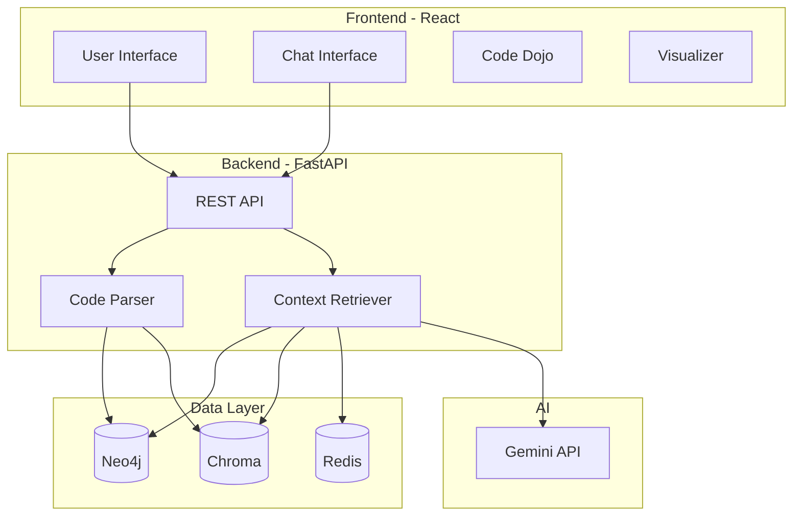

# SocraticDev

> AI-Powered Learning & Developer Productivity Platform

A full-stack platform combining Socratic AI tutoring with Graph-based code intelligence (GraphRAG) for intelligent code understanding and learning.

---

## Table of Contents

- [Overview](#overview)
- [Features](#features)
- [Quick Start](#quick-start)
- [Tech Stack](#tech-stack)
- [Architecture](#architecture)
- [API Documentation](#api-documentation)
- [Development](#development)
- [Deployment](#deployment)
- [Contributing](#contributing)

---

## Overview

SocraticDev is an educational coding platform that teaches developers through the Socratic method while providing intelligent code analysis powered by GraphRAG (Graph Retrieval-Augmented Generation).

### Core Concepts

- **Learn by Thinking** — AI asks guiding questions before providing solutions
- **Context-Aware** — GraphRAG understands entire codebase structure and relationships
- **Two Modes** — Toggle between "Learn" mode (Socratic) and "Build" mode (direct answers)

### Target Users

- CS Students learning to code
- Bootcamp learners seeking deeper understanding
- Junior developers leveling up their skills
- Senior developers needing context-aware code assistance

---

## Features

### Frontend (React + Vite)

- 🎓 **Socratic Learning Mode** — AI guides through questions
- ⚡ **Build Mode** — Fast, direct code generation
- 📊 **Code Dojo** — 10+ interactive coding challenges
- 🔍 **Code Visualizer** — Real-time execution animation
- 📈 **Spaced Repetition System** — Flashcard-based retention
- 🏆 **Gamification** — Achievements, streaks, leagues

### Backend (FastAPI + GraphRAG)

- 🗄️ **Neo4j Graph Database** — Code structure and relationships
- 🔍 **Chroma Vector Database** — Semantic code search
- 🤖 **Gemini AI Integration** — Embeddings and chat
- ⚡ **Celery + Redis** — Async task processing and caching
- 🌳 **Tree-sitter Parsing** — Multi-language AST analysis
- 📊 **Context Retrieval** — Intelligent code context for AI prompts

---

## Quick Start

### Frontend

```bash
cd frontend
npm install
cp .env.example .env.local
# Add your VITE_GEMINI_API_KEY to .env.local
npm run dev
```

Visit http://localhost:5173

### Backend

```bash
cd backend
pip install -r requirements.txt
cp .env.example .env
# Add your GEMINI_API_KEY and configure database connections
docker-compose up -d  # Start Neo4j, Chroma, Redis, RabbitMQ
python -m src.main
```

API available at http://localhost:8000

---

## Tech Stack

### Frontend


| Technology | Version | Purpose |
|------------|---------|---------|
| React | 18.3.1 | UI framework |
| TypeScript | 5.3.3 | Type safety |
| Vite | 5.1.0 | Build tool |
| Tailwind CSS | 3.4.1 | Styling |
| Zustand | 4.5.0 | State management |
| GSAP | 3.14.2 | Animations |
| Monaco Editor | 4.6.0 | Code editor |
| ReactFlow | 11.11.4 | Graph visualization |

### Backend

| Technology | Version | Purpose |
|------------|---------|---------|
| FastAPI | 0.104.1 | Web framework |
| Python | 3.11+ | Language |
| Neo4j | 5.14.1 | Graph database |
| Chroma | 0.4.15 | Vector database |
| Redis | 5.0.1 | Caching |
| Celery | 5.3.4 | Task queue |
| Tree-sitter | 0.21.3 | Code parsing |
| Gemini AI | 0.3.1 | Embeddings |

---

## Architecture

### System Overview



### GraphRAG Pipeline

The backend implements GraphRAG (Graph Retrieval-Augmented Generation) for intelligent code context retrieval:

1. **Code Parsing** — Tree-sitter extracts entities (functions, classes) and relationships
2. **Graph Storage** — Neo4j stores code structure and dependencies
3. **Vector Embeddings** — Gemini generates 768-dim embeddings
4. **Hybrid Search** — Combines semantic search (Chroma) + graph traversal (Neo4j)
5. **Context Ranking** — Ranks results by relevance and graph centrality
6. **Token Fitting** — Selects entities within token budget (default: 8000)

---

## API Documentation

### Base URL

```
http://localhost:8000/api
```

### Upload Project

```bash
POST /api/upload/project
Content-Type: multipart/form-data

{
  "project_name": "MyProject",
  "files": [File, File, ...],
  "user_id": "user123"
}
```

**Response:**
```json
{
  "session_id": "uuid",
  "project_id": "proj_abc123",
  "status": "processing"
}
```

### Semantic Search

```bash
POST /api/query/search
Content-Type: application/json

{
  "query": "authentication middleware",
  "project_ids": ["proj_abc123"],
  "top_k": 20
}
```

### Retrieve Context (GraphRAG)

```bash
POST /api/query/context
Content-Type: application/json

{
  "query": "How does authentication work?",
  "project_id": "proj_abc123",
  "token_budget": 8000
}
```

**Response:**
```json
{
  "context": "# Code Context\n\n## auth/middleware.py\n...",
  "entities_included": 12,
  "token_count": 7856,
  "retrieval_method": "hybrid"
}
```

### Graph Visualization

```bash
POST /api/visualization/graph
Content-Type: application/json

{
  "project_id": "proj_abc123",
  "entity_types": ["function", "class"],
  "max_nodes": 500
}
```

---

## Development

### Frontend Development

```bash
cd frontend
npm run dev      # Start dev server
npm run build    # Production build
npm run lint     # Lint code
```

### Backend Development

```bash
cd backend
python -m pytest              # Run tests
python -m pytest --cov=src    # With coverage
python -m uvicorn src.main:app --reload  # Dev server
```

### Code Parsing

The backend supports multi-language parsing:

- Python (`.py`)
- JavaScript/TypeScript (`.js`, `.ts`, `.tsx`, `.jsx`)
- Java (`.java`)

Extracted entities:
- Functions (name, signature, docstring)
- Classes (name, methods, inheritance)
- Imports and dependencies

---

## Deployment

### Frontend (Vercel/Netlify)

```bash
cd frontend
npm run build
# Deploy dist/ folder
```

**Environment Variables:**
- `VITE_GEMINI_API_KEY` — Gemini API key

### Backend (Docker)

```bash
cd backend
docker build -t socraticdev-backend .
docker run -p 8000:8000 \
  -e GEMINI_API_KEY=xxx \
  -e NEO4J_URI=bolt://neo4j:7687 \
  socraticdev-backend
```

**Required Services:**
- Neo4j (Graph database)
- Chroma (Vector database)
- Redis (Cache)
- RabbitMQ (Message broker for Celery)

---

## Contributing

### Code Style

- **Frontend:** TypeScript strict mode, ESLint, Prettier
- **Backend:** Python 3.11+, Black formatter, Flake8, MyPy

### Commit Convention

```
type(scope): description

Examples:
feat(chat): add streaming responses
fix(parser): handle nested functions
docs: update API documentation
```

### Pull Request Checklist

- [ ] Code compiles without errors
- [ ] Tests pass
- [ ] Linter passes
- [ ] Documentation updated
- [ ] No hardcoded secrets

---

## License

MIT License - see LICENSE file for details

---

## Contact

For questions or support, please open an issue on GitHub.
