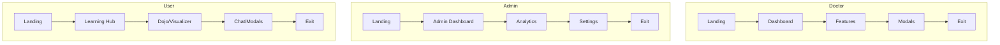
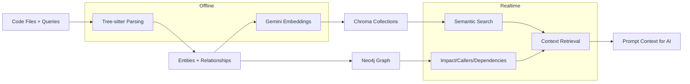
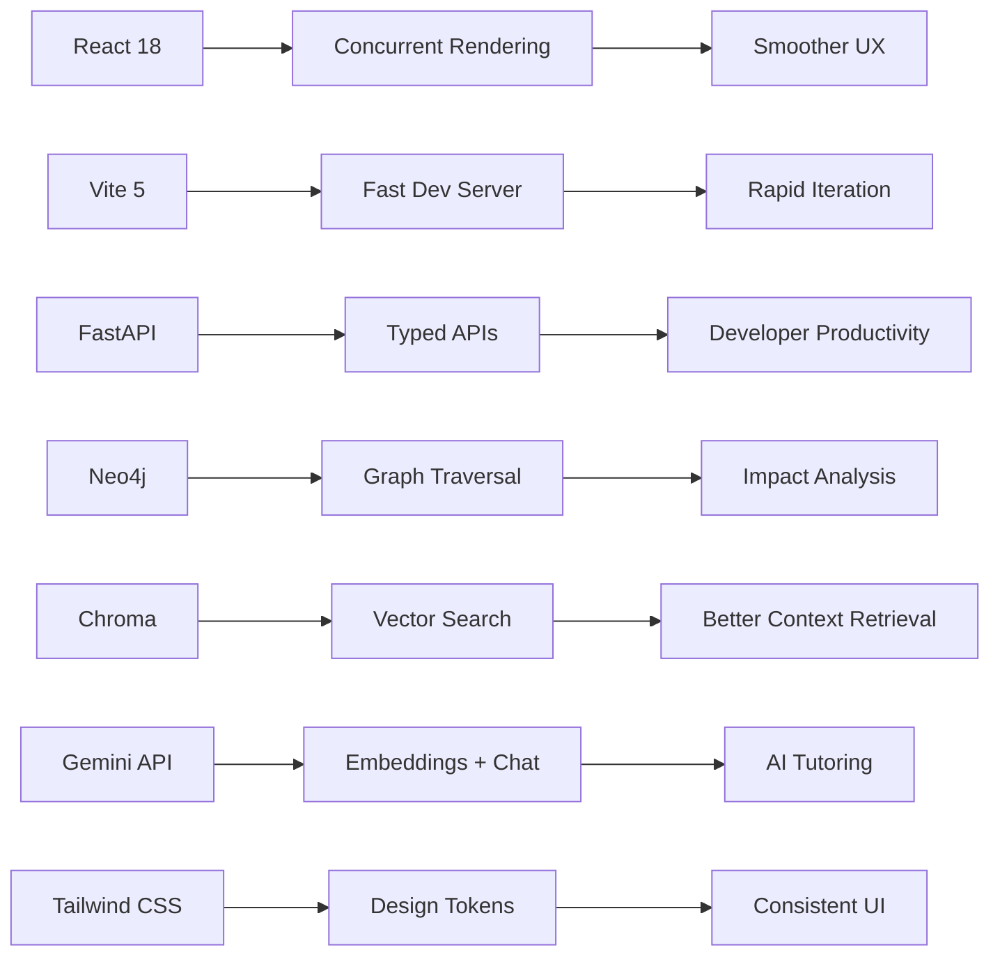
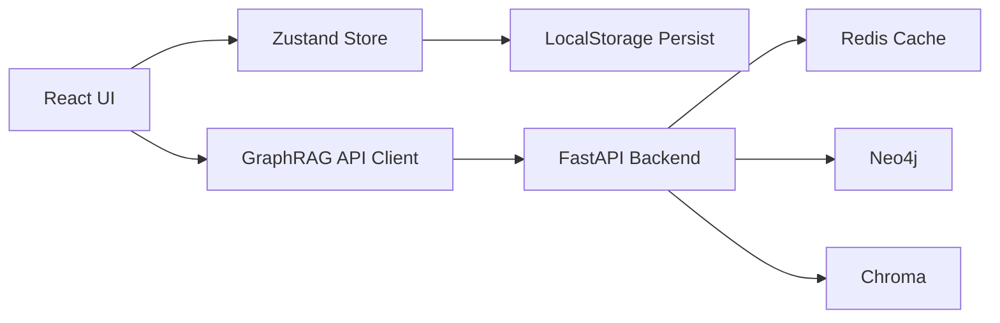

# SocraticDev + GraphRAG System Documentation

## Documentation Plan
- **First 3 files/folders to inspect**: `backend/requirements.txt`, `frontend/package.json`, `backend/src/main.py`
- **First diagram to generate**: Layered System Architecture
- **Estimated pass order**: 1) package/deps & env, 2) backend routes & services, 3) frontend pages/components, 4) ML/analytics code

## Table of Contents
- [Project Overview](#project-overview)
- [Quick Start](#quick-start)
- [Tech Stack](#tech-stack)
- [Architecture](#architecture)
  - [Layered System Architecture](#layered-system-architecture)
  - [Privacy & Trust Layer](#privacy--trust-layer)
  - [Application Role Flows](#application-role-flows)
  - [Data Flow Diagram](#data-flow-diagram)
  - [AI / ML Pipeline Diagram](#ai--ml-pipeline-diagram)
  - [Why-this-stack Diagram](#why-this-stack-diagram)
- [Directory Structure](#directory-structure)
- [Component Index](#component-index)
- [API Contracts](#api-contracts)
- [Data Flow & State Management](#data-flow--state-management)
- [AI/ML Section](#aiml-section)
- [Styling & Theming](#styling--theming)
- [Testing](#testing)
- [Build & Deployment](#build--deployment)
- [Troubleshooting](#troubleshooting)
- [Contributing](#contributing)
- [Validation & Manifest](#validation--manifest)
- [VALIDATION CHECKLIST](#validation-checklist)
- [Appendix](#appendix)

## Project Overview
SocraticDev is an AI-powered coding assistant focused on teaching through the Socratic method, backed by a Graph Retrieval-Augmented Generation (GraphRAG) backend for code structure, semantic search, and visualization. The backend parses project code into graph + vector stores, while the frontend provides learning workflows, a code visualizer, and Gemini-powered tutoring experiences.

**Goals**
- Provide code understanding via questions (learning mode) and fast delivery (build mode).
- Extract code structure and semantics for dependency graphs, impact analysis, and context retrieval.
- Offer interactive features: Dojo challenges, analytics dashboards, SRS flashcards, and visualization.

**Target Users**
- Developers learning codebases or leveling up fundamentals.
- Teams analyzing dependencies and impact across projects.
- Educators seeking interactive, AI-assisted exercises.

## Quick Start

### Backend (FastAPI + Celery)
```bash
cd backend
cp .env.example .env
pip install -r requirements.txt
# Start infra services
Docker Desktop must be running

docker-compose up -d
# Start API
uvicorn src.main:app --reload --host 0.0.0.0 --port 8000
```

### Frontend (Vite + React)
```bash
cd frontend
cp .env.example .env.local
npm install
npm run dev
```

### Required Environment Variables
**Backend** (`backend/.env`)
- `GEMINI_API_KEY`
- `NEO4J_URI`, `NEO4J_USER`, `NEO4J_PASSWORD`, `NEO4J_DATABASE`
- `CHROMA_HOST`, `CHROMA_PORT`
- `REDIS_HOST`, `REDIS_PORT`
- `RABBITMQ_HOST`, `RABBITMQ_PORT`
- `POSTGRES_HOST`, `POSTGRES_PORT`
- `JWT_SECRET_KEY`

**Frontend** (`frontend/.env.local`)
- `VITE_GEMINI_API_KEY`
- `VITE_GEMINI_MODEL`
- `VITE_API_BASE_URL` (optional; defaults to `http://localhost:8000`)

## Tech Stack

### Backend
- FastAPI (from `requirements.txt`: 0.104.1)
- Uvicorn (0.24.0)
- Pydantic + pydantic-settings
- Neo4j (5.14.1)
- ChromaDB (0.4.15)
- Redis (5.0.1)
- Celery + RabbitMQ
- Tree-sitter (Python/JS/TS/Java)
- Google Generative AI client (0.3.1)

> **Verification note**: Backend dependency versions are pinned in `backend/requirements.txt` but not double-sourced elsewhere in the repository; they are flagged for human verification in the VALIDATION checklist.

### Frontend
- React 18.3.1 (resolved in `package-lock.json`, declared in `package.json`)
- Vite 5.1.0
- TypeScript 5.3.3
- Tailwind CSS 3.4.1
- Zustand 4.5.0
- React Router DOM 6.22.0
- Framer Motion 12.29.0
- GSAP 3.14.2
- ReactFlow 11.11.4
- @google/generative-ai 0.21.0

> **Verification note**: Frontend versions were double-verified via `frontend/package.json` and `frontend/package-lock.json`.

## Architecture

### Layered System Architecture
```mermaid
graph TB
  subgraph Frontend
    UI[React UI + Vite]
    Features[Learning Hub / Dojo / Visualizer / SRS / Analytics]
    State[Zustand Store + LocalStorage]
  end

  subgraph API_Gateway
    FastAPI[FastAPI /api]
  end

  subgraph BusinessLogic
    Upload[Upload Service]
    Query[Query Service]
    Graph[Graph Service]
    Vector[Vector Service]
    Context[Context Retriever]
  end

  subgraph AI_ML
    Gemini[Gemini Embeddings + Chat]
    Parser[Tree-sitter Parsing]
  end

  subgraph DataStorage
    Neo4j[Neo4j Graph DB]
    Chroma[Chroma Vector DB]
    Redis[Redis Cache]
    Postgres[Postgres (Chroma metadata)]
    FileStore[Upload Sessions (JSON)]
  end

  subgraph Privacy_Trust
    JWT[JWT Utilities]
    Logging[Structured Logging + Request ID]
    CORS[CORS Policy]
  end

  UI --> Features --> State --> FastAPI
  FastAPI --> Upload --> Parser
  FastAPI --> Query --> Graph
  FastAPI --> Query --> Vector
  FastAPI --> Context --> Graph
  FastAPI --> Context --> Vector
  Upload --> Gemini
  Query --> Redis
  Graph --> Neo4j
  Vector --> Chroma
  Chroma --> Postgres
  Upload --> FileStore
  FastAPI --> Logging
  FastAPI --> JWT
  FastAPI --> CORS
```
The system separates frontend interaction, API boundaries, and backend services. Parsing and embedding generation sit alongside graph and vector services, while storage spans Neo4j, Chroma, and Redis. A privacy/trust layer encapsulates JWT utilities, logging, and CORS, with request IDs for traceability.

Alt text: Layered architecture showing React frontend, FastAPI gateway, backend services, AI/ML components, and data stores with trust primitives.

Caption: Layered architecture from UI to data stores, including trust controls.

Mermaid export (one-line): `npx @mermaid-js/mermaid-cli -i README.md -o layered-architecture.svg`

### Privacy & Trust Layer
```mermaid
flowchart LR
  subgraph Consent
    C1[Consent Intake (UI)]
    C2[Consent Storage (TBD)]
  end
  subgraph PrivacyPipeline
    P1[PII Detection (TBD)] --> P2[Anonymization (TBD)] --> P3[Audit Log]
  end
  subgraph TrustControls
    T1[JWT Verification]
    T2[CORS Policy]
    T3[Request ID + JSON Logs]
  end
  subgraph Admin
    A1[Admin Trends View (TBD)]
  end
  C1 --> C2
  C2 --> P1
  P3 --> A1
  T1 --> T3
```
The repository contains JWT utilities, CORS configuration, and structured logging but no explicit consent or anonymization pipeline. The diagram models a target privacy pipeline with placeholders to be implemented. These placeholders are marked for human review in the VALIDATION checklist.

Alt text: Privacy pipeline with consent intake, anonymization placeholders, and trust controls like JWT and logging.

Caption: Privacy and trust flow with explicit placeholders for missing consent/anonymization logic.

Mermaid export (one-line): `npx @mermaid-js/mermaid-cli -i README.md -o privacy-trust.svg`

### Application Role Flows

The current codebase does not define Doctor/Admin roles; the frontend primarily targets developer users. This diagram is an assumed role flow requested by the prompt and is flagged for validation. The User lane maps to actual learning and visualizer routes in the frontend.

Alt text: Role lanes for Doctor, Admin, and User with landing-to-exit flow.

Caption: Role-based navigation flows (Doctor/Admin are assumptions; User matches app routes).

Mermaid export (one-line): `npx @mermaid-js/mermaid-cli -i README.md -o role-flows.svg`

### Data Flow Diagram
```mermaid
flowchart LR
  FE[Frontend UI] -->|HTTP /api| BE[FastAPI Backend]
  BE -->|Validation + Parse| Parser[Tree-sitter Parser]
  BE -->|Graph Ops| Neo4j[Neo4j]
  BE -->|Embeddings| Gemini[Gemini API]
  BE -->|Vector Ops| Chroma[Chroma]
  BE -->|Cache| Redis[Redis]
  Chroma -->|Metadata| Postgres[Postgres]
  BE -->|Metrics| Admin[Admin Views (TBD)]
  BE -->|Logs| Audit[JSON Logs + Request ID]
```
This flow reflects parsing, embedding generation, and storage across graph/vector databases with caching. Validation and transformation occur in parsing and query services, while logging captures request metadata. Admin views are not implemented and are marked as assumptions.

Alt text: Data flow from frontend to backend, parser, Gemini, databases, cache, and logs.

Caption: Data flow across parsing, embedding, storage, and logging.

Mermaid export (one-line): `npx @mermaid-js/mermaid-cli -i README.md -o data-flow.svg`

### AI / ML Pipeline Diagram

The backend pipeline parses code with Tree-sitter, generates embeddings with Gemini, and indexes them in Chroma. Query-time operations combine vector similarity and graph traversal to assemble prompt context. The offline vs. realtime boundaries reflect when processing is triggered.

Alt text: AI/ML pipeline from code parsing to embeddings, vector/graph stores, and context retrieval.

Caption: AI/ML pipeline with offline parsing/embedding and realtime retrieval.

Mermaid export (one-line): `npx @mermaid-js/mermaid-cli -i README.md -o ml-pipeline.svg`

### Why-this-stack Diagram

This mapping ties technologies to capabilities and user outcomes. It emphasizes developer velocity (Vite/FastAPI) and retrieval quality (Neo4j/Chroma). The frontend stack supports rapid iteration and consistent visual design.

Alt text: Technology-to-capability-to-outcome mapping for the chosen stack.

Caption: Why the stack: capability mapping from tech choices to outcomes.

Mermaid export (one-line): `npx @mermaid-js/mermaid-cli -i README.md -o why-stack.svg`

## Directory Structure
```
├── .kiro
│   └── specs
│       ├── graphrag-system
│       ├── landing-page-animations
│       └── premium-landing-redesign
├── .vscode
│   └── settings.json
├── README.md
├── backend
│   ├── .env.example
│   ├── .gitignore
│   ├── DEPLOYMENT.md
│   ├── Dockerfile
│   ├── Makefile
│   ├── QUICKSTART.md
│   ├── README.md
│   ├── docker-compose.prod.yml
│   ├── docker-compose.yml
│   ├── pytest.ini
│   ├── requirements.txt
│   ├── setup.py
│   ├── src
│   │   ├── __init__.py
│   │   ├── api
│   │   ├── celery_app.py
│   │   ├── config
│   │   ├── main.py
│   │   ├── models
│   │   ├── services
│   │   ├── tasks
│   │   └── utils
│   ├── tests
│   │   ├── __init__.py
│   │   ├── conftest.py
│   │   ├── integration
│   │   └── unit
│   └── upload_sessions
│       ├── session_88254f84fb82.json
│       └── session_9c960b075e6d.json
├── check-status.ps1
├── frontend
│   ├── .env.example
│   ├── .eslintrc.cjs
│   ├── .gitignore
│   ├── README.md
│   ├── eslint.config.js
│   ├── index.html
│   ├── netlify.toml
│   ├── package-lock.json
│   ├── package.json
│   ├── postcss.config.js
│   ├── public
│   │   └── favicon.svg
│   ├── src
│   │   ├── App.tsx
│   │   ├── components
│   │   ├── data
│   │   ├── features
│   │   ├── hooks
│   │   ├── main.tsx
│   │   ├── pages
│   │   ├── services
│   │   ├── store
│   │   ├── styles
│   │   ├── ui
│   │   ├── utils
│   │   └── vite-env.d.ts
│   ├── tailwind.config.js
│   ├── tsconfig.json
│   ├── tsconfig.node.json
│   ├── vercel.json
│   └── vite.config.ts
├── start.bat
├── start.ps1
├── stop.bat
├── stop.ps1
└── verify-relationships.ps1
```
**Key areas**
- `backend/src/`: FastAPI app, services, and models. See [Component Index](#component-index).
- `frontend/src/`: React pages, features, and UI components. See [Component Index](#component-index).
- `backend/tests/`: Backend unit/integration tests.
- `frontend/public/`: Static assets.

## Component Index
### Component Index (All non-vendor files)

> Note: `node_modules/` and `.git/` contents are excluded from this index and tracked as third-party/vendor artifacts.

#### `.kiro/specs/graphrag-system/design.md`
- **Purpose**: Design Document: GraphRAG System
- **Props/Inputs & Types**: N/A
- **Internal State/Lifecycle**: N/A
- **Key Public Methods/Exports**: No explicit exports detected.
- **External Dependencies**: None/standard library only or local imports.
- **Example Usage**:
  ```
  N/A
  ```
- **Test Pointers**: No direct tests found.
- **Complexity Notes**: N/A

#### `.kiro/specs/graphrag-system/requirements.md`
- **Purpose**: Requirements Document: GraphRAG System
- **Props/Inputs & Types**: N/A
- **Internal State/Lifecycle**: N/A
- **Key Public Methods/Exports**: No explicit exports detected.
- **External Dependencies**: None/standard library only or local imports.
- **Example Usage**:
  ```
  N/A
  ```
- **Test Pointers**: No direct tests found.
- **Complexity Notes**: N/A

#### `.kiro/specs/graphrag-system/tasks.md`
- **Purpose**: Implementation Plan: GraphRAG System
- **Props/Inputs & Types**: N/A
- **Internal State/Lifecycle**: N/A
- **Key Public Methods/Exports**: No explicit exports detected.
- **External Dependencies**: None/standard library only or local imports.
- **Example Usage**:
  ```
  N/A
  ```
- **Test Pointers**: No direct tests found.
- **Complexity Notes**: N/A

#### `.kiro/specs/landing-page-animations/design.md`
- **Purpose**: Design Document: SocraticDev Landing Page - Premium Animation System
- **Props/Inputs & Types**: N/A
- **Internal State/Lifecycle**: N/A
- **Key Public Methods/Exports**: No explicit exports detected.
- **External Dependencies**: None/standard library only or local imports.
- **Example Usage**:
  ```
  N/A
  ```
- **Test Pointers**: No direct tests found.
- **Complexity Notes**: N/A

#### `.kiro/specs/landing-page-animations/requirements.md`
- **Purpose**: Requirements Document: SocraticDev Landing Page - Premium Animation System
- **Props/Inputs & Types**: N/A
- **Internal State/Lifecycle**: N/A
- **Key Public Methods/Exports**: No explicit exports detected.
- **External Dependencies**: None/standard library only or local imports.
- **Example Usage**:
  ```
  N/A
  ```
- **Test Pointers**: No direct tests found.
- **Complexity Notes**: N/A

#### `.kiro/specs/landing-page-animations/tasks.md`
- **Purpose**: Tasks: SocraticDev Landing Page - Premium Animation System
- **Props/Inputs & Types**: N/A
- **Internal State/Lifecycle**: N/A
- **Key Public Methods/Exports**: No explicit exports detected.
- **External Dependencies**: None/standard library only or local imports.
- **Example Usage**:
  ```
  N/A
  ```
- **Test Pointers**: No direct tests found.
- **Complexity Notes**: N/A

#### `.kiro/specs/premium-landing-redesign/design.md`
- **Purpose**: Design Document: Premium Landing Page Redesign
- **Props/Inputs & Types**: N/A
- **Internal State/Lifecycle**: N/A
- **Key Public Methods/Exports**: No explicit exports detected.
- **External Dependencies**: None/standard library only or local imports.
- **Example Usage**:
  ```
  N/A
  ```
- **Test Pointers**: No direct tests found.
- **Complexity Notes**: N/A

#### `.kiro/specs/premium-landing-redesign/requirements.md`
- **Purpose**: Requirements Document
- **Props/Inputs & Types**: N/A
- **Internal State/Lifecycle**: N/A
- **Key Public Methods/Exports**: No explicit exports detected.
- **External Dependencies**: None/standard library only or local imports.
- **Example Usage**:
  ```
  N/A
  ```
- **Test Pointers**: No direct tests found.
- **Complexity Notes**: N/A

#### `.kiro/specs/premium-landing-redesign/tasks.md`
- **Purpose**: Implementation Plan: Premium Landing Page Redesign
- **Props/Inputs & Types**: N/A
- **Internal State/Lifecycle**: N/A
- **Key Public Methods/Exports**: No explicit exports detected.
- **External Dependencies**: None/standard library only or local imports.
- **Example Usage**:
  ```
  N/A
  ```
- **Test Pointers**: No direct tests found.
- **Complexity Notes**: N/A

#### `.vscode/settings.json`
- **Purpose**: Not explicitly documented; see source.
- **Props/Inputs & Types**: N/A
- **Internal State/Lifecycle**: N/A
- **Key Public Methods/Exports**: No explicit exports detected.
- **External Dependencies**: None/standard library only or local imports.
- **Example Usage**:
  ```
  N/A
  ```
- **Test Pointers**: No direct tests found.
- **Complexity Notes**: N/A

#### `README.md`
- **Purpose**: SocraticDev + GraphRAG System Documentation
- **Props/Inputs & Types**: N/A
- **Internal State/Lifecycle**: N/A
- **Key Public Methods/Exports**: No explicit exports detected.
- **External Dependencies**: None/standard library only or local imports.
- **Example Usage**:
  ```
  N/A
  ```
- **Test Pointers**: No direct tests found.
- **Complexity Notes**: N/A

#### `backend/.env.example`
- **Purpose**: Application Settings
- **Props/Inputs & Types**: N/A
- **Internal State/Lifecycle**: N/A
- **Key Public Methods/Exports**: No explicit exports detected.
- **External Dependencies**: None/standard library only or local imports.
- **Example Usage**:
  ```
  N/A
  ```
- **Test Pointers**: No direct tests found.
- **Complexity Notes**: N/A

#### `backend/.gitignore`
- **Purpose**: Python
- **Props/Inputs & Types**: N/A
- **Internal State/Lifecycle**: N/A
- **Key Public Methods/Exports**: No explicit exports detected.
- **External Dependencies**: None/standard library only or local imports.
- **Example Usage**:
  ```
  N/A
  ```
- **Test Pointers**: No direct tests found.
- **Complexity Notes**: N/A

#### `backend/DEPLOYMENT.md`
- **Purpose**: GraphRAG System Deployment Guide
- **Props/Inputs & Types**: N/A
- **Internal State/Lifecycle**: N/A
- **Key Public Methods/Exports**: No explicit exports detected.
- **External Dependencies**: None/standard library only or local imports.
- **Example Usage**:
  ```
  N/A
  ```
- **Test Pointers**: No direct tests found.
- **Complexity Notes**: N/A

#### `backend/Dockerfile`
- **Purpose**: Set working directory
- **Props/Inputs & Types**: N/A
- **Internal State/Lifecycle**: N/A
- **Key Public Methods/Exports**: No explicit exports detected.
- **External Dependencies**: None/standard library only or local imports.
- **Example Usage**:
  ```
  N/A
  ```
- **Test Pointers**: No direct tests found.
- **Complexity Notes**: N/A

#### `backend/Makefile`
- **Purpose**: Not explicitly documented; see source.
- **Props/Inputs & Types**: N/A
- **Internal State/Lifecycle**: N/A
- **Key Public Methods/Exports**: No explicit exports detected.
- **External Dependencies**: None/standard library only or local imports.
- **Example Usage**:
  ```
  N/A
  ```
- **Test Pointers**: No direct tests found.
- **Complexity Notes**: N/A

#### `backend/QUICKSTART.md`
- **Purpose**: GraphRAG Backend - Quick Start Guide
- **Props/Inputs & Types**: N/A
- **Internal State/Lifecycle**: N/A
- **Key Public Methods/Exports**: No explicit exports detected.
- **External Dependencies**: None/standard library only or local imports.
- **Example Usage**:
  ```
  N/A
  ```
- **Test Pointers**: No direct tests found.
- **Complexity Notes**: N/A

#### `backend/README.md`
- **Purpose**: GraphRAG System Backend
- **Props/Inputs & Types**: N/A
- **Internal State/Lifecycle**: N/A
- **Key Public Methods/Exports**: No explicit exports detected.
- **External Dependencies**: None/standard library only or local imports.
- **Example Usage**:
  ```
  N/A
  ```
- **Test Pointers**: No direct tests found.
- **Complexity Notes**: N/A

#### `backend/docker-compose.prod.yml`
- **Purpose**: Neo4j Graph Database
- **Props/Inputs & Types**: N/A
- **Internal State/Lifecycle**: N/A
- **Key Public Methods/Exports**: No explicit exports detected.
- **External Dependencies**: None/standard library only or local imports.
- **Example Usage**:
  ```
  N/A
  ```
- **Test Pointers**: No direct tests found.
- **Complexity Notes**: N/A

#### `backend/docker-compose.yml`
- **Purpose**: Neo4j Graph Database
- **Props/Inputs & Types**: N/A
- **Internal State/Lifecycle**: N/A
- **Key Public Methods/Exports**: No explicit exports detected.
- **External Dependencies**: None/standard library only or local imports.
- **Example Usage**:
  ```
  N/A
  ```
- **Test Pointers**: No direct tests found.
- **Complexity Notes**: N/A

#### `backend/pytest.ini`
- **Purpose**: Not explicitly documented; see source.
- **Props/Inputs & Types**: N/A
- **Internal State/Lifecycle**: N/A
- **Key Public Methods/Exports**: No explicit exports detected.
- **External Dependencies**: None/standard library only or local imports.
- **Example Usage**:
  ```
  N/A
  ```
- **Test Pointers**: No direct tests found.
- **Complexity Notes**: N/A

#### `backend/requirements.txt`
- **Purpose**: FastAPI and web framework
- **Props/Inputs & Types**: N/A
- **Internal State/Lifecycle**: N/A
- **Key Public Methods/Exports**: No explicit exports detected.
- **External Dependencies**: None/standard library only or local imports.
- **Example Usage**:
  ```
  N/A
  ```
- **Test Pointers**: No direct tests found.
- **Complexity Notes**: N/A

#### `backend/setup.py`
- **Purpose**: "Setup configuration for the GraphRAG backend.
- **Props/Inputs & Types**: N/A
- **Internal State/Lifecycle**: Stateless module.
- **Key Public Methods/Exports**: No explicit exports detected.
- **External Dependencies**: setuptools
- **Example Usage**:
  ```
  N/A
  ```
- **Test Pointers**: No direct tests found.
- **Complexity Notes**: N/A

#### `backend/src/__init__.py`
- **Purpose**: "GraphRAG System Backend - Main package initialization.
- **Props/Inputs & Types**: N/A
- **Internal State/Lifecycle**: Stateless module.
- **Key Public Methods/Exports**: No explicit exports detected.
- **External Dependencies**: None/standard library only or local imports.
- **Example Usage**:
  ```
  N/A
  ```
- **Test Pointers**: backend/tests/__init__.py, backend/tests/unit/__init__.py
- **Complexity Notes**: N/A

#### `backend/src/api/__init__.py`
- **Purpose**: "API package for GraphRAG REST endpoints.
- **Props/Inputs & Types**: N/A
- **Internal State/Lifecycle**: Stateless module.
- **Key Public Methods/Exports**: No explicit exports detected.
- **External Dependencies**: None/standard library only or local imports.
- **Example Usage**:
  ```
  N/A
  ```
- **Test Pointers**: backend/tests/__init__.py, backend/tests/unit/__init__.py
- **Complexity Notes**: N/A

#### `backend/src/api/auth.py`
- **Purpose**: "Authentication utilities for JWT.
- **Props/Inputs & Types**: create_access_token(data, expires_delta); verify_token(credentials)
- **Internal State/Lifecycle**: Stateless module.
- **Key Public Methods/Exports**: create_access_token, verify_token
- **External Dependencies**: fastapi, jose, datetime, typing
- **Example Usage**:
  ```
  from api.auth import create_access_token
  ```
- **Test Pointers**: No direct tests found.
- **Complexity Notes**: N/A

#### `backend/src/api/health.py`
- **Purpose**: "Health check and monitoring endpoints.
- **Props/Inputs & Types**: N/A
- **Internal State/Lifecycle**: Stateless module.
- **Key Public Methods/Exports**: health_check, detailed_health_check, get_metrics
- **External Dependencies**: fastapi, typing, time
- **Example Usage**:
  ```
  from api.health import health_check
  ```
- **Test Pointers**: No direct tests found.
- **Complexity Notes**: N/A

#### `backend/src/api/projects.py`
- **Purpose**: "Project management API endpoints.
- **Props/Inputs & Types**: get_project(project_id); update_project(project_id, request); delete_project(project_id)
- **Internal State/Lifecycle**: Class instances may maintain state.
- **Key Public Methods/Exports**: ProjectResponse, UpdateProjectRequest, list_projects, get_project, update_project, delete_project
- **External Dependencies**: fastapi, pydantic, typing
- **Example Usage**:
  ```
  from api.projects import ProjectResponse
  ```
- **Test Pointers**: No direct tests found.
- **Complexity Notes**: N/A

#### `backend/src/api/query.py`
- **Purpose**: "Query API endpoints.
- **Props/Inputs & Types**: find_callers(request); find_dependencies(request); impact_analysis(request); semantic_search(request); retrieve_context(request)
- **Internal State/Lifecycle**: Class instances may maintain state.
- **Key Public Methods/Exports**: FindCallersRequest, FindDependenciesRequest, ImpactAnalysisRequest, SemanticSearchRequest, ContextRetrievalRequest, find_callers, find_dependencies, impact_analysis, semantic_search, retrieve_context
- **External Dependencies**: fastapi, pydantic, typing
- **Example Usage**:
  ```
  from api.query import FindCallersRequest
  ```
- **Test Pointers**: No direct tests found.
- **Complexity Notes**: N/A

#### `backend/src/api/upload.py`
- **Purpose**: "Upload API endpoints.
- **Props/Inputs & Types**: upload_project(project_name, files, user_id); upload_from_github(project_name, github_url, user_id); get_upload_status(session_id)
- **Internal State/Lifecycle**: Class instances may maintain state.
- **Key Public Methods/Exports**: UploadResponse, UploadStatusResponse, upload_project, upload_from_github, get_upload_status
- **External Dependencies**: fastapi, typing, pydantic, traceback
- **Example Usage**:
  ```
  from api.upload import UploadResponse
  ```
- **Test Pointers**: No direct tests found.
- **Complexity Notes**: N/A

#### `backend/src/api/visualization.py`
- **Purpose**: "Visualization API endpoints.
- **Props/Inputs & Types**: get_graph_visualization(request)
- **Internal State/Lifecycle**: Class instances may maintain state.
- **Key Public Methods/Exports**: GraphVisualizationRequest, get_graph_visualization
- **External Dependencies**: fastapi, pydantic, typing, dataclasses
- **Example Usage**:
  ```
  from api.visualization import GraphVisualizationRequest
  ```
- **Test Pointers**: No direct tests found.
- **Complexity Notes**: N/A

#### `backend/src/celery_app.py`
- **Purpose**: "Celery application configuration for async task processing.
- **Props/Inputs & Types**: N/A
- **Internal State/Lifecycle**: Stateless module.
- **Key Public Methods/Exports**: No explicit exports detected.
- **External Dependencies**: celery
- **Example Usage**:
  ```
  N/A
  ```
- **Test Pointers**: No direct tests found.
- **Complexity Notes**: N/A

#### `backend/src/config/__init__.py`
- **Purpose**: "Configuration management for the GraphRAG system.
- **Props/Inputs & Types**: N/A
- **Internal State/Lifecycle**: Stateless module.
- **Key Public Methods/Exports**: No explicit exports detected.
- **External Dependencies**: None/standard library only or local imports.
- **Example Usage**:
  ```
  N/A
  ```
- **Test Pointers**: backend/tests/__init__.py, backend/tests/unit/__init__.py
- **Complexity Notes**: N/A

#### `backend/src/config/settings.py`
- **Purpose**: "Application settings and configuration management.
- **Props/Inputs & Types**: Class constructors present; see __init__.
- **Internal State/Lifecycle**: Class instances may maintain state.
- **Key Public Methods/Exports**: Settings
- **External Dependencies**: pydantic_settings, typing
- **Example Usage**:
  ```
  from config.settings import Settings
  ```
- **Test Pointers**: No direct tests found.
- **Complexity Notes**: N/A

#### `backend/src/main.py`
- **Purpose**: "Main FastAPI application entry point.
- **Props/Inputs & Types**: lifespan(app); add_request_id(request, call_next); graphrag_exception_handler(request, exc); general_exception_handler(request, exc)
- **Internal State/Lifecycle**: Stateless module.
- **Key Public Methods/Exports**: lifespan, add_request_id, graphrag_exception_handler, general_exception_handler, health_check, root
- **External Dependencies**: fastapi, contextlib, uuid, datetime, uvicorn
- **Example Usage**:
  ```
  from main import lifespan
  ```
- **Test Pointers**: No direct tests found.
- **Complexity Notes**: N/A

#### `backend/src/models/__init__.py`
- **Purpose**: "Data models for the GraphRAG system.
- **Props/Inputs & Types**: N/A
- **Internal State/Lifecycle**: Stateless module.
- **Key Public Methods/Exports**: No explicit exports detected.
- **External Dependencies**: None/standard library only or local imports.
- **Example Usage**:
  ```
  N/A
  ```
- **Test Pointers**: backend/tests/__init__.py, backend/tests/unit/__init__.py
- **Complexity Notes**: N/A

#### `backend/src/models/api.py`
- **Purpose**: "API request and response models.
- **Props/Inputs & Types**: Class constructors present; see __init__.
- **Internal State/Lifecycle**: Class instances may maintain state.
- **Key Public Methods/Exports**: UploadProjectRequest, UploadFromGitHubRequest, SemanticSearchRequest, FindCallersRequest, FindDependenciesRequest, ImpactAnalysisRequest, ContextRetrievalRequest, GraphVisualizationRequest, ErrorResponse
- **External Dependencies**: pydantic, typing, datetime, fastapi
- **Example Usage**:
  ```
  from models.api import UploadProjectRequest
  ```
- **Test Pointers**: backend/tests/unit/test_api.py
- **Complexity Notes**: N/A

#### `backend/src/models/base.py`
- **Purpose**: "Core data models for the GraphRAG system.
- **Props/Inputs & Types**: Class constructors present; see __init__.
- **Internal State/Lifecycle**: Class instances may maintain state.
- **Key Public Methods/Exports**: EntityType, RelationshipType, Language, CodeEntity, CodeRelationship, Project, UploadSession, ParseResult, SearchResult, ScoredEntity, ContextResult, DependencyNode, DependencyTree, GraphNode, GraphEdge, GraphVisualizationData, GraphFilters
- **External Dependencies**: pydantic, typing, datetime, enum
- **Example Usage**:
  ```
  from models.base import EntityType
  ```
- **Test Pointers**: No direct tests found.
- **Complexity Notes**: N/A

#### `backend/src/services/__init__.py`
- **Purpose**: "Services package for GraphRAG system.
- **Props/Inputs & Types**: N/A
- **Internal State/Lifecycle**: Stateless module.
- **Key Public Methods/Exports**: No explicit exports detected.
- **External Dependencies**: None/standard library only or local imports.
- **Example Usage**:
  ```
  N/A
  ```
- **Test Pointers**: backend/tests/__init__.py, backend/tests/unit/__init__.py
- **Complexity Notes**: N/A

#### `backend/src/services/cache_service.py`
- **Purpose**: "Cache Service using Redis for query result caching.
- **Props/Inputs & Types**: CacheService.__init__(connection_manager)
- **Internal State/Lifecycle**: Class instances may maintain state.
- **Key Public Methods/Exports**: RedisConnectionManager, CacheService, get_cache_service
- **External Dependencies**: logging, json, redis, typing, datetime
- **Example Usage**:
  ```
  from services.cache_service import RedisConnectionManager
  ```
- **Test Pointers**: No direct tests found.
- **Complexity Notes**: N/A

#### `backend/src/services/chroma_manager.py`
- **Purpose**: "Chroma connection manager with collection management.
- **Props/Inputs & Types**: ChromaConnectionManager.__init__(host, port)
- **Internal State/Lifecycle**: Class instances may maintain state.
- **Key Public Methods/Exports**: ChromaConnectionManager, get_chroma_manager, close_chroma_manager
- **External Dependencies**: logging, typing, chromadb
- **Example Usage**:
  ```
  from services.chroma_manager import ChromaConnectionManager
  ```
- **Test Pointers**: backend/tests/unit/test_chroma_manager.py
- **Complexity Notes**: N/A

#### `backend/src/services/code_parser.py`
- **Purpose**: "Code Parser Service using Tree-sitter for multi-language AST parsing.
- **Props/Inputs & Types**: Class constructors present; see __init__.
- **Internal State/Lifecycle**: Class instances may maintain state.
- **Key Public Methods/Exports**: LanguageDetector, TreeSitterParserManager, CodeParserService
- **External Dependencies**: tree_sitter, typing, pathlib, logging, enum
- **Example Usage**:
  ```
  from services.code_parser import LanguageDetector
  ```
- **Test Pointers**: backend/tests/unit/test_code_parser.py
- **Complexity Notes**: Parsing is roughly O(n) time in file length, O(n) space for AST; entity extraction adds linear passes.

#### `backend/src/services/context_retriever.py`
- **Purpose**: "Context Retriever Service for hybrid search and context assembly.
- **Props/Inputs & Types**: ContextRetriever.__init__(vector_service, graph_service)
- **Internal State/Lifecycle**: Class instances may maintain state.
- **Key Public Methods/Exports**: ScoredEntity, ContextResult, ContextRetriever, get_context_retriever
- **External Dependencies**: logging, typing, dataclasses
- **Example Usage**:
  ```
  from services.context_retriever import ScoredEntity
  ```
- **Test Pointers**: No direct tests found.
- **Complexity Notes**: Hybrid search: semantic search cost + graph traversal; overall O(k + t) where k results, t traversal.

#### `backend/src/services/gemini_client.py`
- **Purpose**: "Gemini API client with rate limiting for embedding generation.
- **Props/Inputs & Types**: TokenBucket.__init__(rate_per_minute); GeminiClient.__init__(api_key, model_name, rate_limit_per_minute)
- **Internal State/Lifecycle**: Class instances may maintain state.
- **Key Public Methods/Exports**: TokenBucket, RequestQueue, GeminiClient, get_gemini_client, shutdown_gemini_client
- **External Dependencies**: asyncio, time, typing, collections, logging
- **Example Usage**:
  ```
  from services.gemini_client import TokenBucket
  ```
- **Test Pointers**: backend/tests/unit/test_gemini_client.py
- **Complexity Notes**: TokenBucket.acquire/wait_for_token: O(1) time, O(1) space per call; RequestQueue operations: O(1) amortized.

#### `backend/src/services/graph_service.py`
- **Purpose**: "Graph Service for managing Neo4j graph database operations.
- **Props/Inputs & Types**: ClassHierarchy.__init__(root, parents, children); GraphService.__init__(neo4j_manager)
- **Internal State/Lifecycle**: Class instances may maintain state.
- **Key Public Methods/Exports**: ClassHierarchy, GraphService
- **External Dependencies**: logging, typing, datetime, json
- **Example Usage**:
  ```
  from services.graph_service import ClassHierarchy
  ```
- **Test Pointers**: backend/tests/unit/test_graph_service.py
- **Complexity Notes**: Query complexity depends on Neo4j traversal depth; impact analysis bounded by max_depth.

#### `backend/src/services/neo4j_manager.py`
- **Purpose**: "Neo4j connection manager with retry logic and health checks.
- **Props/Inputs & Types**: Neo4jConnectionManager.__init__(uri, user, password, database, max_connection_pool_size, connection_timeout, max_retries, initial_retry_delay)
- **Internal State/Lifecycle**: Class instances may maintain state.
- **Key Public Methods/Exports**: Neo4jConnectionManager, get_neo4j_manager, close_neo4j_manager
- **External Dependencies**: asyncio, logging, time, contextlib, typing
- **Example Usage**:
  ```
  from services.neo4j_manager import Neo4jConnectionManager
  ```
- **Test Pointers**: backend/tests/unit/test_neo4j_manager.py
- **Complexity Notes**: N/A

#### `backend/src/services/project_service.py`
- **Purpose**: "Project Service for managing project lifecycle.
- **Props/Inputs & Types**: ProjectService.__init__(graph_service, vector_service, cache_service)
- **Internal State/Lifecycle**: Class instances may maintain state.
- **Key Public Methods/Exports**: ProjectService, get_project_service
- **External Dependencies**: logging, typing
- **Example Usage**:
  ```
  from services.project_service import ProjectService
  ```
- **Test Pointers**: No direct tests found.
- **Complexity Notes**: N/A

#### `backend/src/services/query_service.py`
- **Purpose**: "Query Service for coordinating graph and vector operations.
- **Props/Inputs & Types**: QueryService.__init__(graph_service, vector_service, cache_service)
- **Internal State/Lifecycle**: Class instances may maintain state.
- **Key Public Methods/Exports**: QueryResult, ImpactResult, SearchResult, GraphVisualizationData, GraphFilters, QueryService, get_query_service
- **External Dependencies**: logging, typing, dataclasses, time
- **Example Usage**:
  ```
  from services.query_service import QueryResult
  ```
- **Test Pointers**: No direct tests found.
- **Complexity Notes**: Cache lookup/set O(1) average; overall complexity dominated by graph/vector operations.

#### `backend/src/services/upload_service.py`
- **Purpose**: "Upload Service for handling project uploads and coordinating parsing workflow.
- **Props/Inputs & Types**: Class constructors present; see __init__.
- **Internal State/Lifecycle**: Class instances may maintain state.
- **Key Public Methods/Exports**: UploadService, get_upload_service
- **External Dependencies**: asyncio, uuid, json, typing, datetime
- **Example Usage**:
  ```
  from services.upload_service import UploadService
  ```
- **Test Pointers**: No direct tests found.
- **Complexity Notes**: N/A

#### `backend/src/services/vector_service.py`
- **Purpose**: "Vector Service for managing Chroma vector database operations.
- **Props/Inputs & Types**: VectorService.__init__(chroma_manager)
- **Internal State/Lifecycle**: Class instances may maintain state.
- **Key Public Methods/Exports**: VectorService, get_vector_service, close_vector_service
- **External Dependencies**: logging, typing, chromadb
- **Example Usage**:
  ```
  from services.vector_service import VectorService
  ```
- **Test Pointers**: backend/tests/integration/test_vector_service_integration.py, backend/tests/unit/test_vector_service.py
- **Complexity Notes**: Chroma operations depend on backend index; expect ~O(log n) to O(n) depending on collection size.

#### `backend/src/tasks/__init__.py`
- **Purpose**: "Celery tasks for async processing.
- **Props/Inputs & Types**: N/A
- **Internal State/Lifecycle**: Stateless module.
- **Key Public Methods/Exports**: No explicit exports detected.
- **External Dependencies**: None/standard library only or local imports.
- **Example Usage**:
  ```
  N/A
  ```
- **Test Pointers**: backend/tests/__init__.py, backend/tests/unit/__init__.py
- **Complexity Notes**: N/A

#### `backend/src/tasks/upload_tasks.py`
- **Purpose**: "Celery tasks for project upload and processing.
- **Props/Inputs & Types**: process_project_upload(self, session_id, project_id, project_name, files, user_id)
- **Internal State/Lifecycle**: Stateless module.
- **Key Public Methods/Exports**: process_project_upload
- **External Dependencies**: logging, typing, datetime, asyncio, nest_asyncio
- **Example Usage**:
  ```
  from tasks.upload_tasks import process_project_upload
  ```
- **Test Pointers**: No direct tests found.
- **Complexity Notes**: N/A

#### `backend/src/utils/__init__.py`
- **Purpose**: "Utility modules for the GraphRAG system.
- **Props/Inputs & Types**: N/A
- **Internal State/Lifecycle**: Stateless module.
- **Key Public Methods/Exports**: No explicit exports detected.
- **External Dependencies**: None/standard library only or local imports.
- **Example Usage**:
  ```
  N/A
  ```
- **Test Pointers**: backend/tests/__init__.py, backend/tests/unit/__init__.py
- **Complexity Notes**: N/A

#### `backend/src/utils/errors.py`
- **Purpose**: "Custom exception classes for the GraphRAG system.
- **Props/Inputs & Types**: GraphRAGException.__init__(message, error_code, details); ParseError.__init__(message, details); DatabaseConnectionError.__init__(message, details); DatabaseQueryError.__init__(message, details); DatabaseQueryTimeoutError.__init__(message, details); RateLimitExceededError.__init__(message, details); InvalidRequestError.__init__(message, details); ProjectNotFoundError.__init__(message, details); EntityNotFoundError.__init__(message, details); FileSizeExceededError.__init__(message, details); InternalError.__init__(message, details); EmbeddingGenerationError.__init__(message, details); RateLimitError.__init__(message, details)
- **Internal State/Lifecycle**: Class instances may maintain state.
- **Key Public Methods/Exports**: GraphRAGException, ParseError, DatabaseConnectionError, DatabaseQueryError, DatabaseQueryTimeoutError, RateLimitExceededError, InvalidRequestError, ProjectNotFoundError, EntityNotFoundError, FileSizeExceededError, InternalError, EmbeddingGenerationError, RateLimitError
- **External Dependencies**: typing
- **Example Usage**:
  ```
  from utils.errors import GraphRAGException
  ```
- **Test Pointers**: backend/tests/unit/test_errors.py
- **Complexity Notes**: N/A

#### `backend/src/utils/logging.py`
- **Purpose**: "Logging configuration and utilities.
- **Props/Inputs & Types**: get_logger(name); get_context_logger(name)
- **Internal State/Lifecycle**: Class instances may maintain state.
- **Key Public Methods/Exports**: JSONFormatter, TextFormatter, setup_logging, get_logger, LoggerAdapter, get_context_logger
- **External Dependencies**: logging, sys, json, datetime, typing
- **Example Usage**:
  ```
  from utils.logging import JSONFormatter
  ```
- **Test Pointers**: No direct tests found.
- **Complexity Notes**: N/A

#### `backend/tests/__init__.py`
- **Purpose**: "Test suite for the GraphRAG system.
- **Props/Inputs & Types**: N/A
- **Internal State/Lifecycle**: Stateless module.
- **Key Public Methods/Exports**: No explicit exports detected.
- **External Dependencies**: None/standard library only or local imports.
- **Example Usage**:
  ```
  N/A
  ```
- **Test Pointers**: backend/tests/__init__.py, backend/tests/unit/__init__.py
- **Complexity Notes**: N/A

#### `backend/tests/conftest.py`
- **Purpose**: "Pytest configuration and fixtures.
- **Props/Inputs & Types**: N/A
- **Internal State/Lifecycle**: Stateless module.
- **Key Public Methods/Exports**: client, test_settings, reset_settings
- **External Dependencies**: pytest, typing, fastapi, src
- **Example Usage**:
  ```
  N/A
  ```
- **Test Pointers**: backend/tests/conftest.py
- **Complexity Notes**: N/A

#### `backend/tests/integration/test_embedding_generation.py`
- **Purpose**: "Integration tests for embedding generation workflow.
- **Props/Inputs & Types**: Class constructors present; see __init__.
- **Internal State/Lifecycle**: Class instances may maintain state.
- **Key Public Methods/Exports**: TestEmbeddingGenerationWorkflow
- **External Dependencies**: pytest, unittest, src
- **Example Usage**:
  ```
  N/A
  ```
- **Test Pointers**: backend/tests/integration/test_embedding_generation.py
- **Complexity Notes**: N/A

#### `backend/tests/integration/test_vector_service_integration.py`
- **Purpose**: "Integration tests for Vector Service with real Chroma instance.
- **Props/Inputs & Types**: vector_service(chroma_manager); cleanup_test_collections(chroma_manager)
- **Internal State/Lifecycle**: Class instances may maintain state.
- **Key Public Methods/Exports**: chroma_manager, vector_service, sample_embedding, sample_metadata, cleanup_test_collections, TestVectorServiceIntegration, TestVectorServiceEdgeCases
- **External Dependencies**: pytest, typing, backend
- **Example Usage**:
  ```
  N/A
  ```
- **Test Pointers**: backend/tests/integration/test_vector_service_integration.py
- **Complexity Notes**: N/A

#### `backend/tests/unit/__init__.py`
- **Purpose**: "Unit tests for the GraphRAG system.
- **Props/Inputs & Types**: N/A
- **Internal State/Lifecycle**: Stateless module.
- **Key Public Methods/Exports**: No explicit exports detected.
- **External Dependencies**: None/standard library only or local imports.
- **Example Usage**:
  ```
  N/A
  ```
- **Test Pointers**: backend/tests/__init__.py, backend/tests/unit/__init__.py
- **Complexity Notes**: N/A

#### `backend/tests/unit/test_api.py`
- **Purpose**: "Unit tests for API endpoints.
- **Props/Inputs & Types**: test_health_check(client); test_root_endpoint(client); test_cors_headers(client); test_request_id_header(client); test_openapi_docs(client); test_openapi_json(client)
- **Internal State/Lifecycle**: Stateless module.
- **Key Public Methods/Exports**: test_health_check, test_root_endpoint, test_cors_headers, test_request_id_header, test_openapi_docs, test_openapi_json
- **External Dependencies**: pytest, fastapi
- **Example Usage**:
  ```
  N/A
  ```
- **Test Pointers**: backend/tests/unit/test_api.py
- **Complexity Notes**: N/A

#### `backend/tests/unit/test_chroma_manager.py`
- **Purpose**: "Unit tests for Chroma connection manager.
- **Props/Inputs & Types**: Class constructors present; see __init__.
- **Internal State/Lifecycle**: Class instances may maintain state.
- **Key Public Methods/Exports**: TestChromaConnectionManager, TestGlobalManager, TestEdgeCases
- **External Dependencies**: pytest, unittest, chromadb, src
- **Example Usage**:
  ```
  N/A
  ```
- **Test Pointers**: backend/tests/unit/test_chroma_manager.py
- **Complexity Notes**: N/A

#### `backend/tests/unit/test_code_parser.py`
- **Purpose**: "Unit tests for Code Parser Service.
- **Props/Inputs & Types**: Class constructors present; see __init__.
- **Internal State/Lifecycle**: Class instances may maintain state.
- **Key Public Methods/Exports**: TestLanguageDetector, TestTreeSitterParserManager, TestCodeParserService, TestEdgeCases, TestFunctionOverloadingDisambiguation
- **External Dependencies**: pytest, src, os, sys, React
- **Example Usage**:
  ```
  N/A
  ```
- **Test Pointers**: backend/tests/unit/test_code_parser.py
- **Complexity Notes**: N/A

#### `backend/tests/unit/test_config.py`
- **Purpose**: "Unit tests for configuration management.
- **Props/Inputs & Types**: N/A
- **Internal State/Lifecycle**: Stateless module.
- **Key Public Methods/Exports**: test_settings_loaded, test_database_connection_config, test_api_settings, test_upload_limits, test_query_settings, test_logging_settings
- **External Dependencies**: pytest, src
- **Example Usage**:
  ```
  N/A
  ```
- **Test Pointers**: backend/tests/unit/test_config.py
- **Complexity Notes**: N/A

#### `backend/tests/unit/test_errors.py`
- **Purpose**: "Unit tests for error handling.
- **Props/Inputs & Types**: N/A
- **Internal State/Lifecycle**: Stateless module.
- **Key Public Methods/Exports**: test_graphrag_exception, test_parse_error, test_database_connection_error, test_database_query_timeout_error, test_rate_limit_exceeded_error, test_invalid_request_error, test_project_not_found_error, test_entity_not_found_error, test_file_size_exceeded_error, test_internal_error, test_exception_with_empty_details
- **External Dependencies**: pytest, src
- **Example Usage**:
  ```
  N/A
  ```
- **Test Pointers**: backend/tests/unit/test_errors.py
- **Complexity Notes**: N/A

#### `backend/tests/unit/test_gemini_client.py`
- **Purpose**: "Unit tests for Gemini API client with rate limiting.
- **Props/Inputs & Types**: Class constructors present; see __init__.
- **Internal State/Lifecycle**: Class instances may maintain state.
- **Key Public Methods/Exports**: TestTokenBucket, TestRequestQueue, TestGeminiClient, TestGlobalClient, TestCodeEmbedding, TestEdgeCases
- **External Dependencies**: pytest, asyncio, unittest, typing, src
- **Example Usage**:
  ```
  N/A
  ```
- **Test Pointers**: backend/tests/unit/test_gemini_client.py
- **Complexity Notes**: N/A

#### `backend/tests/unit/test_graph_service.py`
- **Purpose**: "Unit tests for Graph Service.
- **Props/Inputs & Types**: graph_service(mock_neo4j_manager)
- **Internal State/Lifecycle**: Class instances may maintain state.
- **Key Public Methods/Exports**: mock_neo4j_manager, graph_service, sample_project, sample_entities, sample_relationships, TestGraphServiceInitialization, TestProjectOperations, TestEntityOperations, TestRelationshipOperations, TestGraphQueries, TestImpactAnalysis, TestGraphVisualization, TestHelperMethods
- **External Dependencies**: pytest, datetime, typing, unittest, src
- **Example Usage**:
  ```
  N/A
  ```
- **Test Pointers**: backend/tests/unit/test_graph_service.py
- **Complexity Notes**: N/A

#### `backend/tests/unit/test_models.py`
- **Purpose**: "Unit tests for data models.
- **Props/Inputs & Types**: N/A
- **Internal State/Lifecycle**: Stateless module.
- **Key Public Methods/Exports**: test_entity_type_enum, test_relationship_type_enum, test_language_enum, test_code_entity_creation, test_code_relationship_creation, test_project_creation, test_upload_session_creation, test_code_entity_with_metadata
- **External Dependencies**: pytest, datetime, src
- **Example Usage**:
  ```
  N/A
  ```
- **Test Pointers**: backend/tests/unit/test_models.py
- **Complexity Notes**: N/A

#### `backend/tests/unit/test_neo4j_manager.py`
- **Purpose**: "Unit tests for Neo4j connection manager.
- **Props/Inputs & Types**: Class constructors present; see __init__.
- **Internal State/Lifecycle**: Class instances may maintain state.
- **Key Public Methods/Exports**: mock_driver, mock_session, connection_manager, TestNeo4jConnectionManager, TestEdgeCases
- **External Dependencies**: asyncio, pytest, unittest, neo4j, src
- **Example Usage**:
  ```
  N/A
  ```
- **Test Pointers**: backend/tests/unit/test_neo4j_manager.py
- **Complexity Notes**: N/A

#### `backend/tests/unit/test_transactions.py`
- **Purpose**: "Unit tests for transaction management with rollback.
- **Props/Inputs & Types**: neo4j_manager(mock_driver, mock_session)
- **Internal State/Lifecycle**: Class instances may maintain state.
- **Key Public Methods/Exports**: mock_driver, mock_session, mock_transaction, neo4j_manager, TestTransactionContextManager, TestAtomicWriteOperations
- **External Dependencies**: pytest, unittest, datetime, src
- **Example Usage**:
  ```
  N/A
  ```
- **Test Pointers**: backend/tests/unit/test_transactions.py
- **Complexity Notes**: N/A

#### `backend/tests/unit/test_vector_service.py`
- **Purpose**: "Unit tests for Vector Service.
- **Props/Inputs & Types**: vector_service(mock_chroma_manager)
- **Internal State/Lifecycle**: Class instances may maintain state.
- **Key Public Methods/Exports**: mock_chroma_manager, mock_collection, vector_service, sample_embedding, sample_metadata, TestVectorServiceInit, TestCollectionManagement, TestStoreEmbedding, TestSemanticSearch, TestFindSimilarEntities, TestDeleteProjectEmbeddings, TestGetEmbedding, TestBatchStoreEmbeddings, TestGlobalServiceInstance
- **External Dependencies**: pytest, typing, unittest, src, chromadb
- **Example Usage**:
  ```
  N/A
  ```
- **Test Pointers**: backend/tests/integration/test_vector_service_integration.py, backend/tests/unit/test_vector_service.py
- **Complexity Notes**: N/A

#### `backend/upload_sessions/session_88254f84fb82.json`
- **Purpose**: Not explicitly documented; see source.
- **Props/Inputs & Types**: N/A
- **Internal State/Lifecycle**: N/A
- **Key Public Methods/Exports**: No explicit exports detected.
- **External Dependencies**: None/standard library only or local imports.
- **Example Usage**:
  ```
  N/A
  ```
- **Test Pointers**: No direct tests found.
- **Complexity Notes**: N/A

#### `backend/upload_sessions/session_9c960b075e6d.json`
- **Purpose**: Not explicitly documented; see source.
- **Props/Inputs & Types**: N/A
- **Internal State/Lifecycle**: N/A
- **Key Public Methods/Exports**: No explicit exports detected.
- **External Dependencies**: None/standard library only or local imports.
- **Example Usage**:
  ```
  N/A
  ```
- **Test Pointers**: No direct tests found.
- **Complexity Notes**: N/A

#### `check-status.ps1`
- **Purpose**: GraphRAG System Status Check Script (PowerShell)
- **Props/Inputs & Types**: N/A
- **Internal State/Lifecycle**: N/A
- **Key Public Methods/Exports**: No explicit exports detected.
- **External Dependencies**: None/standard library only or local imports.
- **Example Usage**:
  ```
  N/A
  ```
- **Test Pointers**: No direct tests found.
- **Complexity Notes**: N/A

#### `frontend/.env.example`
- **Purpose**: SocraticDev Environment Variables
- **Props/Inputs & Types**: N/A
- **Internal State/Lifecycle**: N/A
- **Key Public Methods/Exports**: No explicit exports detected.
- **External Dependencies**: None/standard library only or local imports.
- **Example Usage**:
  ```
  N/A
  ```
- **Test Pointers**: No direct tests found.
- **Complexity Notes**: N/A

#### `frontend/.eslintrc.cjs`
- **Purpose**: Not explicitly documented; see source.
- **Props/Inputs & Types**: N/A
- **Internal State/Lifecycle**: N/A
- **Key Public Methods/Exports**: No explicit exports detected.
- **External Dependencies**: None/standard library only or local imports.
- **Example Usage**:
  ```
  N/A
  ```
- **Test Pointers**: No direct tests found.
- **Complexity Notes**: N/A

#### `frontend/.gitignore`
- **Purpose**: Dependencies
- **Props/Inputs & Types**: N/A
- **Internal State/Lifecycle**: N/A
- **Key Public Methods/Exports**: No explicit exports detected.
- **External Dependencies**: None/standard library only or local imports.
- **Example Usage**:
  ```
  N/A
  ```
- **Test Pointers**: No direct tests found.
- **Complexity Notes**: N/A

#### `frontend/README.md`
- **Purpose**: SocraticDev
- **Props/Inputs & Types**: N/A
- **Internal State/Lifecycle**: N/A
- **Key Public Methods/Exports**: No explicit exports detected.
- **External Dependencies**: None/standard library only or local imports.
- **Example Usage**:
  ```
  N/A
  ```
- **Test Pointers**: No direct tests found.
- **Complexity Notes**: N/A

#### `frontend/eslint.config.js`
- **Purpose**: Not explicitly documented; see source.
- **Props/Inputs & Types**: N/A
- **Internal State/Lifecycle**: N/A
- **Key Public Methods/Exports**: No explicit exports detected.
- **External Dependencies**: @eslint, globals, eslint-plugin-react-hooks, eslint-plugin-react-refresh, typescript-eslint
- **Example Usage**:
  ```
  N/A
  ```
- **Test Pointers**: No direct tests found.
- **Complexity Notes**: N/A

#### `frontend/index.html`
- **Purpose**: Not explicitly documented; see source.
- **Props/Inputs & Types**: N/A
- **Internal State/Lifecycle**: N/A
- **Key Public Methods/Exports**: No explicit exports detected.
- **External Dependencies**: None/standard library only or local imports.
- **Example Usage**:
  ```
  N/A
  ```
- **Test Pointers**: No direct tests found.
- **Complexity Notes**: N/A

#### `frontend/netlify.toml`
- **Purpose**: Not explicitly documented; see source.
- **Props/Inputs & Types**: N/A
- **Internal State/Lifecycle**: N/A
- **Key Public Methods/Exports**: No explicit exports detected.
- **External Dependencies**: None/standard library only or local imports.
- **Example Usage**:
  ```
  N/A
  ```
- **Test Pointers**: No direct tests found.
- **Complexity Notes**: N/A

#### `frontend/package-lock.json`
- **Purpose**: Not explicitly documented; see source.
- **Props/Inputs & Types**: N/A
- **Internal State/Lifecycle**: N/A
- **Key Public Methods/Exports**: No explicit exports detected.
- **External Dependencies**: None/standard library only or local imports.
- **Example Usage**:
  ```
  N/A
  ```
- **Test Pointers**: No direct tests found.
- **Complexity Notes**: N/A

#### `frontend/package.json`
- **Purpose**: Not explicitly documented; see source.
- **Props/Inputs & Types**: N/A
- **Internal State/Lifecycle**: N/A
- **Key Public Methods/Exports**: No explicit exports detected.
- **External Dependencies**: None/standard library only or local imports.
- **Example Usage**:
  ```
  N/A
  ```
- **Test Pointers**: No direct tests found.
- **Complexity Notes**: N/A

#### `frontend/postcss.config.js`
- **Purpose**: Not explicitly documented; see source.
- **Props/Inputs & Types**: N/A
- **Internal State/Lifecycle**: N/A
- **Key Public Methods/Exports**: No explicit exports detected.
- **External Dependencies**: None/standard library only or local imports.
- **Example Usage**:
  ```
  N/A
  ```
- **Test Pointers**: No direct tests found.
- **Complexity Notes**: N/A

#### `frontend/public/favicon.svg`
- **Purpose**: Not explicitly documented; see source.
- **Props/Inputs & Types**: N/A
- **Internal State/Lifecycle**: N/A
- **Key Public Methods/Exports**: No explicit exports detected.
- **External Dependencies**: None/standard library only or local imports.
- **Example Usage**:
  ```
  N/A
  ```
- **Test Pointers**: No direct tests found.
- **Complexity Notes**: N/A

#### `frontend/src/App.tsx`
- **Purpose**: Not explicitly documented; see source.
- **Props/Inputs & Types**: Not explicitly typed in file; review component signature.
- **Internal State/Lifecycle**: Uses hooks: useEffect
- **Key Public Methods/Exports**: No explicit exports detected.
- **External Dependencies**: react-router-dom, react
- **Example Usage**:
  ```
  N/A
  ```
- **Test Pointers**: No direct tests found.
- **Complexity Notes**: N/A

#### `frontend/src/components/CTASection.tsx`
- **Purpose**: Not explicitly documented; see source.
- **Props/Inputs & Types**: Not explicitly typed in file; review component signature.
- **Internal State/Lifecycle**: Uses hooks: useRef
- **Key Public Methods/Exports**: No explicit exports detected.
- **External Dependencies**: react-router-dom, framer-motion, react
- **Example Usage**:
  ```
  N/A
  ```
- **Test Pointers**: No direct tests found.
- **Complexity Notes**: N/A

#### `frontend/src/components/ComparisonSection.tsx`
- **Purpose**: Not explicitly documented; see source.
- **Props/Inputs & Types**: Not explicitly typed in file; review component signature.
- **Internal State/Lifecycle**: Uses hooks: useState, useRef
- **Key Public Methods/Exports**: default:ComparisonSection
- **External Dependencies**: react, framer-motion
- **Example Usage**:
  ```
  import ComparisonSection from '@/components/ComparisonSection';
  ```
- **Test Pointers**: No direct tests found.
- **Complexity Notes**: N/A

#### `frontend/src/components/CustomCursor.tsx`
- **Purpose**: Not explicitly documented; see source.
- **Props/Inputs & Types**: Not explicitly typed in file; review component signature.
- **Internal State/Lifecycle**: Uses hooks: useState, useEffect
- **Key Public Methods/Exports**: CustomCursor
- **External Dependencies**: framer-motion, react
- **Example Usage**:
  ```
  import { CustomCursor } from '@/components/CustomCursor';
  ```
- **Test Pointers**: No direct tests found.
- **Complexity Notes**: N/A

#### `frontend/src/components/DojoSection.tsx`
- **Purpose**: Not explicitly documented; see source.
- **Props/Inputs & Types**: Not explicitly typed in file; review component signature.
- **Internal State/Lifecycle**: Uses hooks: useState, useEffect, useRef
- **Key Public Methods/Exports**: No explicit exports detected.
- **External Dependencies**: react, react-router-dom, framer-motion
- **Example Usage**:
  ```
  N/A
  ```
- **Test Pointers**: No direct tests found.
- **Complexity Notes**: N/A

#### `frontend/src/components/FeatureSection.tsx`
- **Purpose**: Not explicitly documented; see source.
- **Props/Inputs & Types**: Not explicitly typed in file; review component signature.
- **Internal State/Lifecycle**: Uses hooks: useState, useRef
- **Key Public Methods/Exports**: No explicit exports detected.
- **External Dependencies**: framer-motion, react
- **Example Usage**:
  ```
  N/A
  ```
- **Test Pointers**: No direct tests found.
- **Complexity Notes**: N/A

#### `frontend/src/components/Footer.tsx`
- **Purpose**: Not explicitly documented; see source.
- **Props/Inputs & Types**: Not explicitly typed in file; review component signature.
- **Internal State/Lifecycle**: Uses hooks: useRef
- **Key Public Methods/Exports**: No explicit exports detected.
- **External Dependencies**: react-router-dom, framer-motion, react
- **Example Usage**:
  ```
  N/A
  ```
- **Test Pointers**: No direct tests found.
- **Complexity Notes**: N/A

#### `frontend/src/components/Hero.tsx`
- **Purpose**: Not explicitly documented; see source.
- **Props/Inputs & Types**: Not explicitly typed in file; review component signature.
- **Internal State/Lifecycle**: Stateless component/module.
- **Key Public Methods/Exports**: No explicit exports detected.
- **External Dependencies**: react-router-dom, framer-motion
- **Example Usage**:
  ```
  N/A
  ```
- **Test Pointers**: No direct tests found.
- **Complexity Notes**: N/A

#### `frontend/src/components/HowItWorksSection.tsx`
- **Purpose**: Not explicitly documented; see source.
- **Props/Inputs & Types**: Not explicitly typed in file; review component signature.
- **Internal State/Lifecycle**: Uses hooks: useRef
- **Key Public Methods/Exports**: No explicit exports detected.
- **External Dependencies**: framer-motion, react
- **Example Usage**:
  ```
  N/A
  ```
- **Test Pointers**: No direct tests found.
- **Complexity Notes**: N/A

#### `frontend/src/components/Loader.tsx`
- **Purpose**: Not explicitly documented; see source.
- **Props/Inputs & Types**: Not explicitly typed in file; review component signature.
- **Internal State/Lifecycle**: Uses hooks: useEffect, useRef
- **Key Public Methods/Exports**: No explicit exports detected.
- **External Dependencies**: react, gsap
- **Example Usage**:
  ```
  N/A
  ```
- **Test Pointers**: No direct tests found.
- **Complexity Notes**: N/A

#### `frontend/src/components/Navbar.tsx`
- **Purpose**: Not explicitly documented; see source.
- **Props/Inputs & Types**: Not explicitly typed in file; review component signature.
- **Internal State/Lifecycle**: Uses hooks: useState
- **Key Public Methods/Exports**: No explicit exports detected.
- **External Dependencies**: react, react-router-dom
- **Example Usage**:
  ```
  N/A
  ```
- **Test Pointers**: No direct tests found.
- **Complexity Notes**: N/A

#### `frontend/src/components/ProblemSection.tsx`
- **Purpose**: Not explicitly documented; see source.
- **Props/Inputs & Types**: Not explicitly typed in file; review component signature.
- **Internal State/Lifecycle**: Uses hooks: useEffect, useRef
- **Key Public Methods/Exports**: No explicit exports detected.
- **External Dependencies**: framer-motion, react
- **Example Usage**:
  ```
  N/A
  ```
- **Test Pointers**: No direct tests found.
- **Complexity Notes**: N/A

#### `frontend/src/components/ScrollProgress.tsx`
- **Purpose**: Not explicitly documented; see source.
- **Props/Inputs & Types**: Not explicitly typed in file; review component signature.
- **Internal State/Lifecycle**: Stateless component/module.
- **Key Public Methods/Exports**: ScrollProgress
- **External Dependencies**: framer-motion
- **Example Usage**:
  ```
  import { ScrollProgress } from '@/components/ScrollProgress';
  ```
- **Test Pointers**: No direct tests found.
- **Complexity Notes**: N/A

#### `frontend/src/components/SectionIndicators.tsx`
- **Purpose**: Section color scheme - each section gets its own color
- **Props/Inputs & Types**: Not explicitly typed in file; review component signature.
- **Internal State/Lifecycle**: Uses hooks: useState, useEffect
- **Key Public Methods/Exports**: SectionIndicators
- **External Dependencies**: framer-motion, react
- **Example Usage**:
  ```
  import { SectionIndicators } from '@/components/SectionIndicators';
  ```
- **Test Pointers**: No direct tests found.
- **Complexity Notes**: N/A

#### `frontend/src/components/SocraticDemoSection.tsx`
- **Purpose**: Not explicitly documented; see source.
- **Props/Inputs & Types**: Not explicitly typed in file; review component signature.
- **Internal State/Lifecycle**: Uses hooks: useState, useEffect, useRef
- **Key Public Methods/Exports**: default:SocraticDemoSection
- **External Dependencies**: react, framer-motion
- **Example Usage**:
  ```
  import SocraticDemoSection from '@/components/SocraticDemoSection';
  ```
- **Test Pointers**: No direct tests found.
- **Complexity Notes**: N/A

#### `frontend/src/components/SolutionSection.tsx`
- **Purpose**: Not explicitly documented; see source.
- **Props/Inputs & Types**: Not explicitly typed in file; review component signature.
- **Internal State/Lifecycle**: Uses hooks: useRef
- **Key Public Methods/Exports**: No explicit exports detected.
- **External Dependencies**: framer-motion, react
- **Example Usage**:
  ```
  N/A
  ```
- **Test Pointers**: No direct tests found.
- **Complexity Notes**: N/A

#### `frontend/src/components/SyntaxHighlighter.tsx`
- **Purpose**: Import languages
- **Props/Inputs & Types**: SyntaxHighlighterProps: code: string, language: string, showLineNumbers?: boolean, className?: string; CodeLineProps: code: string, language: string, lineNumber?: number, onClick?: () => void, isHighlighted?: boolean, highlightColor?: 'green' | 'red' | 'yellow', className?: string
- **Internal State/Lifecycle**: Uses hooks: useEffect, useRef
- **Key Public Methods/Exports**: SyntaxHighlighter, CodeLine
- **External Dependencies**: react, prismjs
- **Example Usage**:
  ```
  import { SyntaxHighlighter } from '@/components/SyntaxHighlighter';
  ```
- **Test Pointers**: No direct tests found.
- **Complexity Notes**: N/A

#### `frontend/src/components/TechStackSection.tsx`
- **Purpose**: Not explicitly documented; see source.
- **Props/Inputs & Types**: Not explicitly typed in file; review component signature.
- **Internal State/Lifecycle**: Uses hooks: useRef
- **Key Public Methods/Exports**: No explicit exports detected.
- **External Dependencies**: framer-motion, react
- **Example Usage**:
  ```
  N/A
  ```
- **Test Pointers**: No direct tests found.
- **Complexity Notes**: N/A

#### `frontend/src/components/ThemeToggle.tsx`
- **Purpose**: Not explicitly documented; see source.
- **Props/Inputs & Types**: Not explicitly typed in file; review component signature.
- **Internal State/Lifecycle**: Stateless component/module.
- **Key Public Methods/Exports**: No explicit exports detected.
- **External Dependencies**: None/standard library only or local imports.
- **Example Usage**:
  ```
  N/A
  ```
- **Test Pointers**: No direct tests found.
- **Complexity Notes**: N/A

#### `frontend/src/components/index.ts`
- **Purpose**: Not explicitly documented; see source.
- **Props/Inputs & Types**: Not explicitly typed in file; review component signature.
- **Internal State/Lifecycle**: Stateless component/module.
- **Key Public Methods/Exports**: default
- **External Dependencies**: None/standard library only or local imports.
- **Example Usage**:
  ```
  import { default } from '@/components/index';
  ```
- **Test Pointers**: No direct tests found.
- **Complexity Notes**: N/A

#### `frontend/src/data/examples.ts`
- **Purpose**: Example code samples for demonstration
- **Props/Inputs & Types**: Not explicitly typed in file; review component signature.
- **Internal State/Lifecycle**: Uses hooks: useState, useEffect, useCallback
- **Key Public Methods/Exports**: EXAMPLE_PROJECTS, QUICK_PROMPTS
- **External Dependencies**: None/standard library only or local imports.
- **Example Usage**:
  ```
  import { EXAMPLE_PROJECTS } from '@/data/examples';
  ```
- **Test Pointers**: No direct tests found.
- **Complexity Notes**: N/A

#### `frontend/src/features/analytics/AnalyticsDashboard.tsx`
- **Purpose**: Not explicitly documented; see source.
- **Props/Inputs & Types**: Not explicitly typed in file; review component signature.
- **Internal State/Lifecycle**: Stateless component/module.
- **Key Public Methods/Exports**: No explicit exports detected.
- **External Dependencies**: react-router-dom, framer-motion
- **Example Usage**:
  ```
  N/A
  ```
- **Test Pointers**: No direct tests found.
- **Complexity Notes**: N/A

#### `frontend/src/features/analytics/SkillRadar.tsx`
- **Purpose**: Not explicitly documented; see source.
- **Props/Inputs & Types**: SkillRadarProps: skills: SkillScore[], size?: number
- **Internal State/Lifecycle**: Uses hooks: useMemo
- **Key Public Methods/Exports**: No explicit exports detected.
- **External Dependencies**: react
- **Example Usage**:
  ```
  N/A
  ```
- **Test Pointers**: No direct tests found.
- **Complexity Notes**: N/A

#### `frontend/src/features/analytics/index.ts`
- **Purpose**: Not explicitly documented; see source.
- **Props/Inputs & Types**: Not explicitly typed in file; review component signature.
- **Internal State/Lifecycle**: Stateless component/module.
- **Key Public Methods/Exports**: default
- **External Dependencies**: None/standard library only or local imports.
- **Example Usage**:
  ```
  import { default } from '@/features/analytics/index';
  ```
- **Test Pointers**: No direct tests found.
- **Complexity Notes**: N/A

#### `frontend/src/features/analytics/types.ts`
- **Purpose**: Learning Analytics Types
- **Props/Inputs & Types**: Not explicitly typed in file; review component signature.
- **Internal State/Lifecycle**: Stateless component/module.
- **Key Public Methods/Exports**: DEFAULT_SKILLS
- **External Dependencies**: None/standard library only or local imports.
- **Example Usage**:
  ```
  import { DEFAULT_SKILLS } from '@/features/analytics/types';
  ```
- **Test Pointers**: No direct tests found.
- **Complexity Notes**: N/A

#### `frontend/src/features/analytics/useAnalytics.ts`
- **Purpose**: Not explicitly documented; see source.
- **Props/Inputs & Types**: Not explicitly typed in file; review component signature.
- **Internal State/Lifecycle**: Uses hooks: useState, useEffect, useCallback
- **Key Public Methods/Exports**: useAnalytics
- **External Dependencies**: react
- **Example Usage**:
  ```
  import { useAnalytics } from '@/features/analytics/useAnalytics';
  ```
- **Test Pointers**: No direct tests found.
- **Complexity Notes**: N/A

#### `frontend/src/features/chat/ChatInput.tsx`
- **Purpose**: Not explicitly documented; see source.
- **Props/Inputs & Types**: ChatInputProps: onSendMessage: (content: string) => void, isLoading?: boolean
- **Internal State/Lifecycle**: Uses hooks: useState, useCallback, useRef
- **Key Public Methods/Exports**: No explicit exports detected.
- **External Dependencies**: react, @gsap, gsap
- **Example Usage**:
  ```
  N/A
  ```
- **Test Pointers**: No direct tests found.
- **Complexity Notes**: N/A

#### `frontend/src/features/chat/ChatMessage.tsx`
- **Purpose**: Not explicitly documented; see source.
- **Props/Inputs & Types**: ChatMessageProps: message: Message, isLatest?: boolean
- **Internal State/Lifecycle**: Uses hooks: useRef
- **Key Public Methods/Exports**: No explicit exports detected.
- **External Dependencies**: react, @gsap, gsap
- **Example Usage**:
  ```
  N/A
  ```
- **Test Pointers**: No direct tests found.
- **Complexity Notes**: N/A

#### `frontend/src/features/chat/ChatPanel.tsx`
- **Purpose**: Not explicitly documented; see source.
- **Props/Inputs & Types**: Not explicitly typed in file; review component signature.
- **Internal State/Lifecycle**: Uses hooks: useEffect, useRef
- **Key Public Methods/Exports**: No explicit exports detected.
- **External Dependencies**: react
- **Example Usage**:
  ```
  N/A
  ```
- **Test Pointers**: No direct tests found.
- **Complexity Notes**: N/A

#### `frontend/src/features/chat/CodeBlock.tsx`
- **Purpose**: Not explicitly documented; see source.
- **Props/Inputs & Types**: CodeBlockProps: code: string, language: string, showLineNumbers?: boolean, showApplyButton?: boolean
- **Internal State/Lifecycle**: Uses hooks: useState, useCallback, useRef
- **Key Public Methods/Exports**: No explicit exports detected.
- **External Dependencies**: react
- **Example Usage**:
  ```
  N/A
  ```
- **Test Pointers**: No direct tests found.
- **Complexity Notes**: N/A

#### `frontend/src/features/chat/index.ts`
- **Purpose**: Not explicitly documented; see source.
- **Props/Inputs & Types**: Not explicitly typed in file; review component signature.
- **Internal State/Lifecycle**: Stateless component/module.
- **Key Public Methods/Exports**: default, useChat
- **External Dependencies**: None/standard library only or local imports.
- **Example Usage**:
  ```
  import { default } from '@/features/chat/index';
  ```
- **Test Pointers**: No direct tests found.
- **Complexity Notes**: N/A

#### `frontend/src/features/chat/useChat.ts`
- **Purpose**: Not explicitly documented; see source.
- **Props/Inputs & Types**: Not explicitly typed in file; review component signature.
- **Internal State/Lifecycle**: Uses hooks: useState, useCallback
- **Key Public Methods/Exports**: useChat
- **External Dependencies**: react
- **Example Usage**:
  ```
  import { useChat } from '@/features/chat/useChat';
  ```
- **Test Pointers**: No direct tests found.
- **Complexity Notes**: N/A

#### `frontend/src/features/context/ContextManagementPanel.tsx`
- **Purpose**: Not explicitly documented; see source.
- **Props/Inputs & Types**: ContextManagementPanelProps: projectId: string, query?: string, tokenBudget?: number, onContextUpdate?: (context: ContextResponse) => void
- **Internal State/Lifecycle**: Uses hooks: useState, useEffect, useCallback, useRef
- **Key Public Methods/Exports**: No explicit exports detected.
- **External Dependencies**: react, @gsap, gsap
- **Example Usage**:
  ```
  N/A
  ```
- **Test Pointers**: No direct tests found.
- **Complexity Notes**: N/A

#### `frontend/src/features/context/index.ts`
- **Purpose**: Not explicitly documented; see source.
- **Props/Inputs & Types**: Not explicitly typed in file; review component signature.
- **Internal State/Lifecycle**: Stateless component/module.
- **Key Public Methods/Exports**: default
- **External Dependencies**: None/standard library only or local imports.
- **Example Usage**:
  ```
  import { default } from '@/features/context/index';
  ```
- **Test Pointers**: No direct tests found.
- **Complexity Notes**: N/A

#### `frontend/src/features/dojo/BigOBattle.tsx`
- **Purpose**: Not explicitly documented; see source.
- **Props/Inputs & Types**: BigOBattleProps: onComplete?: (score: number) => void, onBack?: () => void, useAI?: boolean
- **Internal State/Lifecycle**: Uses hooks: useState, useEffect, useCallback
- **Key Public Methods/Exports**: No explicit exports detected.
- **External Dependencies**: react, gsap
- **Example Usage**:
  ```
  N/A
  ```
- **Test Pointers**: No direct tests found.
- **Complexity Notes**: N/A

#### `frontend/src/features/dojo/ChallengeIcons.tsx`
- **Purpose**: Custom SVG Icons for The Dojo challenges
- **Props/Inputs & Types**: IconProps: className?: string, size?: number
- **Internal State/Lifecycle**: Stateless component/module.
- **Key Public Methods/Exports**: ParsonsIcon, SurgeryIcon, ELI5Icon, FadedIcon, MentalIcon, DuckIcon, TranslationIcon, PatternIcon, BigOIcon, TDDIcon, DojoIcon, ChallengeIcons
- **External Dependencies**: None/standard library only or local imports.
- **Example Usage**:
  ```
  import { ParsonsIcon } from '@/features/dojo/ChallengeIcons';
  ```
- **Test Pointers**: No direct tests found.
- **Complexity Notes**: N/A

#### `frontend/src/features/dojo/CodeSurgery.tsx`
- **Purpose**: Not explicitly documented; see source.
- **Props/Inputs & Types**: CodeSurgeryProps: topic?: string, language?: string, onComplete?: (score: number) => void, onBack?: () => void, useAI?: boolean
- **Internal State/Lifecycle**: Uses hooks: useState, useEffect, useCallback
- **Key Public Methods/Exports**: No explicit exports detected.
- **External Dependencies**: react, gsap
- **Example Usage**:
  ```
  N/A
  ```
- **Test Pointers**: No direct tests found.
- **Complexity Notes**: N/A

#### `frontend/src/features/dojo/CodeTranslation.tsx`
- **Purpose**: Not explicitly documented; see source.
- **Props/Inputs & Types**: CodeTranslationProps: onComplete?: (score: number) => void, onBack?: () => void, useAI?: boolean
- **Internal State/Lifecycle**: Uses hooks: useState, useEffect, useCallback
- **Key Public Methods/Exports**: No explicit exports detected.
- **External Dependencies**: react, gsap
- **Example Usage**:
  ```
  N/A
  ```
- **Test Pointers**: No direct tests found.
- **Complexity Notes**: N/A

#### `frontend/src/features/dojo/DojoHub.tsx`
- **Purpose**: Not explicitly documented; see source.
- **Props/Inputs & Types**: DojoHubProps: onSelectChallenge: (type: ChallengeType) => void, selectedLanguage?: string, onLanguageChange?: (lang: string) => void, useAI?: boolean, onAIToggle?: (value: boolean) => void
- **Internal State/Lifecycle**: Uses hooks: useState, useEffect, useRef
- **Key Public Methods/Exports**: No explicit exports detected.
- **External Dependencies**: react, react-router-dom, gsap
- **Example Usage**:
  ```
  N/A
  ```
- **Test Pointers**: No direct tests found.
- **Complexity Notes**: N/A

#### `frontend/src/features/dojo/DojoPage.tsx`
- **Purpose**: Not explicitly documented; see source.
- **Props/Inputs & Types**: Not explicitly typed in file; review component signature.
- **Internal State/Lifecycle**: Uses hooks: useState, useCallback
- **Key Public Methods/Exports**: SUPPORTED_LANGUAGES
- **External Dependencies**: react
- **Example Usage**:
  ```
  import { SUPPORTED_LANGUAGES } from '@/features/dojo/DojoPage';
  ```
- **Test Pointers**: No direct tests found.
- **Complexity Notes**: N/A

#### `frontend/src/features/dojo/ELI5Challenge.tsx`
- **Purpose**: Not explicitly documented; see source.
- **Props/Inputs & Types**: ELI5Props: topic?: string, language?: string, onComplete?: (score: number) => void, onBack?: () => void, useAI?: boolean
- **Internal State/Lifecycle**: Uses hooks: useState, useEffect, useMemo, useCallback
- **Key Public Methods/Exports**: No explicit exports detected.
- **External Dependencies**: react, gsap
- **Example Usage**:
  ```
  N/A
  ```
- **Test Pointers**: No direct tests found.
- **Complexity Notes**: N/A

#### `frontend/src/features/dojo/FadedExamples.tsx`
- **Purpose**: Not explicitly documented; see source.
- **Props/Inputs & Types**: FadedExamplesProps: topic?: string, language?: string, onComplete?: (score: number) => void, onBack?: () => void, useAI?: boolean
- **Internal State/Lifecycle**: Uses hooks: useState, useEffect, useCallback
- **Key Public Methods/Exports**: No explicit exports detected.
- **External Dependencies**: react, gsap
- **Example Usage**:
  ```
  N/A
  ```
- **Test Pointers**: No direct tests found.
- **Complexity Notes**: N/A

#### `frontend/src/features/dojo/MentalCompiler.tsx`
- **Purpose**: Not explicitly documented; see source.
- **Props/Inputs & Types**: MentalCompilerProps: topic?: string, language?: string, onComplete?: (score: number) => void, onBack?: () => void, useAI?: boolean
- **Internal State/Lifecycle**: Uses hooks: useState, useEffect, useCallback
- **Key Public Methods/Exports**: No explicit exports detected.
- **External Dependencies**: react, gsap
- **Example Usage**:
  ```
  N/A
  ```
- **Test Pointers**: No direct tests found.
- **Complexity Notes**: N/A

#### `frontend/src/features/dojo/ModeSwitcher.tsx`
- **Purpose**: Not explicitly documented; see source.
- **Props/Inputs & Types**: ModeSwitcherProps: useAI: boolean, onToggle: (value: boolean) => void
- **Internal State/Lifecycle**: Uses hooks: useEffect, useRef
- **Key Public Methods/Exports**: No explicit exports detected.
- **External Dependencies**: react, gsap
- **Example Usage**:
  ```
  N/A
  ```
- **Test Pointers**: No direct tests found.
- **Complexity Notes**: N/A

#### `frontend/src/features/dojo/ParsonsChallenge.tsx`
- **Purpose**: Not explicitly documented; see source.
- **Props/Inputs & Types**: SortableLineProps: line: CodeLine, isCorrect?: boolean | null; ParsonsChallengeProps: topic?: string, language?: string, onComplete?: (score: number) => void, onBack?: () => void, useAI?: boolean
- **Internal State/Lifecycle**: Uses hooks: useState, useEffect, useCallback
- **Key Public Methods/Exports**: No explicit exports detected.
- **External Dependencies**: react, @dnd-kit, gsap
- **Example Usage**:
  ```
  N/A
  ```
- **Test Pointers**: No direct tests found.
- **Complexity Notes**: N/A

#### `frontend/src/features/dojo/PatternDetective.tsx`
- **Purpose**: Not explicitly documented; see source.
- **Props/Inputs & Types**: PatternDetectiveProps: onComplete?: (score: number) => void, onBack?: () => void, useAI?: boolean
- **Internal State/Lifecycle**: Uses hooks: useState, useEffect, useCallback
- **Key Public Methods/Exports**: No explicit exports detected.
- **External Dependencies**: react, gsap
- **Example Usage**:
  ```
  N/A
  ```
- **Test Pointers**: No direct tests found.
- **Complexity Notes**: N/A

#### `frontend/src/features/dojo/RubberDuckDebugger.tsx`
- **Purpose**: Not explicitly documented; see source.
- **Props/Inputs & Types**: RubberDuckProps: onComplete?: (score: number) => void, onBack?: () => void
- **Internal State/Lifecycle**: Uses hooks: useState, useEffect, useCallback, useRef
- **Key Public Methods/Exports**: No explicit exports detected.
- **External Dependencies**: react, gsap
- **Example Usage**:
  ```
  N/A
  ```
- **Test Pointers**: No direct tests found.
- **Complexity Notes**: N/A

#### `frontend/src/features/dojo/TDDChallenge.tsx`
- **Purpose**: Not explicitly documented; see source.
- **Props/Inputs & Types**: TDDChallengeProps: onComplete?: (score: number) => void, onBack?: () => void, useAI?: boolean
- **Internal State/Lifecycle**: Uses hooks: useState, useEffect, useCallback
- **Key Public Methods/Exports**: No explicit exports detected.
- **External Dependencies**: react, gsap
- **Example Usage**:
  ```
  N/A
  ```
- **Test Pointers**: No direct tests found.
- **Complexity Notes**: N/A

#### `frontend/src/features/dojo/constants.ts`
- **Purpose**: Dojo constants - shared across Dojo components
- **Props/Inputs & Types**: Not explicitly typed in file; review component signature.
- **Internal State/Lifecycle**: Stateless component/module.
- **Key Public Methods/Exports**: SUPPORTED_LANGUAGES, DEFAULT_LANGUAGE
- **External Dependencies**: None/standard library only or local imports.
- **Example Usage**:
  ```
  import { SUPPORTED_LANGUAGES } from '@/features/dojo/constants';
  ```
- **Test Pointers**: No direct tests found.
- **Complexity Notes**: N/A

#### `frontend/src/features/dojo/examples/bigOExamples.ts`
- **Purpose**: Big O Battle Hardcoded Examples
- **Props/Inputs & Types**: Not explicitly typed in file; review component signature.
- **Internal State/Lifecycle**: Stateless component/module.
- **Key Public Methods/Exports**: getRandomBigOExample, BIGO_EXAMPLES
- **External Dependencies**: None/standard library only or local imports.
- **Example Usage**:
  ```
  import { getRandomBigOExample } from '@/features/dojo/examples/bigOExamples';
  ```
- **Test Pointers**: No direct tests found.
- **Complexity Notes**: N/A

#### `frontend/src/features/dojo/examples/eli5Examples.ts`
- **Purpose**: ELI5 Challenge Hardcoded Examples
- **Props/Inputs & Types**: Not explicitly typed in file; review component signature.
- **Internal State/Lifecycle**: Stateless component/module.
- **Key Public Methods/Exports**: getRandomELI5Example, ELI5_EXAMPLES
- **External Dependencies**: None/standard library only or local imports.
- **Example Usage**:
  ```
  import { getRandomELI5Example } from '@/features/dojo/examples/eli5Examples';
  ```
- **Test Pointers**: No direct tests found.
- **Complexity Notes**: N/A

#### `frontend/src/features/dojo/examples/fadedExamples.ts`
- **Purpose**: Faded Examples (Fill-in-the-blank) Hardcoded Examples
- **Props/Inputs & Types**: Not explicitly typed in file; review component signature.
- **Internal State/Lifecycle**: Stateless component/module.
- **Key Public Methods/Exports**: getRandomFadedExample, FADED_EXAMPLES
- **External Dependencies**: None/standard library only or local imports.
- **Example Usage**:
  ```
  import { getRandomFadedExample } from '@/features/dojo/examples/fadedExamples';
  ```
- **Test Pointers**: No direct tests found.
- **Complexity Notes**: N/A

#### `frontend/src/features/dojo/examples/index.ts`
- **Purpose**: Dojo Examples Index
- **Props/Inputs & Types**: Not explicitly typed in file; review component signature.
- **Internal State/Lifecycle**: Stateless component/module.
- **Key Public Methods/Exports**: getRandomExample, createExamplePicker
- **External Dependencies**: None/standard library only or local imports.
- **Example Usage**:
  ```
  import { getRandomExample } from '@/features/dojo/examples/index';
  ```
- **Test Pointers**: No direct tests found.
- **Complexity Notes**: N/A

#### `frontend/src/features/dojo/examples/mentalExamples.ts`
- **Purpose**: Mental Compiler Hardcoded Examples
- **Props/Inputs & Types**: Not explicitly typed in file; review component signature.
- **Internal State/Lifecycle**: Stateless component/module.
- **Key Public Methods/Exports**: getRandomMentalExample, MENTAL_EXAMPLES
- **External Dependencies**: None/standard library only or local imports.
- **Example Usage**:
  ```
  import { getRandomMentalExample } from '@/features/dojo/examples/mentalExamples';
  ```
- **Test Pointers**: No direct tests found.
- **Complexity Notes**: N/A

#### `frontend/src/features/dojo/examples/parsonsExamples.ts`
- **Purpose**: Parsons Problem Hardcoded Examples
- **Props/Inputs & Types**: Not explicitly typed in file; review component signature.
- **Internal State/Lifecycle**: Stateless component/module.
- **Key Public Methods/Exports**: getRandomParsonsExample, PARSONS_EXAMPLES
- **External Dependencies**: None/standard library only or local imports.
- **Example Usage**:
  ```
  import { getRandomParsonsExample } from '@/features/dojo/examples/parsonsExamples';
  ```
- **Test Pointers**: No direct tests found.
- **Complexity Notes**: N/A

#### `frontend/src/features/dojo/examples/patternExamples.ts`
- **Purpose**: Pattern Detective Hardcoded Examples
- **Props/Inputs & Types**: Not explicitly typed in file; review component signature.
- **Internal State/Lifecycle**: Stateless component/module.
- **Key Public Methods/Exports**: getRandomPatternExample, PATTERN_EXAMPLES
- **External Dependencies**: None/standard library only or local imports.
- **Example Usage**:
  ```
  import { getRandomPatternExample } from '@/features/dojo/examples/patternExamples';
  ```
- **Test Pointers**: No direct tests found.
- **Complexity Notes**: N/A

#### `frontend/src/features/dojo/examples/surgeryExamples.ts`
- **Purpose**: Code Surgery Hardcoded Examples
- **Props/Inputs & Types**: Not explicitly typed in file; review component signature.
- **Internal State/Lifecycle**: Stateless component/module.
- **Key Public Methods/Exports**: getRandomSurgeryExample, SURGERY_EXAMPLES
- **External Dependencies**: None/standard library only or local imports.
- **Example Usage**:
  ```
  import { getRandomSurgeryExample } from '@/features/dojo/examples/surgeryExamples';
  ```
- **Test Pointers**: No direct tests found.
- **Complexity Notes**: N/A

#### `frontend/src/features/dojo/examples/tddExamples.ts`
- **Purpose**: TDD Challenge Hardcoded Examples
- **Props/Inputs & Types**: Not explicitly typed in file; review component signature.
- **Internal State/Lifecycle**: Stateless component/module.
- **Key Public Methods/Exports**: getRandomTDDExample, TDD_EXAMPLES
- **External Dependencies**: None/standard library only or local imports.
- **Example Usage**:
  ```
  import { getRandomTDDExample } from '@/features/dojo/examples/tddExamples';
  ```
- **Test Pointers**: No direct tests found.
- **Complexity Notes**: N/A

#### `frontend/src/features/dojo/examples/translationExamples.ts`
- **Purpose**: Code Translation Hardcoded Examples
- **Props/Inputs & Types**: Not explicitly typed in file; review component signature.
- **Internal State/Lifecycle**: Stateless component/module.
- **Key Public Methods/Exports**: getRandomTranslationExample, TRANSLATION_EXAMPLES
- **External Dependencies**: None/standard library only or local imports.
- **Example Usage**:
  ```
  import { getRandomTranslationExample } from '@/features/dojo/examples/translationExamples';
  ```
- **Test Pointers**: No direct tests found.
- **Complexity Notes**: N/A

#### `frontend/src/features/dojo/index.ts`
- **Purpose**: The Dojo - Interactive Learning Challenges
- **Props/Inputs & Types**: Not explicitly typed in file; review component signature.
- **Internal State/Lifecycle**: Stateless component/module.
- **Key Public Methods/Exports**: default, useChallengeAI
- **External Dependencies**: None/standard library only or local imports.
- **Example Usage**:
  ```
  import { default } from '@/features/dojo/index';
  ```
- **Test Pointers**: No direct tests found.
- **Complexity Notes**: N/A

#### `frontend/src/features/dojo/types.ts`
- **Purpose**: Challenge types for The Dojo
- **Props/Inputs & Types**: Not explicitly typed in file; review component signature.
- **Internal State/Lifecycle**: Stateless component/module.
- **Key Public Methods/Exports**: No explicit exports detected.
- **External Dependencies**: None/standard library only or local imports.
- **Example Usage**:
  ```
  N/A
  ```
- **Test Pointers**: No direct tests found.
- **Complexity Notes**: N/A

#### `frontend/src/features/dojo/useChallengeAI.ts`
- **Purpose**: Not explicitly documented; see source.
- **Props/Inputs & Types**: Not explicitly typed in file; review component signature.
- **Internal State/Lifecycle**: Uses hooks: useState, useCallback
- **Key Public Methods/Exports**: useChallengeAI
- **External Dependencies**: react
- **Example Usage**:
  ```
  import { useChallengeAI } from '@/features/dojo/useChallengeAI';
  ```
- **Test Pointers**: No direct tests found.
- **Complexity Notes**: N/A

#### `frontend/src/features/editor/CodeEditor.tsx`
- **Purpose**: Not explicitly documented; see source.
- **Props/Inputs & Types**: CodeEditorProps: initialValue?: string, language?: string, filename?: string, onChange?: (value: string | undefined) => void, readOnly?: boolean
- **Internal State/Lifecycle**: Uses hooks: useState, useEffect, useRef
- **Key Public Methods/Exports**: No explicit exports detected.
- **External Dependencies**: react, @monaco-editor
- **Example Usage**:
  ```
  N/A
  ```
- **Test Pointers**: No direct tests found.
- **Complexity Notes**: N/A

#### `frontend/src/features/editor/index.ts`
- **Purpose**: Not explicitly documented; see source.
- **Props/Inputs & Types**: Not explicitly typed in file; review component signature.
- **Internal State/Lifecycle**: Stateless component/module.
- **Key Public Methods/Exports**: default
- **External Dependencies**: None/standard library only or local imports.
- **Example Usage**:
  ```
  import { default } from '@/features/editor/index';
  ```
- **Test Pointers**: No direct tests found.
- **Complexity Notes**: N/A

#### `frontend/src/features/explorer/FileExplorer.tsx`
- **Purpose**: Not explicitly documented; see source.
- **Props/Inputs & Types**: FileExplorerProps: files: ProjectFile[], selectedFile: ProjectFile | null, onFileSelect: (file: ProjectFile) => void; FileTreeItemProps: item: ProjectFile, depth: number, selectedFile: ProjectFile | null, onFileSelect: (file: ProjectFile) => void
- **Internal State/Lifecycle**: Uses hooks: useState, useCallback
- **Key Public Methods/Exports**: No explicit exports detected.
- **External Dependencies**: react
- **Example Usage**:
  ```
  N/A
  ```
- **Test Pointers**: No direct tests found.
- **Complexity Notes**: N/A

#### `frontend/src/features/explorer/index.ts`
- **Purpose**: Not explicitly documented; see source.
- **Props/Inputs & Types**: Not explicitly typed in file; review component signature.
- **Internal State/Lifecycle**: Stateless component/module.
- **Key Public Methods/Exports**: default
- **External Dependencies**: None/standard library only or local imports.
- **Example Usage**:
  ```
  import { default } from '@/features/explorer/index';
  ```
- **Test Pointers**: No direct tests found.
- **Complexity Notes**: N/A

#### `frontend/src/features/gamification/AchievementCard.tsx`
- **Purpose**: Not explicitly documented; see source.
- **Props/Inputs & Types**: AchievementCardProps: achievement: Achievement, unlocked: boolean
- **Internal State/Lifecycle**: Stateless component/module.
- **Key Public Methods/Exports**: No explicit exports detected.
- **External Dependencies**: framer-motion
- **Example Usage**:
  ```
  N/A
  ```
- **Test Pointers**: No direct tests found.
- **Complexity Notes**: N/A

#### `frontend/src/features/gamification/DailyQuestCard.tsx`
- **Purpose**: Not explicitly documented; see source.
- **Props/Inputs & Types**: DailyQuestCardProps: quest: DailyQuest
- **Internal State/Lifecycle**: Stateless component/module.
- **Key Public Methods/Exports**: No explicit exports detected.
- **External Dependencies**: framer-motion
- **Example Usage**:
  ```
  N/A
  ```
- **Test Pointers**: No direct tests found.
- **Complexity Notes**: N/A

#### `frontend/src/features/gamification/GamificationHub.tsx`
- **Purpose**: Not explicitly documented; see source.
- **Props/Inputs & Types**: Not explicitly typed in file; review component signature.
- **Internal State/Lifecycle**: Stateless component/module.
- **Key Public Methods/Exports**: No explicit exports detected.
- **External Dependencies**: react-router-dom, framer-motion
- **Example Usage**:
  ```
  N/A
  ```
- **Test Pointers**: No direct tests found.
- **Complexity Notes**: N/A

#### `frontend/src/features/gamification/index.ts`
- **Purpose**: Not explicitly documented; see source.
- **Props/Inputs & Types**: Not explicitly typed in file; review component signature.
- **Internal State/Lifecycle**: Stateless component/module.
- **Key Public Methods/Exports**: default
- **External Dependencies**: None/standard library only or local imports.
- **Example Usage**:
  ```
  import { default } from '@/features/gamification/index';
  ```
- **Test Pointers**: No direct tests found.
- **Complexity Notes**: N/A

#### `frontend/src/features/gamification/types.ts`
- **Purpose**: Enhanced Gamification Types
- **Props/Inputs & Types**: Not explicitly typed in file; review component signature.
- **Internal State/Lifecycle**: Stateless component/module.
- **Key Public Methods/Exports**: LEAGUES, ACHIEVEMENTS, RARITY_COLORS
- **External Dependencies**: None/standard library only or local imports.
- **Example Usage**:
  ```
  import { LEAGUES } from '@/features/gamification/types';
  ```
- **Test Pointers**: No direct tests found.
- **Complexity Notes**: N/A

#### `frontend/src/features/gamification/useGamification.ts`
- **Purpose**: Not explicitly documented; see source.
- **Props/Inputs & Types**: Not explicitly typed in file; review component signature.
- **Internal State/Lifecycle**: Uses hooks: useState, useEffect, useCallback
- **Key Public Methods/Exports**: useGamification
- **External Dependencies**: react
- **Example Usage**:
  ```
  import { useGamification } from '@/features/gamification/useGamification';
  ```
- **Test Pointers**: No direct tests found.
- **Complexity Notes**: N/A

#### `frontend/src/features/graph/DependencyGraph.tsx`
- **Purpose**: Types for the graph
- **Props/Inputs & Types**: DependencyGraphProps: nodes: GraphNode[], edges: GraphEdge[], onNodeClick?: (node: GraphNode) => void, onNodeHover?: (node: GraphNode | null) => void, selectedNodeId?: string | null, highlightedNodeIds?: string[]
- **Internal State/Lifecycle**: Uses hooks: useState, useEffect, useMemo, useCallback, useRef
- **Key Public Methods/Exports**: No explicit exports detected.
- **External Dependencies**: react, @gsap, gsap
- **Example Usage**:
  ```
  N/A
  ```
- **Test Pointers**: No direct tests found.
- **Complexity Notes**: N/A

#### `frontend/src/features/graph/GraphPanel.tsx`
- **Purpose**: Not explicitly documented; see source.
- **Props/Inputs & Types**: GraphPanelProps: projectName?: string
- **Internal State/Lifecycle**: Uses hooks: useState, useEffect, useCallback
- **Key Public Methods/Exports**: No explicit exports detected.
- **External Dependencies**: react
- **Example Usage**:
  ```
  N/A
  ```
- **Test Pointers**: No direct tests found.
- **Complexity Notes**: N/A

#### `frontend/src/features/graph/GraphRAGVisualization.tsx`
- **Purpose**: Not explicitly documented; see source.
- **Props/Inputs & Types**: GraphRAGVisualizationProps: projectId: string, onNodeClick?: (node: GraphNode) => void
- **Internal State/Lifecycle**: Uses hooks: useState, useEffect, useMemo, useCallback, useRef
- **Key Public Methods/Exports**: No explicit exports detected.
- **External Dependencies**: react, @gsap, gsap
- **Example Usage**:
  ```
  N/A
  ```
- **Test Pointers**: No direct tests found.
- **Complexity Notes**: N/A

#### `frontend/src/features/graph/index.ts`
- **Purpose**: Not explicitly documented; see source.
- **Props/Inputs & Types**: Not explicitly typed in file; review component signature.
- **Internal State/Lifecycle**: Stateless component/module.
- **Key Public Methods/Exports**: default
- **External Dependencies**: None/standard library only or local imports.
- **Example Usage**:
  ```
  import { default } from '@/features/graph/index';
  ```
- **Test Pointers**: No direct tests found.
- **Complexity Notes**: N/A

#### `frontend/src/features/index.ts`
- **Purpose**: Not explicitly documented; see source.
- **Props/Inputs & Types**: Not explicitly typed in file; review component signature.
- **Internal State/Lifecycle**: Stateless component/module.
- **Key Public Methods/Exports**: CodeVisualizer, CodeInputPanel, CallGraphView, ExecutionAnimator
- **External Dependencies**: None/standard library only or local imports.
- **Example Usage**:
  ```
  import { CodeVisualizer } from '@/features/index';
  ```
- **Test Pointers**: No direct tests found.
- **Complexity Notes**: N/A

#### `frontend/src/features/metrics/MetricsDashboard.tsx`
- **Purpose**: Not explicitly documented; see source.
- **Props/Inputs & Types**: Not explicitly typed in file; review component signature.
- **Internal State/Lifecycle**: Uses hooks: useRef
- **Key Public Methods/Exports**: No explicit exports detected.
- **External Dependencies**: react, @gsap, gsap
- **Example Usage**:
  ```
  N/A
  ```
- **Test Pointers**: No direct tests found.
- **Complexity Notes**: N/A

#### `frontend/src/features/metrics/index.ts`
- **Purpose**: Not explicitly documented; see source.
- **Props/Inputs & Types**: Not explicitly typed in file; review component signature.
- **Internal State/Lifecycle**: Stateless component/module.
- **Key Public Methods/Exports**: default
- **External Dependencies**: None/standard library only or local imports.
- **Example Usage**:
  ```
  import { default } from '@/features/metrics/index';
  ```
- **Test Pointers**: No direct tests found.
- **Complexity Notes**: N/A

#### `frontend/src/features/mode/ModeToggle.tsx`
- **Purpose**: Not explicitly documented; see source.
- **Props/Inputs & Types**: ModeToggleProps: size?: 'sm' | 'md' | 'lg', showLabels?: boolean
- **Internal State/Lifecycle**: Uses hooks: useRef
- **Key Public Methods/Exports**: No explicit exports detected.
- **External Dependencies**: react, @gsap, gsap
- **Example Usage**:
  ```
  N/A
  ```
- **Test Pointers**: No direct tests found.
- **Complexity Notes**: N/A

#### `frontend/src/features/mode/index.ts`
- **Purpose**: Not explicitly documented; see source.
- **Props/Inputs & Types**: Not explicitly typed in file; review component signature.
- **Internal State/Lifecycle**: Stateless component/module.
- **Key Public Methods/Exports**: default
- **External Dependencies**: None/standard library only or local imports.
- **Example Usage**:
  ```
  import { default } from '@/features/mode/index';
  ```
- **Test Pointers**: No direct tests found.
- **Complexity Notes**: N/A

#### `frontend/src/features/onboarding/Onboarding.tsx`
- **Purpose**: Not explicitly documented; see source.
- **Props/Inputs & Types**: OnboardingProps: onComplete: () => void
- **Internal State/Lifecycle**: Uses hooks: useState, useEffect, useRef
- **Key Public Methods/Exports**: No explicit exports detected.
- **External Dependencies**: react, @gsap, gsap
- **Example Usage**:
  ```
  N/A
  ```
- **Test Pointers**: No direct tests found.
- **Complexity Notes**: N/A

#### `frontend/src/features/onboarding/index.ts`
- **Purpose**: Not explicitly documented; see source.
- **Props/Inputs & Types**: Not explicitly typed in file; review component signature.
- **Internal State/Lifecycle**: Stateless component/module.
- **Key Public Methods/Exports**: default
- **External Dependencies**: None/standard library only or local imports.
- **Example Usage**:
  ```
  import { default } from '@/features/onboarding/index';
  ```
- **Test Pointers**: No direct tests found.
- **Complexity Notes**: N/A

#### `frontend/src/features/query/GraphQueryInterface.tsx`
- **Purpose**: Not explicitly documented; see source.
- **Props/Inputs & Types**: GraphQueryInterfaceProps: projectId: string, onEntitySelect?: (entity: Entity) => void
- **Internal State/Lifecycle**: Uses hooks: useState, useCallback, useRef
- **Key Public Methods/Exports**: No explicit exports detected.
- **External Dependencies**: react, @gsap, gsap
- **Example Usage**:
  ```
  N/A
  ```
- **Test Pointers**: No direct tests found.
- **Complexity Notes**: N/A

#### `frontend/src/features/query/index.ts`
- **Purpose**: Not explicitly documented; see source.
- **Props/Inputs & Types**: Not explicitly typed in file; review component signature.
- **Internal State/Lifecycle**: Stateless component/module.
- **Key Public Methods/Exports**: default
- **External Dependencies**: None/standard library only or local imports.
- **Example Usage**:
  ```
  import { default } from '@/features/query/index';
  ```
- **Test Pointers**: No direct tests found.
- **Complexity Notes**: N/A

#### `frontend/src/features/search/SemanticSearch.tsx`
- **Purpose**: Not explicitly documented; see source.
- **Props/Inputs & Types**: SemanticSearchProps: projectId: string, onResultSelect?: (entity: Entity) => void
- **Internal State/Lifecycle**: Uses hooks: useState, useCallback, useRef
- **Key Public Methods/Exports**: No explicit exports detected.
- **External Dependencies**: react, @gsap, gsap
- **Example Usage**:
  ```
  N/A
  ```
- **Test Pointers**: No direct tests found.
- **Complexity Notes**: N/A

#### `frontend/src/features/search/index.ts`
- **Purpose**: Not explicitly documented; see source.
- **Props/Inputs & Types**: Not explicitly typed in file; review component signature.
- **Internal State/Lifecycle**: Stateless component/module.
- **Key Public Methods/Exports**: default
- **External Dependencies**: None/standard library only or local imports.
- **Example Usage**:
  ```
  import { default } from '@/features/search/index';
  ```
- **Test Pointers**: No direct tests found.
- **Complexity Notes**: N/A

#### `frontend/src/features/srs/FlashcardDeck.tsx`
- **Purpose**: Not explicitly documented; see source.
- **Props/Inputs & Types**: FlashcardDeckProps: card: Flashcard, onRate: (quality: Quality) => void, showAnswer: boolean, onFlip: () => void
- **Internal State/Lifecycle**: Stateless component/module.
- **Key Public Methods/Exports**: No explicit exports detected.
- **External Dependencies**: framer-motion
- **Example Usage**:
  ```
  N/A
  ```
- **Test Pointers**: No direct tests found.
- **Complexity Notes**: N/A

#### `frontend/src/features/srs/ReviewSession.tsx`
- **Purpose**: Not explicitly documented; see source.
- **Props/Inputs & Types**: Not explicitly typed in file; review component signature.
- **Internal State/Lifecycle**: Uses hooks: useState, useEffect
- **Key Public Methods/Exports**: No explicit exports detected.
- **External Dependencies**: react, react-router-dom, framer-motion
- **Example Usage**:
  ```
  N/A
  ```
- **Test Pointers**: No direct tests found.
- **Complexity Notes**: N/A

#### `frontend/src/features/srs/SRSDashboard.tsx`
- **Purpose**: Not explicitly documented; see source.
- **Props/Inputs & Types**: Not explicitly typed in file; review component signature.
- **Internal State/Lifecycle**: Stateless component/module.
- **Key Public Methods/Exports**: No explicit exports detected.
- **External Dependencies**: react-router-dom, framer-motion
- **Example Usage**:
  ```
  N/A
  ```
- **Test Pointers**: No direct tests found.
- **Complexity Notes**: N/A

#### `frontend/src/features/srs/index.ts`
- **Purpose**: Not explicitly documented; see source.
- **Props/Inputs & Types**: Not explicitly typed in file; review component signature.
- **Internal State/Lifecycle**: Stateless component/module.
- **Key Public Methods/Exports**: default
- **External Dependencies**: None/standard library only or local imports.
- **Example Usage**:
  ```
  import { default } from '@/features/srs/index';
  ```
- **Test Pointers**: No direct tests found.
- **Complexity Notes**: N/A

#### `frontend/src/features/srs/types.ts`
- **Purpose**: Spaced Repetition System Types
- **Props/Inputs & Types**: Not explicitly typed in file; review component signature.
- **Internal State/Lifecycle**: Stateless component/module.
- **Key Public Methods/Exports**: QUALITY_LABELS, SIMPLE_RATINGS
- **External Dependencies**: None/standard library only or local imports.
- **Example Usage**:
  ```
  import { QUALITY_LABELS } from '@/features/srs/types';
  ```
- **Test Pointers**: No direct tests found.
- **Complexity Notes**: N/A

#### `frontend/src/features/srs/useSRS.ts`
- **Purpose**: Not explicitly documented; see source.
- **Props/Inputs & Types**: Not explicitly typed in file; review component signature.
- **Internal State/Lifecycle**: Uses hooks: useState, useEffect, useCallback
- **Key Public Methods/Exports**: createCard, createCodeCard, useSRS
- **External Dependencies**: react
- **Example Usage**:
  ```
  import { createCard } from '@/features/srs/useSRS';
  ```
- **Test Pointers**: No direct tests found.
- **Complexity Notes**: N/A

#### `frontend/src/features/upload/ProjectUpload.tsx`
- **Purpose**: Not explicitly documented; see source.
- **Props/Inputs & Types**: Not explicitly typed in file; review component signature.
- **Internal State/Lifecycle**: Uses hooks: useState, useEffect, useCallback, useRef
- **Key Public Methods/Exports**: No explicit exports detected.
- **External Dependencies**: react, @gsap, gsap
- **Example Usage**:
  ```
  N/A
  ```
- **Test Pointers**: No direct tests found.
- **Complexity Notes**: N/A

#### `frontend/src/features/upload/index.ts`
- **Purpose**: Not explicitly documented; see source.
- **Props/Inputs & Types**: Not explicitly typed in file; review component signature.
- **Internal State/Lifecycle**: Stateless component/module.
- **Key Public Methods/Exports**: default
- **External Dependencies**: None/standard library only or local imports.
- **Example Usage**:
  ```
  import { default } from '@/features/upload/index';
  ```
- **Test Pointers**: No direct tests found.
- **Complexity Notes**: N/A

#### `frontend/src/features/visualizer/CallGraphView.tsx`
- **Purpose**: Not explicitly documented; see source.
- **Props/Inputs & Types**: CallGraphViewProps: graph: CallGraph
- **Internal State/Lifecycle**: Uses hooks: useMemo
- **Key Public Methods/Exports**: No explicit exports detected.
- **External Dependencies**: react
- **Example Usage**:
  ```
  N/A
  ```
- **Test Pointers**: No direct tests found.
- **Complexity Notes**: N/A

#### `frontend/src/features/visualizer/CodeInputPanel.tsx`
- **Purpose**: Not explicitly documented; see source.
- **Props/Inputs & Types**: CodeInputPanelProps: code: string, language: string, onCodeChange: (code: string) => void, onLanguageChange: (lang: string) => void, onAnalyze: () => void, isAnalyzing: boolean
- **Internal State/Lifecycle**: Uses hooks: useState
- **Key Public Methods/Exports**: No explicit exports detected.
- **External Dependencies**: react, @monaco-editor
- **Example Usage**:
  ```
  N/A
  ```
- **Test Pointers**: No direct tests found.
- **Complexity Notes**: N/A

#### `frontend/src/features/visualizer/CodeVisualizer.tsx`
- **Purpose**: Not explicitly documented; see source.
- **Props/Inputs & Types**: Not explicitly typed in file; review component signature.
- **Internal State/Lifecycle**: Uses hooks: useState, useCallback
- **Key Public Methods/Exports**: No explicit exports detected.
- **External Dependencies**: react, react-router-dom
- **Example Usage**:
  ```
  N/A
  ```
- **Test Pointers**: No direct tests found.
- **Complexity Notes**: N/A

#### `frontend/src/features/visualizer/ExecutionAnimator.tsx`
- **Purpose**: Not explicitly documented; see source.
- **Props/Inputs & Types**: ExecutionAnimatorProps: trace: ExecutionTrace, code: string
- **Internal State/Lifecycle**: Uses hooks: useState, useEffect, useRef
- **Key Public Methods/Exports**: No explicit exports detected.
- **External Dependencies**: react, framer-motion
- **Example Usage**:
  ```
  N/A
  ```
- **Test Pointers**: No direct tests found.
- **Complexity Notes**: N/A

#### `frontend/src/features/visualizer/index.ts`
- **Purpose**: Visualizer feature exports
- **Props/Inputs & Types**: Not explicitly typed in file; review component signature.
- **Internal State/Lifecycle**: Stateless component/module.
- **Key Public Methods/Exports**: default
- **External Dependencies**: None/standard library only or local imports.
- **Example Usage**:
  ```
  import { default } from '@/features/visualizer/index';
  ```
- **Test Pointers**: No direct tests found.
- **Complexity Notes**: N/A

#### `frontend/src/features/visualizer/types.ts`
- **Purpose**: Code Visualizer Types
- **Props/Inputs & Types**: Not explicitly typed in file; review component signature.
- **Internal State/Lifecycle**: Stateless component/module.
- **Key Public Methods/Exports**: SUPPORTED_VISUALIZER_LANGUAGES
- **External Dependencies**: None/standard library only or local imports.
- **Example Usage**:
  ```
  import { SUPPORTED_VISUALIZER_LANGUAGES } from '@/features/visualizer/types';
  ```
- **Test Pointers**: No direct tests found.
- **Complexity Notes**: N/A

#### `frontend/src/features/visualizer/useCodeAnalysis.ts`
- **Purpose**: Not explicitly documented; see source.
- **Props/Inputs & Types**: Not explicitly typed in file; review component signature.
- **Internal State/Lifecycle**: Uses hooks: useState, useCallback
- **Key Public Methods/Exports**: useCodeAnalysis
- **External Dependencies**: react, @google
- **Example Usage**:
  ```
  import { useCodeAnalysis } from '@/features/visualizer/useCodeAnalysis';
  ```
- **Test Pointers**: No direct tests found.
- **Complexity Notes**: N/A

#### `frontend/src/hooks/useDeviceType.ts`
- **Purpose**: Not explicitly documented; see source.
- **Props/Inputs & Types**: Not explicitly typed in file; review component signature.
- **Internal State/Lifecycle**: Uses hooks: useState, useEffect
- **Key Public Methods/Exports**: useDeviceType
- **External Dependencies**: react
- **Example Usage**:
  ```
  import { useDeviceType } from '@/hooks/useDeviceType';
  ```
- **Test Pointers**: No direct tests found.
- **Complexity Notes**: N/A

#### `frontend/src/hooks/useInViewAnimation.ts`
- **Purpose**: Not explicitly documented; see source.
- **Props/Inputs & Types**: Not explicitly typed in file; review component signature.
- **Internal State/Lifecycle**: Uses hooks: useRef
- **Key Public Methods/Exports**: useInViewAnimation
- **External Dependencies**: framer-motion, react
- **Example Usage**:
  ```
  import { useInViewAnimation } from '@/hooks/useInViewAnimation';
  ```
- **Test Pointers**: No direct tests found.
- **Complexity Notes**: N/A

#### `frontend/src/hooks/useMouseParallax.ts`
- **Purpose**: Not explicitly documented; see source.
- **Props/Inputs & Types**: Not explicitly typed in file; review component signature.
- **Internal State/Lifecycle**: Uses hooks: useEffect
- **Key Public Methods/Exports**: useMouseParallax
- **External Dependencies**: framer-motion, react
- **Example Usage**:
  ```
  import { useMouseParallax } from '@/hooks/useMouseParallax';
  ```
- **Test Pointers**: No direct tests found.
- **Complexity Notes**: N/A

#### `frontend/src/hooks/useReducedMotion.ts`
- **Purpose**: Not explicitly documented; see source.
- **Props/Inputs & Types**: Not explicitly typed in file; review component signature.
- **Internal State/Lifecycle**: Uses hooks: useState, useEffect
- **Key Public Methods/Exports**: useReducedMotion, getAnimationConfig
- **External Dependencies**: react
- **Example Usage**:
  ```
  import { useReducedMotion } from '@/hooks/useReducedMotion';
  ```
- **Test Pointers**: No direct tests found.
- **Complexity Notes**: N/A

#### `frontend/src/hooks/useScrollAnimation.ts`
- **Purpose**: Not explicitly documented; see source.
- **Props/Inputs & Types**: Not explicitly typed in file; review component signature.
- **Internal State/Lifecycle**: Uses hooks: useState, useEffect, useRef
- **Key Public Methods/Exports**: useScrollAnimation, useStaggeredAnimation, getScrollAnimationClass
- **External Dependencies**: react
- **Example Usage**:
  ```
  import { useScrollAnimation } from '@/hooks/useScrollAnimation';
  ```
- **Test Pointers**: No direct tests found.
- **Complexity Notes**: N/A

#### `frontend/src/main.tsx`
- **Purpose**: Not explicitly documented; see source.
- **Props/Inputs & Types**: Not explicitly typed in file; review component signature.
- **Internal State/Lifecycle**: Stateless component/module.
- **Key Public Methods/Exports**: No explicit exports detected.
- **External Dependencies**: react, react-dom, gsap, @gsap
- **Example Usage**:
  ```
  N/A
  ```
- **Test Pointers**: No direct tests found.
- **Complexity Notes**: N/A

#### `frontend/src/pages/AppPage.tsx`
- **Purpose**: Not explicitly documented; see source.
- **Props/Inputs & Types**: Not explicitly typed in file; review component signature.
- **Internal State/Lifecycle**: Uses hooks: useState, useEffect, useRef
- **Key Public Methods/Exports**: No explicit exports detected.
- **External Dependencies**: react, react-router-dom, @gsap, gsap
- **Example Usage**:
  ```
  N/A
  ```
- **Test Pointers**: No direct tests found.
- **Complexity Notes**: N/A

#### `frontend/src/pages/BuildModePage.tsx`
- **Purpose**: Not explicitly documented; see source.
- **Props/Inputs & Types**: Not explicitly typed in file; review component signature.
- **Internal State/Lifecycle**: Uses hooks: useState, useEffect, useCallback, useRef
- **Key Public Methods/Exports**: No explicit exports detected.
- **External Dependencies**: react, react-router-dom
- **Example Usage**:
  ```
  N/A
  ```
- **Test Pointers**: No direct tests found.
- **Complexity Notes**: N/A

#### `frontend/src/pages/LandingPage.tsx`
- **Purpose**: Components
- **Props/Inputs & Types**: Not explicitly typed in file; review component signature.
- **Internal State/Lifecycle**: Uses hooks: useEffect, useRef
- **Key Public Methods/Exports**: No explicit exports detected.
- **External Dependencies**: react, gsap
- **Example Usage**:
  ```
  N/A
  ```
- **Test Pointers**: No direct tests found.
- **Complexity Notes**: N/A

#### `frontend/src/pages/LearningHub.tsx`
- **Purpose**: Not explicitly documented; see source.
- **Props/Inputs & Types**: Not explicitly typed in file; review component signature.
- **Internal State/Lifecycle**: Uses hooks: useEffect, useRef
- **Key Public Methods/Exports**: No explicit exports detected.
- **External Dependencies**: react-router-dom, framer-motion, react, gsap
- **Example Usage**:
  ```
  N/A
  ```
- **Test Pointers**: No direct tests found.
- **Complexity Notes**: N/A

#### `frontend/src/pages/index.ts`
- **Purpose**: Info pages (Resources & Company)
- **Props/Inputs & Types**: Not explicitly typed in file; review component signature.
- **Internal State/Lifecycle**: Stateless component/module.
- **Key Public Methods/Exports**: default
- **External Dependencies**: None/standard library only or local imports.
- **Example Usage**:
  ```
  import { default } from '@/pages/index';
  ```
- **Test Pointers**: No direct tests found.
- **Complexity Notes**: N/A

#### `frontend/src/pages/info/APIPage.tsx`
- **Purpose**: API Reference page with endpoint documentation
- **Props/Inputs & Types**: Not explicitly typed in file; review component signature.
- **Internal State/Lifecycle**: Stateless component/module.
- **Key Public Methods/Exports**: No explicit exports detected.
- **External Dependencies**: None/standard library only or local imports.
- **Example Usage**:
  ```
  N/A
  ```
- **Test Pointers**: No direct tests found.
- **Complexity Notes**: N/A

#### `frontend/src/pages/info/AboutPage.tsx`
- **Purpose**: About page with company story and mission
- **Props/Inputs & Types**: Not explicitly typed in file; review component signature.
- **Internal State/Lifecycle**: Stateless component/module.
- **Key Public Methods/Exports**: No explicit exports detected.
- **External Dependencies**: react-router-dom
- **Example Usage**:
  ```
  N/A
  ```
- **Test Pointers**: No direct tests found.
- **Complexity Notes**: N/A

#### `frontend/src/pages/info/BlogPage.tsx`
- **Purpose**: Blog page with articles about learning and coding
- **Props/Inputs & Types**: Not explicitly typed in file; review component signature.
- **Internal State/Lifecycle**: Stateless component/module.
- **Key Public Methods/Exports**: No explicit exports detected.
- **External Dependencies**: react-router-dom
- **Example Usage**:
  ```
  N/A
  ```
- **Test Pointers**: No direct tests found.
- **Complexity Notes**: N/A

#### `frontend/src/pages/info/CareersPage.tsx`
- **Purpose**: Careers page with job openings
- **Props/Inputs & Types**: Not explicitly typed in file; review component signature.
- **Internal State/Lifecycle**: Stateless component/module.
- **Key Public Methods/Exports**: No explicit exports detected.
- **External Dependencies**: react-router-dom
- **Example Usage**:
  ```
  N/A
  ```
- **Test Pointers**: No direct tests found.
- **Complexity Notes**: N/A

#### `frontend/src/pages/info/ChangelogPage.tsx`
- **Purpose**: Changelog page with version history
- **Props/Inputs & Types**: Not explicitly typed in file; review component signature.
- **Internal State/Lifecycle**: Stateless component/module.
- **Key Public Methods/Exports**: No explicit exports detected.
- **External Dependencies**: None/standard library only or local imports.
- **Example Usage**:
  ```
  N/A
  ```
- **Test Pointers**: No direct tests found.
- **Complexity Notes**: N/A

#### `frontend/src/pages/info/ContactPage.tsx`
- **Purpose**: Contact page with form and support options
- **Props/Inputs & Types**: Not explicitly typed in file; review component signature.
- **Internal State/Lifecycle**: Uses hooks: useState
- **Key Public Methods/Exports**: No explicit exports detected.
- **External Dependencies**: react
- **Example Usage**:
  ```
  N/A
  ```
- **Test Pointers**: No direct tests found.
- **Complexity Notes**: N/A

#### `frontend/src/pages/info/DocsPage.tsx`
- **Purpose**: Documentation page with comprehensive guides and tutorials
- **Props/Inputs & Types**: Not explicitly typed in file; review component signature.
- **Internal State/Lifecycle**: Stateless component/module.
- **Key Public Methods/Exports**: No explicit exports detected.
- **External Dependencies**: react-router-dom
- **Example Usage**:
  ```
  N/A
  ```
- **Test Pointers**: No direct tests found.
- **Complexity Notes**: N/A

#### `frontend/src/pages/info/PressPage.tsx`
- **Purpose**: Press Kit page with brand assets and media info
- **Props/Inputs & Types**: Not explicitly typed in file; review component signature.
- **Internal State/Lifecycle**: Stateless component/module.
- **Key Public Methods/Exports**: No explicit exports detected.
- **External Dependencies**: None/standard library only or local imports.
- **Example Usage**:
  ```
  N/A
  ```
- **Test Pointers**: No direct tests found.
- **Complexity Notes**: N/A

#### `frontend/src/pages/legal/CookiePage.tsx`
- **Purpose**: Cookie Policy page with consent management
- **Props/Inputs & Types**: Not explicitly typed in file; review component signature.
- **Internal State/Lifecycle**: Uses hooks: useState
- **Key Public Methods/Exports**: No explicit exports detected.
- **External Dependencies**: react
- **Example Usage**:
  ```
  N/A
  ```
- **Test Pointers**: No direct tests found.
- **Complexity Notes**: N/A

#### `frontend/src/pages/legal/PrivacyPage.tsx`
- **Purpose**: Privacy Policy page
- **Props/Inputs & Types**: Not explicitly typed in file; review component signature.
- **Internal State/Lifecycle**: Stateless component/module.
- **Key Public Methods/Exports**: No explicit exports detected.
- **External Dependencies**: None/standard library only or local imports.
- **Example Usage**:
  ```
  N/A
  ```
- **Test Pointers**: No direct tests found.
- **Complexity Notes**: N/A

#### `frontend/src/pages/legal/TermsPage.tsx`
- **Purpose**: Terms of Service page
- **Props/Inputs & Types**: Not explicitly typed in file; review component signature.
- **Internal State/Lifecycle**: Stateless component/module.
- **Key Public Methods/Exports**: No explicit exports detected.
- **External Dependencies**: None/standard library only or local imports.
- **Example Usage**:
  ```
  N/A
  ```
- **Test Pointers**: No direct tests found.
- **Complexity Notes**: N/A

#### `frontend/src/services/gemini.ts`
- **Purpose**: Gemini API configuration
- **Props/Inputs & Types**: Not explicitly typed in file; review component signature.
- **Internal State/Lifecycle**: Stateless component/module.
- **Key Public Methods/Exports**: sendMessageToGemini, isGeminiConfigured, getModelName
- **External Dependencies**: @google
- **Example Usage**:
  ```
  import { sendMessageToGemini } from '@/services/gemini';
  ```
- **Test Pointers**: backend/tests/unit/test_gemini_client.py
- **Complexity Notes**: N/A

#### `frontend/src/services/graphrag-api.ts`
- **Purpose**: API Configuration
- **Props/Inputs & Types**: Not explicitly typed in file; review component signature.
- **Internal State/Lifecycle**: Stateless component/module.
- **Key Public Methods/Exports**: graphragAPI
- **External Dependencies**: axios
- **Example Usage**:
  ```
  import { graphragAPI } from '@/services/graphrag-api';
  ```
- **Test Pointers**: No direct tests found.
- **Complexity Notes**: N/A

#### `frontend/src/services/index.ts`
- **Purpose**: Not explicitly documented; see source.
- **Props/Inputs & Types**: Not explicitly typed in file; review component signature.
- **Internal State/Lifecycle**: Stateless component/module.
- **Key Public Methods/Exports**: sendMessageToGemini, isGeminiConfigured, getModelName, graphragAPI
- **External Dependencies**: None/standard library only or local imports.
- **Example Usage**:
  ```
  import { sendMessageToGemini } from '@/services/index';
  ```
- **Test Pointers**: No direct tests found.
- **Complexity Notes**: N/A

#### `frontend/src/store/useStore.ts`
- **Purpose**: Types
- **Props/Inputs & Types**: Not explicitly typed in file; review component signature.
- **Internal State/Lifecycle**: Stateless component/module.
- **Key Public Methods/Exports**: useStore
- **External Dependencies**: zustand
- **Example Usage**:
  ```
  import { useStore } from '@/store/useStore';
  ```
- **Test Pointers**: No direct tests found.
- **Complexity Notes**: N/A

#### `frontend/src/styles/globals.css`
- **Purpose**: Not explicitly documented; see source.
- **Props/Inputs & Types**: N/A
- **Internal State/Lifecycle**: N/A
- **Key Public Methods/Exports**: No explicit exports detected.
- **External Dependencies**: None/standard library only or local imports.
- **Example Usage**:
  ```
  N/A
  ```
- **Test Pointers**: No direct tests found.
- **Complexity Notes**: N/A

#### `frontend/src/ui/Badge.tsx`
- **Purpose**: Not explicitly documented; see source.
- **Props/Inputs & Types**: BadgeProps: children: ReactNode, variant?: BadgeVariant, icon?: ReactNode, className?: string
- **Internal State/Lifecycle**: Stateless component/module.
- **Key Public Methods/Exports**: No explicit exports detected.
- **External Dependencies**: react
- **Example Usage**:
  ```
  N/A
  ```
- **Test Pointers**: No direct tests found.
- **Complexity Notes**: N/A

#### `frontend/src/ui/Button.tsx`
- **Purpose**: Not explicitly documented; see source.
- **Props/Inputs & Types**: Not explicitly typed in file; review component signature.
- **Internal State/Lifecycle**: Stateless component/module.
- **Key Public Methods/Exports**: No explicit exports detected.
- **External Dependencies**: react
- **Example Usage**:
  ```
  N/A
  ```
- **Test Pointers**: No direct tests found.
- **Complexity Notes**: N/A

#### `frontend/src/ui/Card.tsx`
- **Purpose**: Not explicitly documented; see source.
- **Props/Inputs & Types**: CardHeaderProps: children?: ReactNode, title?: string, subtitle?: string, action?: ReactNode; CardTerminalHeaderProps: title?: string, showDots?: boolean
- **Internal State/Lifecycle**: Stateless component/module.
- **Key Public Methods/Exports**: No explicit exports detected.
- **External Dependencies**: react
- **Example Usage**:
  ```
  N/A
  ```
- **Test Pointers**: No direct tests found.
- **Complexity Notes**: N/A

#### `frontend/src/ui/index.ts`
- **Purpose**: Not explicitly documented; see source.
- **Props/Inputs & Types**: Not explicitly typed in file; review component signature.
- **Internal State/Lifecycle**: Stateless component/module.
- **Key Public Methods/Exports**: default
- **External Dependencies**: None/standard library only or local imports.
- **Example Usage**:
  ```
  import { default } from '@/ui/index';
  ```
- **Test Pointers**: No direct tests found.
- **Complexity Notes**: N/A

#### `frontend/src/utils/animationVariants.ts`
- **Purpose**: Not explicitly documented; see source.
- **Props/Inputs & Types**: Not explicitly typed in file; review component signature.
- **Internal State/Lifecycle**: Stateless component/module.
- **Key Public Methods/Exports**: fadeInUp, fadeInLeft, fadeInRight, scaleIn, rotateIn, staggerContainer, staggerItem, scaleRotateIn, slideUpScale
- **External Dependencies**: framer-motion
- **Example Usage**:
  ```
  import { fadeInUp } from '@/utils/animationVariants';
  ```
- **Test Pointers**: No direct tests found.
- **Complexity Notes**: N/A

#### `frontend/src/utils/projectAnalyzer.ts`
- **Purpose**: Types for the project file system
- **Props/Inputs & Types**: Not explicitly typed in file; review component signature.
- **Internal State/Lifecycle**: Stateless component/module.
- **Key Public Methods/Exports**: getLanguageFromExtension, isTextFile, isCodeFile, readFileContent, processUploadedFiles, analyzeCode, buildDependencyGraph
- **External Dependencies**: None/standard library only or local imports.
- **Example Usage**:
  ```
  import { getLanguageFromExtension } from '@/utils/projectAnalyzer';
  ```
- **Test Pointers**: No direct tests found.
- **Complexity Notes**: N/A

#### `frontend/src/vite-env.d.ts`
- **Purpose**: <reference types="vite/client" />
- **Props/Inputs & Types**: Not explicitly typed in file; review component signature.
- **Internal State/Lifecycle**: Stateless component/module.
- **Key Public Methods/Exports**: No explicit exports detected.
- **External Dependencies**: None/standard library only or local imports.
- **Example Usage**:
  ```
  N/A
  ```
- **Test Pointers**: No direct tests found.
- **Complexity Notes**: N/A

#### `frontend/tailwind.config.js`
- **Purpose**: @type {import('tailwindcss').Config}
- **Props/Inputs & Types**: N/A
- **Internal State/Lifecycle**: N/A
- **Key Public Methods/Exports**: No explicit exports detected.
- **External Dependencies**: None/standard library only or local imports.
- **Example Usage**:
  ```
  N/A
  ```
- **Test Pointers**: No direct tests found.
- **Complexity Notes**: N/A

#### `frontend/tsconfig.json`
- **Purpose**: Not explicitly documented; see source.
- **Props/Inputs & Types**: N/A
- **Internal State/Lifecycle**: N/A
- **Key Public Methods/Exports**: No explicit exports detected.
- **External Dependencies**: None/standard library only or local imports.
- **Example Usage**:
  ```
  N/A
  ```
- **Test Pointers**: No direct tests found.
- **Complexity Notes**: N/A

#### `frontend/tsconfig.node.json`
- **Purpose**: Not explicitly documented; see source.
- **Props/Inputs & Types**: N/A
- **Internal State/Lifecycle**: N/A
- **Key Public Methods/Exports**: No explicit exports detected.
- **External Dependencies**: None/standard library only or local imports.
- **Example Usage**:
  ```
  N/A
  ```
- **Test Pointers**: No direct tests found.
- **Complexity Notes**: N/A

#### `frontend/vercel.json`
- **Purpose**: Not explicitly documented; see source.
- **Props/Inputs & Types**: N/A
- **Internal State/Lifecycle**: N/A
- **Key Public Methods/Exports**: No explicit exports detected.
- **External Dependencies**: None/standard library only or local imports.
- **Example Usage**:
  ```
  N/A
  ```
- **Test Pointers**: No direct tests found.
- **Complexity Notes**: N/A

#### `frontend/vite.config.ts`
- **Purpose**: Not explicitly documented; see source.
- **Props/Inputs & Types**: Not explicitly typed in file; review component signature.
- **Internal State/Lifecycle**: Stateless component/module.
- **Key Public Methods/Exports**: No explicit exports detected.
- **External Dependencies**: vite, @vitejs, path
- **Example Usage**:
  ```
  N/A
  ```
- **Test Pointers**: No direct tests found.
- **Complexity Notes**: N/A

#### `start.bat`
- **Purpose**: Not explicitly documented; see source.
- **Props/Inputs & Types**: N/A
- **Internal State/Lifecycle**: N/A
- **Key Public Methods/Exports**: No explicit exports detected.
- **External Dependencies**: None/standard library only or local imports.
- **Example Usage**:
  ```
  N/A
  ```
- **Test Pointers**: No direct tests found.
- **Complexity Notes**: N/A

#### `start.ps1`
- **Purpose**: GraphRAG System Startup Script (PowerShell)
- **Props/Inputs & Types**: N/A
- **Internal State/Lifecycle**: N/A
- **Key Public Methods/Exports**: No explicit exports detected.
- **External Dependencies**: None/standard library only or local imports.
- **Example Usage**:
  ```
  N/A
  ```
- **Test Pointers**: No direct tests found.
- **Complexity Notes**: N/A

#### `stop.bat`
- **Purpose**: Not explicitly documented; see source.
- **Props/Inputs & Types**: N/A
- **Internal State/Lifecycle**: N/A
- **Key Public Methods/Exports**: No explicit exports detected.
- **External Dependencies**: None/standard library only or local imports.
- **Example Usage**:
  ```
  N/A
  ```
- **Test Pointers**: No direct tests found.
- **Complexity Notes**: N/A

#### `stop.ps1`
- **Purpose**: GraphRAG System Stop Script (PowerShell)
- **Props/Inputs & Types**: N/A
- **Internal State/Lifecycle**: N/A
- **Key Public Methods/Exports**: No explicit exports detected.
- **External Dependencies**: None/standard library only or local imports.
- **Example Usage**:
  ```
  N/A
  ```
- **Test Pointers**: No direct tests found.
- **Complexity Notes**: N/A

#### `verify-relationships.ps1`
- **Purpose**: Verify Relationships in Neo4j
- **Props/Inputs & Types**: N/A
- **Internal State/Lifecycle**: N/A
- **Key Public Methods/Exports**: No explicit exports detected.
- **External Dependencies**: None/standard library only or local imports.
- **Example Usage**:
  ```
  N/A
  ```
- **Test Pointers**: No direct tests found.
- **Complexity Notes**: N/A


## API Contracts

> Auth: No endpoints currently enforce JWT auth; JWT helpers exist but are not wired as dependencies.

### `GET /`
- **Description**: Root endpoint returning service metadata.
- **Response**:
```json
{ "name": "GraphRAG System", "version": "0.1.0", "docs": "/docs", "health": "/health" }
```
- **Auth**: None
- **Example**: `curl http://localhost:8000/`
- **Integrations**: None

### `GET /health`
- **Description**: Basic health check.
- **Response**:
```json
{ "status": "healthy", "version": "0.1.0", "environment": "development" }
```
- **Auth**: None
- **Example**: `curl http://localhost:8000/health`
- **Integrations**: None

### `GET /api/health/`
- **Description**: Health check via API router.
- **Response**:
```json
{ "status": "healthy", "version": "0.1.0", "environment": "development", "timestamp": 1710000000 }
```
- **Auth**: None
- **Example**: `curl http://localhost:8000/api/health/`
- **Integrations**: None

### `GET /api/health/detailed`
- **Description**: Health check including Neo4j, Redis, Chroma status.
- **Response**:
```json
{ "status": "healthy", "version": "0.1.0", "services": { "neo4j": {"status": "healthy"}, "redis": {"status": "healthy"}, "chroma": {"status": "unknown"} } }
```
- **Auth**: None
- **Example**: `curl http://localhost:8000/api/health/detailed`
- **Integrations**: Neo4j, Redis, Chroma

### `GET /api/health/metrics`
- **Description**: Returns cache metrics (Redis stats) and timestamp.
- **Response**:
```json
{ "cache": { "connected": true }, "timestamp": 1710000000 }
```
- **Auth**: None
- **Example**: `curl http://localhost:8000/api/health/metrics`
- **Integrations**: Redis

### `POST /api/upload/project`
- **Description**: Upload project files for parsing and indexing.
- **Request**: `multipart/form-data` with `project_name`, `files[]`, optional `user_id`.
- **Response**:
```json
{ "session_id": "session_...", "project_id": "proj_...", "status": "pending", "message": "Upload initiated..." }
```
- **Auth**: None
- **Example**:
```bash
curl -F "project_name=demo" -F "files=@main.py" http://localhost:8000/api/upload/project
```
- **Integrations**: Celery, Tree-sitter, Neo4j, Chroma, Gemini

### `POST /api/upload/github`
- **Description**: Initiate upload from a GitHub URL.
- **Request**:
```json
{ "project_name": "demo", "github_url": "https://github.com/org/repo", "user_id": "default_user" }
```
- **Response**:
```json
{ "session_id": "session_...", "project_id": "proj_...", "status": "pending", "message": "GitHub upload initiated..." }
```
- **Auth**: None
- **Example**: `curl -X POST http://localhost:8000/api/upload/github -F "project_name=demo" -F "github_url=https://github.com/org/repo"`
- **Integrations**: Celery (placeholder in code)

### `GET /api/upload/status/{session_id}`
- **Description**: Fetch upload session status.
- **Response**:
```json
{ "session_id": "session_...", "project_id": "proj_...", "status": "processing", "progress": 0.4, "files_processed": 10, "entities_extracted": 120, "errors": [], "statistics": {} }
```
- **Auth**: None
- **Example**: `curl http://localhost:8000/api/upload/status/session_123`
- **Integrations**: File-based session store

### `POST /api/query/callers`
- **Description**: Find functions calling the specified function.
- **Request**:
```json
{ "function_id": "path/to/file.py:func", "project_id": "proj_..." }
```
- **Response**:
```json
{ "entities": [/* CodeEntity */], "count": 1, "query_time_ms": 12.3, "metadata": {"query_type": "find_callers"} }
```
- **Auth**: None
- **Example**: `curl -X POST http://localhost:8000/api/query/callers -H "Content-Type: application/json" -d '{"function_id":"src/app.py:main","project_id":"proj_123"}'`
- **Integrations**: Neo4j, Redis

### `POST /api/query/dependencies`
- **Description**: Find dependencies for a function.
- **Request**:
```json
{ "function_id": "path/to/file.py:func", "project_id": "proj_..." }
```
- **Response**:
```json
{ "entities": [/* CodeEntity */], "count": 4, "query_time_ms": 18.2, "metadata": {"query_type": "find_dependencies"} }
```
- **Auth**: None
- **Example**: `curl -X POST http://localhost:8000/api/query/dependencies -H "Content-Type: application/json" -d '{"function_id":"src/app.py:main","project_id":"proj_123"}'`
- **Integrations**: Neo4j, Redis

### `POST /api/query/impact`
- **Description**: Impact analysis for a function.
- **Request**:
```json
{ "function_id": "path/to/file.py:func", "project_id": "proj_...", "max_depth": 5 }
```
- **Response**:
```json
{ "target_entity": {/* CodeEntity */}, "affected_entities": [/* CodeEntity */], "max_depth": 5, "total_affected": 10 }
```
- **Auth**: None
- **Example**: `curl -X POST http://localhost:8000/api/query/impact -H "Content-Type: application/json" -d '{"function_id":"src/app.py:main","project_id":"proj_123","max_depth":3}'`
- **Integrations**: Neo4j, Redis

### `POST /api/query/search`
- **Description**: Semantic code search across projects.
- **Request**:
```json
{ "query": "authentication", "project_ids": ["proj_123"], "top_k": 20 }
```
- **Response**:
```json
{ "results": [/* SearchResult */], "count": 20 }
```
- **Auth**: None
- **Example**: `curl -X POST http://localhost:8000/api/query/search -H "Content-Type: application/json" -d '{"query":"auth","project_ids":["proj_123"],"top_k":5}'`
- **Integrations**: Chroma, Redis

### `POST /api/query/context`
- **Description**: Retrieve context for prompting.
- **Request**:
```json
{ "query": "how does login work?", "project_id": "proj_123", "token_budget": 8000, "manual_entity_ids": [] }
```
- **Response**:
```json
{ "context_text": "...", "entities": [/* ScoredEntity */], "token_count": 1200, "token_budget": 8000 }
```
- **Auth**: None
- **Example**: `curl -X POST http://localhost:8000/api/query/context -H "Content-Type: application/json" -d '{"query":"login","project_id":"proj_123"}'`
- **Integrations**: Neo4j, Chroma

### `GET /api/projects/`
- **Description**: List all projects.
- **Response**:
```json
[{ "id": "proj_123", "name": "demo", "file_count": 10, "entity_count": 120, "status": "active" }]
```
- **Auth**: None
- **Example**: `curl http://localhost:8000/api/projects/`
- **Integrations**: Neo4j

### `GET /api/projects/{project_id}`
- **Description**: Get project details and counts.
- **Response**:
```json
{ "id": "proj_123", "name": "demo", "file_count": 10, "entity_count": 120, "status": "active" }
```
- **Auth**: None
- **Example**: `curl http://localhost:8000/api/projects/proj_123`
- **Integrations**: Neo4j

### `PUT /api/projects/{project_id}`
- **Description**: Update project with changed/deleted files.
- **Request**:
```json
{ "changed_files": [], "deleted_files": ["src/old.py"] }
```
- **Response**:
```json
{ "message": "Project updated successfully", "stats": { "graph": {}, "cache": {} } }
```
- **Auth**: None
- **Example**: `curl -X PUT http://localhost:8000/api/projects/proj_123 -H "Content-Type: application/json" -d '{"changed_files":[],"deleted_files":["src/old.py"]}'`
- **Integrations**: Neo4j, Redis

### `DELETE /api/projects/{project_id}`
- **Description**: Delete project and all related data.
- **Response**:
```json
{ "message": "Project deleted successfully", "stats": { "graph": {}, "vector": {}, "cache": {} } }
```
- **Auth**: None
- **Example**: `curl -X DELETE http://localhost:8000/api/projects/proj_123`
- **Integrations**: Neo4j, Chroma, Redis

### `POST /api/visualization/graph`
- **Description**: Return graph nodes/edges for visualization.
- **Request**:
```json
{ "project_id": "proj_...", "entity_types": ["function","class"], "languages": ["python"], "max_nodes": 500 }
```
- **Response**:
```json
{ "nodes": [/* GraphNode */], "edges": [/* GraphEdge */], "stats": {"nodes": 120, "edges": 310} }
```
- **Auth**: None
- **Example**: `curl -X POST http://localhost:8000/api/visualization/graph -H "Content-Type: application/json" -d '{"project_id":"proj_123"}'`
- **Integrations**: Neo4j

## Data Flow & State Management


Zustand stores UI state (theme, mode, project context) and persists select fields to localStorage. The GraphRAG API client communicates with the backend for uploads, queries, and visualization data. Backend query services layer Redis caching over graph and vector stores to reduce response times.

Alt text: State flow from React UI to Zustand store and backend services with cache.

Caption: State management flow across frontend and backend caches.

Mermaid export (one-line): `npx @mermaid-js/mermaid-cli -i README.md -o state-flow.svg`

## AI/ML Section
The backend performs parsing via Tree-sitter and generates Gemini embeddings for code entities. Semantic search is executed in Chroma, while impact analysis and dependency traversal use Neo4j. The frontend uses Gemini for chat responses and instructional prompts in learning/building modes.

- **Models**: Gemini embedding model (`text-embedding-004`) for backend; Gemini chat model for frontend.
- **Feature sources**: File content, entity signatures, and graph relationships extracted by Tree-sitter.
- **Inference modes**: Offline embedding generation during uploads; realtime semantic search and context retrieval during queries.
- **Drift monitoring**: No drift/quality monitoring implemented in repo; requires human review.
- **Explainability**: Graph visualization surfaces relationships; no explicit model-level explainability provided.

## Styling & Theming
Tailwind CSS defines a custom color palette and typography tokens. The global stylesheet sets CSS variables for light/dark themes, and `darkMode: 'class'` is toggled via Zustand. Utility classes and custom shadows are used for glassmorphism and cards.

```css
:root { --color-bg-primary: theme('colors.neutral.50'); }
.dark { --color-bg-primary: theme('colors.neutral.950'); }
```

```js
// tailwind.config.js
export default { darkMode: 'class', theme: { extend: { colors: { primary: { 500: '#E07A5F' }}}}};
```

## Testing
Backend tests are defined under `backend/tests/` and include unit + integration coverage for services and API modules. Typical commands:
```bash
pytest
pytest tests/unit/test_graph_service.py
pytest tests/integration/test_vector_service_integration.py
```
Frontend has no test suite configured in the repository (no `frontend/tests` directory). Gaps include UI tests for pages/components and end-to-end coverage.

## Build & Deployment
- **Backend**: Dockerfile for Python 3.11, `docker-compose.yml` for Neo4j/Chroma/Postgres/Redis/RabbitMQ.
- **Frontend**: Netlify (`frontend/netlify.toml`) and Vercel (`frontend/vercel.json`) configs for Vite builds.
- **Build steps**:
```bash
cd frontend
npm run build
```
```bash
cd backend
docker build -t graphrag-backend .
```

## Troubleshooting
- **Port conflicts**: Change ports in `backend/docker-compose.yml` if 8000/8001/7474/7687 are occupied.
- **Gemini key missing**: Ensure `.env` / `.env.local` is populated.
- **CORS errors**: Update `CORS_ORIGINS` in `backend/.env` and restart backend.
- **Redis/Neo4j health**: Check `/api/health/detailed` to confirm connectivity.

## Contributing
- Format Python with `black` and `isort` (see `backend/README.md`).
- Lint frontend with `npm run lint`.
- PR checklist: tests pass, env vars documented, API changes updated in README, and new routes added to API Contracts.

## Validation & Manifest
```json
{
  "docs_manifest": {
    "files_scanned_count": 15014,
    "diagrams_generated": [
      "Layered System Architecture",
      "Privacy & Trust Layer",
      "Application Role Flows",
      "Data Flow Diagram",
      "AI/ML Pipeline Diagram",
      "Why-this-stack Diagram",
      "State Management Flow"
    ],
    "components_indexed_count": 231,
    "api_routes_count": 18,
    "issues_flagged_count": 8,
    "run_timestamp": "2026-02-03T05:45:11.025540+00:00"
  }
}
```

## VALIDATION CHECKLIST
- [x] Read all repository files (15014 files) for documentation coverage. (Evidence: repo walk)
- [x] Double-verified backend env vars in `backend/.env.example` and `backend/src/config/settings.py`.
- [x] Double-verified frontend env vars in `frontend/.env.example` and `frontend/src/services/gemini.ts`.
- [x] Double-verified API routes in `backend/src/api/*.py` and `frontend/src/services/graphrag-api.ts`.
- [ ] **Human review required**: Role flows for Doctor/Admin are assumptions (no role-specific UX in code).
- [ ] **Human review required**: Privacy/consent/anonymization pipeline is not implemented; diagram shows placeholders.
- [ ] **Human review required**: Backend dependency versions only appear in `backend/requirements.txt` (no secondary verification).
- [ ] **Human review required**: ClickHouse referenced in docs but not in `backend/docker-compose.yml`; verify intended infra.
- [ ] **Human review required**: Component index contains placeholders where props/state are not explicitly typed.
- [ ] **Human review required**: Style reference images were not found at provided paths.

## Appendix
- Export Mermaid to SVG: `npx @mermaid-js/mermaid-cli -i README.md -o diagram.svg`
- Frontend dev server: `npm run dev`
- Backend dev server: `uvicorn src.main:app --reload`
