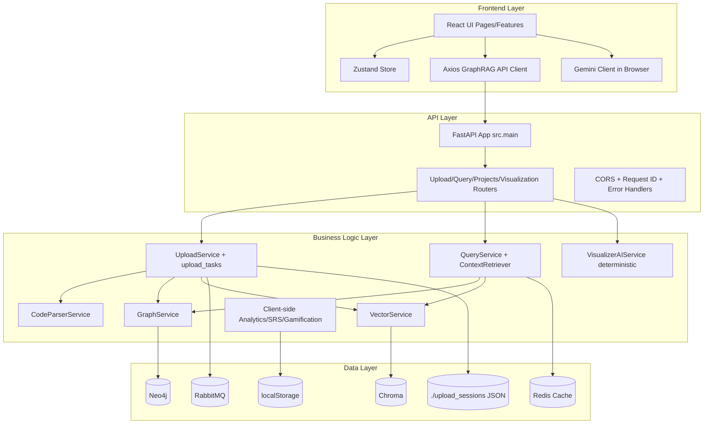
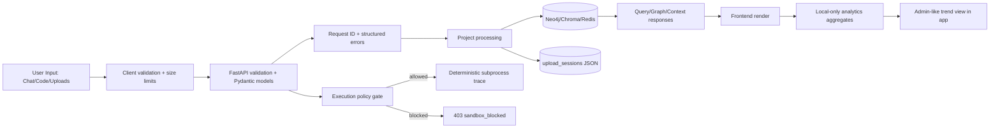
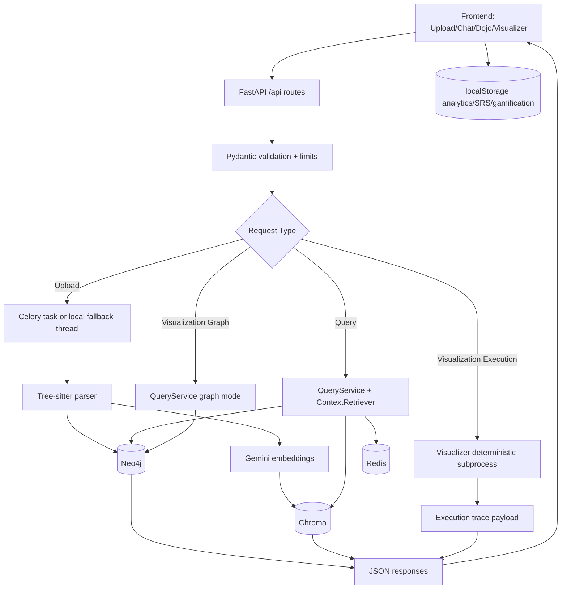
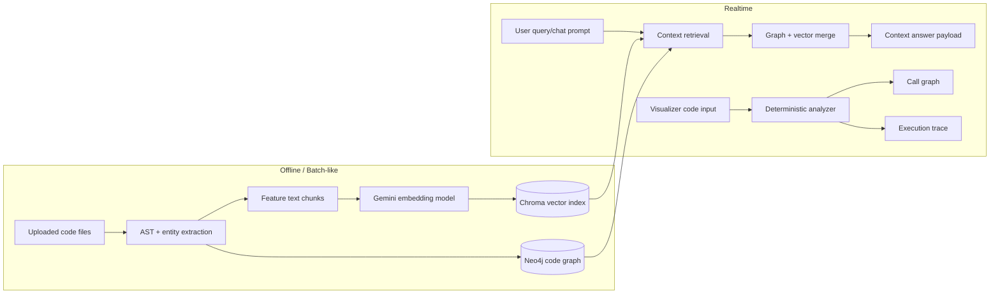
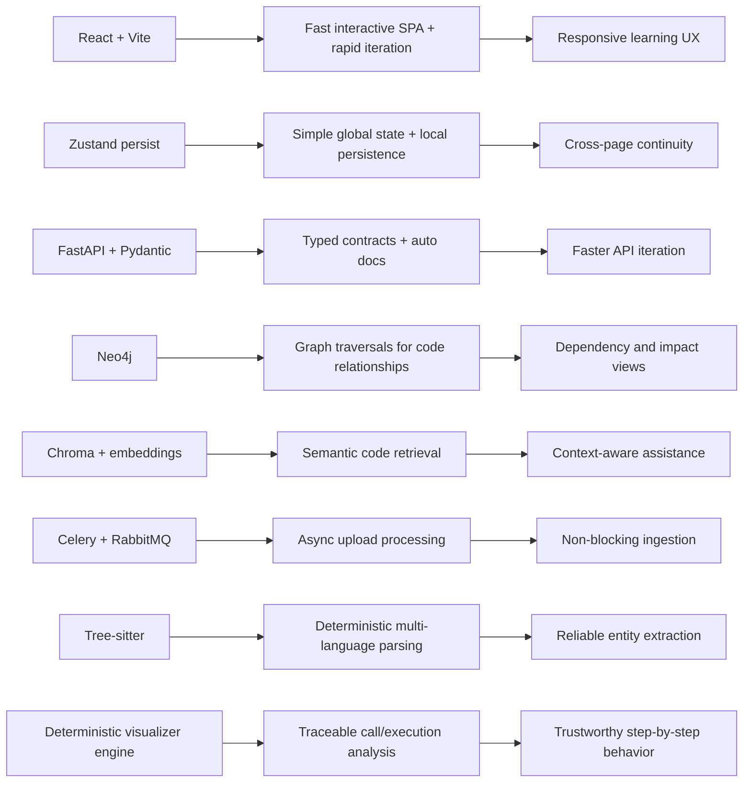
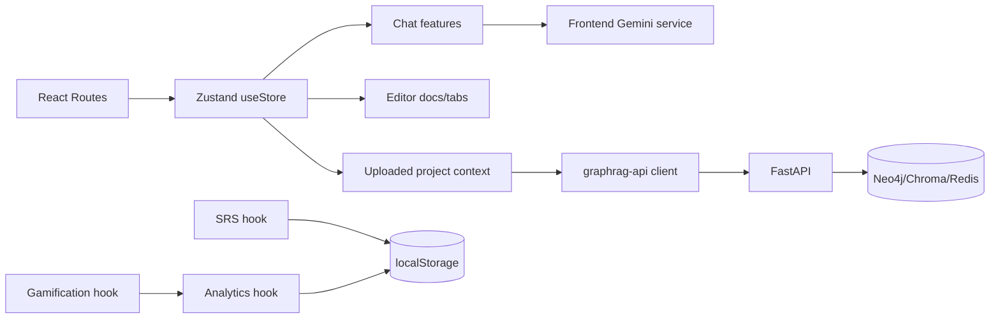

# SocraticDev

## Documentation Plan
- First 3 files/folders to inspect: `frontend/package.json`, `backend/src/main.py`, `backend/src/api/`.
- First diagram to generate: **Layered System Architecture**.
- Estimated pass order: `1) package/env + startup scripts, 2) backend routes/contracts/services, 3) frontend pages/features/state, 4) analytics/ML/visualizer pipeline + validation`.

## Table of Contents
- [Project Overview](#project-overview)
- [Quick Start](#quick-start)
- [Tech Stack](#tech-stack)
- [Architecture](#architecture)
- [Directory Structure](#directory-structure)
- [Component Index](#component-index)
- [API Contracts](#api-contracts)
- [Data Flow & State Management](#data-flow--state-management)
- [AI/ML Section](#aiml-section)
- [Styling & Theming](#styling--theming)
- [Testing](#testing)
- [Build & Deployment](#build--deployment)
- [Troubleshooting](#troubleshooting)
- [Contributing](#contributing)
- [Validation & Manifest](#validation--manifest)
- [VALIDATION CHECKLIST](#validation-checklist)
- [Appendix](#appendix)

## Project Overview
SocraticDev is a full-stack learning workspace for developers that combines:
- Socratic and build-oriented AI chat.
- Project upload + GraphRAG-style structural/semantic retrieval.
- Interactive Dojo challenge modes.
- Deterministic Python visualizer (call graph + execution trace).
- Spaced repetition flashcards (SM-2), analytics, and gamification.

Primary target users:
- Learners practicing DSA/systematic coding.
- Builders reviewing project code with AI support.
- Demo/prototype evaluators (hackathon judges, technical reviewers).

Core goals:
- Improve understanding, not only code generation.
- Keep project-level context available in chat and graph flows.
- Provide a closed loop: ask -> practice -> visualize -> review -> track.

## Quick Start
### Prerequisites
- Python `3.11+`
- Node.js `20+`
- Docker + Docker Compose

### Fastest local startup (Windows)
```powershell
.\start.bat
```

### Manual startup
```powershell
# 1) Infra
cd backend
docker compose up -d

# 2) Backend API
python -m venv .venv
.venv\Scripts\activate
pip install -r requirements.txt
python -m uvicorn src.main:app --host 0.0.0.0 --port 8002 --reload
```

```powershell
# 3) Celery worker (new terminal)
cd backend
.venv\Scripts\activate
python -m celery -A src.celery_app worker --loglevel=info --pool=solo
```

```powershell
# 4) Frontend
cd frontend
npm install
npm run dev
```

### Test commands
```powershell
# Backend tests
cd backend
pytest

# Frontend lint/build
cd frontend
npm run lint
npm run build
```

### Required environment variables
Backend (`backend/.env` from `backend/.env.example`):
- `API_PORT` (default `8002`)
- `NEO4J_URI`, `NEO4J_USER`, `NEO4J_PASSWORD`
- `CHROMA_HOST`, `CHROMA_PORT`
- `REDIS_HOST`, `REDIS_PORT`
- `CELERY_BROKER_URL`, `CELERY_RESULT_BACKEND`
- `GEMINI_API_KEY`, `GEMINI_EMBEDDING_MODEL`
- `VISUALIZER_EXECUTION_ENABLED`
- `VISUALIZER_EXECUTION_ALLOW_IN_PRODUCTION`

Frontend (`frontend/.env.local` from `frontend/.env.example`):
- `VITE_GEMINI_API_KEY`
- `VITE_GEMINI_MODEL`
- `VITE_API_BASE_URL` (optional; defaults to `http://localhost:8002`)

## Tech Stack
### Frontend
- React `^18.3.1` (lockfile resolved `18.3.1`)
- Vite `^5.1.0` (lockfile resolved `5.4.21`)
- TypeScript `^5.3.3`
- Tailwind CSS `^3.4.1` (lockfile resolved `3.4.19`)
- Framer Motion `^12.29.0`
- GSAP `^3.14.2` + `@gsap/react`
- Zustand `^4.5.0` (lockfile resolved `4.5.7`)
- Monaco Editor, React Flow, DnD Kit
- Axios for API transport
- `@google/generative-ai` `^0.21.0` for direct frontend chat/card generation

### Backend
- FastAPI `0.104.1`
- Uvicorn `0.24.0`
- Pydantic `2.5.0`, pydantic-settings `2.1.0`
- Neo4j `5.14.1`
- ChromaDB `0.4.15`
- Redis `5.0.1`
- Celery `5.3.4` + RabbitMQ (broker)
- Tree-sitter parsers (Python/JS/TS/Java)
- `google-generativeai` `0.3.1` (embeddings service)

### Infra & deployment clues
- Docker / Docker Compose (`backend/docker-compose.yml`, `backend/docker-compose.prod.yml`)
- Vercel config (`frontend/vercel.json`)
- Netlify config (`frontend/netlify.toml`)

### Version verification notes
Double-verified from:
- `frontend/package.json` + `frontend/package-lock.json`
- `backend/requirements.txt` + runtime settings/compose files

Items with range-vs-lock mismatch are flagged in [VALIDATION CHECKLIST](#validation-checklist).

## Architecture

### 1) Layered System Architecture

This architecture reflects the shipped split between browser-driven experience and FastAPI-backed project intelligence. Upload and parsing are asynchronous-capable through Celery, while query/visualizer flows are synchronous API calls. LocalStorage is used for user-side analytics, SRS, and personalization state, while project graph/vector state lives in Neo4j/Chroma. External health-data integrations (FHIR/HealthLake/ABDM) are not present in this repository.

Caption: Layered architecture from UI to storage with queue/cache boundaries.
Alt text: Multi-layer system diagram showing React frontend, FastAPI backend, services, and databases with data flow arrows.

### 2) Privacy & Trust Layer (detailed)

Trust controls in this codebase are implementation-focused: request IDs, strict payload models, environment-driven execution gate, and local data boundaries. There is no explicit consent artifact service, anonymization pipeline, or cryptographic ZKP module in code. Privacy-sensitive behavior is mostly operational: what is persisted locally vs server-side, and what executes in subprocess mode. “Admin trends” are local dashboard/gamification views, not a separate privileged backend role.

Caption: Privacy/trust checkpoints from request validation to policy-gated execution and local analytics.
Alt text: Pipeline showing validation, policy gating, data persistence, and response rendering with trust checkpoints.
### 3) Application Role Flows
```mermaid
flowchart LR
    LAND[Landing] --> HUB[Learning Hub]
    LAND --> APP[/app]
    LAND --> BUILD[/build]
    LAND --> DOJO[/dojo]
    LAND --> VIS[/visualizer]

    subgraph Learner[Role: Learner/User]
      HUB --> DOJO
      DOJO --> SRS[/srs]
      SRS --> ANALYTICS[/analytics]
      ANALYTICS --> ACH[/achievements]
    end

    subgraph Builder[Role: Builder/IDE user]
      APP --> BUILD
      BUILD --> CHAT[Chat + CodeEditor]
      CHAT --> GRAPH[Graph Panel]
      CHAT --> VIS
    end

    subgraph Maintainer[Role: Project Maintainer/Admin-like]
      UPLOAD[ProjectUpload] --> STATUS[Upload Status Polling]
      STATUS --> PROJECTS[/api/projects]
      PROJECTS --> DELETE[Delete/Update project data]
    end

    ACH --> EXIT[Exit/Return routes]
    VIS --> EXIT
```
The app exposes role-like journeys via route surfaces rather than backend RBAC roles. Learner flow emphasizes Dojo->SRS->Analytics->Achievements loop. Builder flow emphasizes editor/chat/graph/visualizer iteration. Maintainer-like actions are project upload and lifecycle endpoints, currently without enforced auth middleware on route handlers.

Caption: User journeys across learner, builder, and maintainer-style flows.
Alt text: Role flow map connecting landing entry points to core route experiences and action endpoints.

### 4) Data Flow Diagram

Uploads are transformed through parsing/entity extraction then stored in graph/vector stores. Query APIs coordinate structural and semantic lookups with optional Redis caching. Visualizer graph mode queries persisted graph state, while execution mode runs code in a deterministic isolated subprocess path. Frontend-only analytics/SRS data is persisted separately in localStorage and does not currently sync to backend.

Caption: End-to-end flow from frontend requests through backend processing, storage, and client-side analytics.
Alt text: Data flow chart showing upload/query/visualizer branches, databases, and return to frontend.

### 5) AI / ML Pipeline Diagram

The repo uses AI primarily for embeddings and browser-side generative chat/cards; there is no model training pipeline in-repo. Deterministic analysis for visualizer is AST + traced subprocess, not LLM-based inference. Monitoring/drift instrumentation is minimal and mostly operational logs, so this section is inference-driven from code structure. Isolation Forest or similar anomaly model is not present.

Caption: Practical AI/ML pipeline split between embedding/indexing and realtime retrieval/visualization.
Alt text: Diagram separating offline embedding/index build and realtime retrieval plus deterministic visualizer outputs.

### 6) Why-this-stack Diagram

This stack prioritizes understandable behavior over opaque automation: graph/vector retrieval is explicit, and visualizer analysis is deterministic. Frontend keeps learning UX fluid while backend handles heavy parsing and persistence. Async tasking prevents upload bottlenecks in normal operation. The result is a prototype-friendly architecture that can evolve toward hardened production controls.

Caption: Technology-to-capability-to-outcome mapping for core product decisions.
Alt text: Mapping graph linking each major technology choice to capability and user-facing outcome.

Mermaid export (local one-liner):
```bash
npx @mermaid-js/mermaid-cli -i diagram.mmd -o diagram.svg
```

## Directory Structure
```text
socraticDev/
|-- backend/
|   |-- src/
|   |   |-- api/            # FastAPI routers
|   |   |-- config/         # Settings/env model
|   |   |-- models/         # Domain + API models
|   |   |-- services/       # Core business services (graph/vector/parser/upload/visualizer)
|   |   |-- tasks/          # Celery async ingestion task
|   |   `-- utils/          # Logging/errors
|   |-- tests/
|   |   |-- unit/
|   |   `-- integration/
|   |-- docker-compose.yml
|   |-- docker-compose.prod.yml
|   `-- requirements.txt
|-- frontend/
|   |-- src/
|   |   |-- components/     # Landing sections + shared visual components
|   |   |-- pages/          # Route pages
|   |   |-- features/       # Domain feature modules (chat, dojo, visualizer, srs, analytics, etc.)
|   |   |-- store/          # Zustand app state
|   |   |-- services/       # API + Gemini clients
|   |   |-- hooks/          # Reusable custom hooks
|   |   |-- ui/             # Primitive UI components
|   |   |-- utils/          # Utilities
|   |   `-- styles/         # Global tokens/CSS
|   |-- package.json
|   `-- vite.config.ts
|-- start.bat
|-- stop.bat
|-- guide.md
`-- requirements.md
```
See [Component Index](#component-index) for per-module details and exports.

## Component Index
### Index Method (how to read this)
Each module is indexed with:
- Relative path
- Purpose
- Inputs/props or API shape
- Internal state/lifecycle note
- Key exports/methods
- External dependencies
- Example usage pointer
- Test pointer
- Complexity note

Where exact internals cannot be fully inferred without runtime interaction, entries are marked `manual-review`.

### Pattern-based detail map (applies to full register)
| Pattern | Purpose | Inputs / Props | State / Lifecycle | Tests | Complexity |
|---|---|---|---|---|---|
| `frontend/src/pages/*` | Route-level composition | Router params + feature props | React hooks lifecycle | No dedicated frontend tests found | Render-bound |
| `frontend/src/features/*/*.tsx` | Feature UI logic | Component props/interfaces in file | React state/effects | No dedicated frontend tests found | UI logic, usually O(n) over list size |
| `frontend/src/features/*/*.ts` | Feature service/types/evaluators | Function args + typed interfaces | Stateless unless hook file | No dedicated frontend tests found | Function-specific |
| `frontend/src/components/*` | Landing/shared presentation blocks | Props in component | Motion + view hooks | No dedicated frontend tests found | Animation/render-bound |
| `backend/src/api/*` | FastAPI routes | Pydantic request models/form-data/path params | Per-request | Covered partially by `backend/tests/unit/test_api.py` | Endpoint orchestration |
| `backend/src/services/*` | Core backend business logic | Service method signatures | Singleton managers/cached clients | Unit/integration tests exist for selected services | From O(1) cache to O(V+E) graph traversals |
| `backend/src/models/*` | Domain and API contracts | Pydantic/dataclass fields | N/A | `test_models.py` | N/A |
| `backend/src/tasks/*` | Async pipeline tasks | Celery task args | Worker process lifecycle | `test_upload_tasks.py` | Batch O(files + entities + relationships) |
| `backend/src/utils/*` | Logging/errors/utilities | Function args/exceptions | N/A | `test_errors.py` | N/A |
### Detailed critical modules
| Path | Purpose | Inputs/Props | Internal state/lifecycle | Key methods/exports | External dependencies | Example usage | Tests | Complexity |
|---|---|---|---|---|---|---|---|---|
| `frontend/src/store/useStore.ts` | Global app state + persisted editor/chat/project context | Zustand actions + typed entities | Persist middleware and in-memory updates | `useStore`, document/chat snippet actions | Zustand, browser storage | Imported by most pages/features | indirect only | Action-dependent; list/tree ops mostly O(n) |
| `frontend/src/services/graphrag-api.ts` | Frontend API client | Typed request interfaces | Axios interceptors + fallback analyzer endpoint probing | `graphragAPI` singleton | Axios | `graphragAPI.getGraphVisualization(...)` | manual-review | Request-bound |
| `frontend/src/services/gemini.ts` | Browser-side generative chat + flashcard generation | `sendMessageToGemini`, `generateFlashcardsWithGemini` | lazy singleton for Gemini SDK | exports in file | `@google/generative-ai` | Used by `useChat` and SRS flow | manual-review | Prompt/token-bound |
| `frontend/src/features/chat/useChat.ts` | Chat orchestration and context enrichment | `sendMessage(content, opts)` | `isLoading`/`error` hook state | `useChat` | Store + Gemini client | Used by `ChatPanel`, `BuildModePage` | manual-review | O(message_history) |
| `frontend/src/features/editor/CodeEditor.tsx` | Monaco editor wrapper + selection/context actions | `CodeEditorProps` | React + Monaco lifecycle | default component | `@monaco-editor/react` | In `/app` and `/build` | manual-review | Render/cursor operations |
| `frontend/src/features/visualizer/useCodeAnalysis.ts` | Visualizer API orchestration + response sanitization | code, language, mode | request sequence ref for stale response control | `useCodeAnalysis` | `graphragAPI` | Used by `CodeVisualizer` | manual-review | O(nodes+edges) sanitization |
| `frontend/src/features/dojo/DojoPage.tsx` | Dojo challenge container and routing | challenge source/language/mode controls | multiple mode state transitions | default component | dojo mode components + analytics | route `/dojo` | manual-review | mode dependent |
| `frontend/src/features/srs/useSRS.ts` | SRS engine + persistence/import/export | card/review operations | localStorage-backed hook state | `useSRS`, `createCard`, `createCodeCard` | localStorage only | SRS dashboard/session | manual-review | review operations O(n cards/log) |
| `frontend/src/features/analytics/useAnalytics.ts` | Event-backed metrics derivation | record event/challenge/review | local event log + memoized metrics | `useAnalytics` | localStorage | analytics dashboard + gamification bridge | manual-review | O(events) derivation |
| `frontend/src/features/gamification/useGamification.ts` | XP/league/quests integration | derived from analytics events | local persistence + sync effect | `useGamification` | localStorage + analytics hook | achievements page | manual-review | O(events + achievements) |
| `backend/src/main.py` | FastAPI app entry, middleware, router mounting | settings/env | app lifespan + middleware chain | `app`, handlers | FastAPI | `uvicorn src.main:app` | `test_api.py` | Request-bound |
| `backend/src/api/upload.py` | Upload endpoints (file/GitHub/status) | multipart form + path params | per-request stateless | `upload_project`, `upload_from_github`, `get_upload_status` | UploadService | `/api/upload/*` | `test_api.py`, task tests | Upload-size/data-bound |
| `backend/src/services/upload_service.py` | Session management + celery/local fallback + Git clone flow | file tuples/repo URL/user id | file-backed sessions + background thread | `UploadService`, `get_upload_service` | filesystem, git, threading | called by upload API | `test_upload_tasks.py` | O(files) collection and dispatch |
| `backend/src/tasks/upload_tasks.py` | Async parse->graph->embedding->vector pipeline | celery task args | worker lifecycle | `process_project_upload` + async impl | Celery, parser, graph/vector services | queued from upload service | `test_upload_tasks.py` | O(files + entities + embeddings) |
| `backend/src/services/query_service.py` | Cross-store query orchestration + graph visualization shaping | function/query/project filters | optional cache branch | `QueryService`, `GraphFilters` | GraphService, VectorService, Redis | query/visualization routes | `test_query_service.py` | Graph traversal + vector search |
| `backend/src/services/graph_service.py` | Neo4j persistence and graph traversals | entities/relationships/project IDs | manager-backed async sessions | `GraphService` | Neo4j driver | upload/query/project workflows | `test_graph_service.py` | Traversal O(V+E) typical |
| `backend/src/services/vector_service.py` | Chroma persistence and semantic retrieval | embeddings + metadata | singleton manager access | `VectorService` | Chroma | upload/query workflows | `test_vector_service.py` + integration | search vendor-dependent |
| `backend/src/services/visualizer_ai_service.py` | Deterministic Python call graph/execution trace engine | mode/code/lang/limits | subprocess trace runner | `VisualizerAIService` | `ast`, subprocess | `/api/visualization/analyze` | manual-review | O(AST) for graph; O(steps) for trace |

### Complete source module register (all `frontend/src` and `backend/src` files)
```text
backend/src/__init__.py
backend/src/api/__init__.py
backend/src/api/auth.py
backend/src/api/health.py
backend/src/api/projects.py
backend/src/api/query.py
backend/src/api/upload.py
backend/src/api/visualization.py
backend/src/celery_app.py
backend/src/config/__init__.py
backend/src/config/settings.py
backend/src/main.py
backend/src/models/__init__.py
backend/src/models/api.py
backend/src/models/base.py
backend/src/services/__init__.py
backend/src/services/cache_service.py
backend/src/services/chroma_manager.py
backend/src/services/code_parser.py
backend/src/services/context_retriever.py
backend/src/services/gemini_client.py
backend/src/services/graph_service.py
backend/src/services/neo4j_manager.py
backend/src/services/project_service.py
backend/src/services/query_service.py
backend/src/services/upload_service.py
backend/src/services/vector_service.py
backend/src/services/visualizer_ai_service.py
backend/src/tasks/__init__.py
backend/src/tasks/upload_tasks.py
backend/src/utils/__init__.py
backend/src/utils/errors.py
backend/src/utils/logging.py
frontend/src/App.tsx
frontend/src/components/ComparisonSection.tsx
frontend/src/components/CTASection.tsx
frontend/src/components/CustomCursor.tsx
frontend/src/components/DojoSection.tsx
frontend/src/components/FeatureSection.tsx
frontend/src/components/Footer.tsx
frontend/src/components/Hero.tsx
frontend/src/components/HowItWorksSection.tsx
frontend/src/components/index.ts
frontend/src/components/Loader.tsx
frontend/src/components/Navbar.tsx
frontend/src/components/ProblemSection.tsx
frontend/src/components/ScrollProgress.tsx
frontend/src/components/SectionIndicators.tsx
frontend/src/components/SocraticDemoSection.tsx
frontend/src/components/SolutionSection.tsx
frontend/src/components/SyntaxHighlighter.tsx
frontend/src/components/TechStackSection.tsx
frontend/src/components/ThemeToggle.tsx
frontend/src/data/examples.ts
frontend/src/features/analytics/AnalyticsDashboard.tsx
frontend/src/features/analytics/index.ts
frontend/src/features/analytics/SkillRadar.tsx
frontend/src/features/analytics/types.ts
frontend/src/features/analytics/useAnalytics.ts
frontend/src/features/chat/ChatInput.tsx
frontend/src/features/chat/ChatMessage.tsx
frontend/src/features/chat/ChatPanel.tsx
frontend/src/features/chat/CodeBlock.tsx
frontend/src/features/chat/index.ts
frontend/src/features/chat/useChat.ts
frontend/src/features/context/ContextManagementPanel.tsx
frontend/src/features/context/index.ts
frontend/src/features/dojo/BigOBattle.tsx
frontend/src/features/dojo/ChallengeIcons.tsx
frontend/src/features/dojo/ChallengeSourceBadge.tsx
frontend/src/features/dojo/CodeSurgery.tsx
frontend/src/features/dojo/CodeTranslation.tsx
frontend/src/features/dojo/constants.ts
frontend/src/features/dojo/DojoHub.tsx
frontend/src/features/dojo/DojoPage.tsx
frontend/src/features/dojo/ELI5Challenge.tsx
frontend/src/features/dojo/evaluators/evaluateBigOSelection.ts
frontend/src/features/dojo/evaluators/evaluateTddTests.ts
frontend/src/features/dojo/evaluators/evaluateTranslation.ts
frontend/src/features/dojo/evaluators/index.ts
frontend/src/features/dojo/examples/bigOExamples.ts
frontend/src/features/dojo/examples/eli5Examples.ts
frontend/src/features/dojo/examples/fadedExamples.ts
frontend/src/features/dojo/examples/index.ts
frontend/src/features/dojo/examples/mentalExamples.ts
frontend/src/features/dojo/examples/parsonsExamples.ts
frontend/src/features/dojo/examples/patternExamples.ts
frontend/src/features/dojo/examples/surgeryExamples.ts
frontend/src/features/dojo/examples/tddExamples.ts
frontend/src/features/dojo/examples/translationExamples.ts
frontend/src/features/dojo/FadedExamples.tsx
frontend/src/features/dojo/index.ts
frontend/src/features/dojo/MentalCompiler.tsx
frontend/src/features/dojo/ModeSwitcher.tsx
frontend/src/features/dojo/ParsonsChallenge.tsx
frontend/src/features/dojo/PatternDetective.tsx
frontend/src/features/dojo/RubberDuckDebugger.tsx
frontend/src/features/dojo/TDDChallenge.tsx
frontend/src/features/dojo/types.ts
frontend/src/features/dojo/useChallengeAI.ts
frontend/src/features/editor/CodeEditor.tsx
frontend/src/features/editor/index.ts
frontend/src/features/explorer/FileExplorer.tsx
frontend/src/features/explorer/index.ts
frontend/src/features/gamification/AchievementCard.tsx
frontend/src/features/gamification/DailyQuestCard.tsx
frontend/src/features/gamification/GamificationHub.tsx
frontend/src/features/gamification/index.ts
frontend/src/features/gamification/types.ts
frontend/src/features/gamification/useGamification.ts
frontend/src/features/graph/DependencyGraph.tsx
frontend/src/features/graph/GraphPanel.tsx
frontend/src/features/graph/GraphRAGVisualization.tsx
frontend/src/features/graph/index.ts
frontend/src/features/index.ts
frontend/src/features/metrics/index.ts
frontend/src/features/metrics/MetricsDashboard.tsx
frontend/src/features/mode/index.ts
frontend/src/features/mode/ModeToggle.tsx
frontend/src/features/onboarding/index.ts
frontend/src/features/onboarding/Onboarding.tsx
frontend/src/features/query/GraphQueryInterface.tsx
frontend/src/features/query/index.ts
frontend/src/features/search/index.ts
frontend/src/features/search/SemanticSearch.tsx
frontend/src/features/srs/aiCardFallback.ts
frontend/src/features/srs/FlashcardDeck.tsx
frontend/src/features/srs/GeneratedCardReviewModal.tsx
frontend/src/features/srs/index.ts
frontend/src/features/srs/ReviewSession.tsx
frontend/src/features/srs/SRSDashboard.tsx
frontend/src/features/srs/types.ts
frontend/src/features/srs/useSRS.ts
frontend/src/features/upload/index.ts
frontend/src/features/upload/ProjectUpload.tsx
frontend/src/features/visualizer/CallGraphView.tsx
frontend/src/features/visualizer/CodeInputPanel.tsx
frontend/src/features/visualizer/CodeVisualizer.tsx
frontend/src/features/visualizer/ExecutionAnimator.tsx
frontend/src/features/visualizer/index.ts
frontend/src/features/visualizer/types.ts
frontend/src/features/visualizer/useCodeAnalysis.ts
frontend/src/hooks/useDeviceType.ts
frontend/src/hooks/useInViewAnimation.ts
frontend/src/hooks/useMouseParallax.ts
frontend/src/hooks/useReducedMotion.ts
frontend/src/hooks/useScrollAnimation.ts
frontend/src/main.tsx
frontend/src/pages/AppPage.tsx
frontend/src/pages/BuildModePage.tsx
frontend/src/pages/index.ts
frontend/src/pages/info/AboutPage.tsx
frontend/src/pages/info/APIPage.tsx
frontend/src/pages/info/BlogPage.tsx
frontend/src/pages/info/CareersPage.tsx
frontend/src/pages/info/ChangelogPage.tsx
frontend/src/pages/info/ContactPage.tsx
frontend/src/pages/info/DocsPage.tsx
frontend/src/pages/info/PressPage.tsx
frontend/src/pages/LandingPage.tsx
frontend/src/pages/LearningHub.tsx
frontend/src/pages/legal/CookiePage.tsx
frontend/src/pages/legal/PrivacyPage.tsx
frontend/src/pages/legal/TermsPage.tsx
frontend/src/services/gemini.ts
frontend/src/services/graphrag-api.ts
frontend/src/services/index.ts
frontend/src/store/useStore.ts
frontend/src/styles/globals.css
frontend/src/ui/Badge.tsx
frontend/src/ui/Button.tsx
frontend/src/ui/Card.tsx
frontend/src/ui/index.ts
frontend/src/utils/animationVariants.ts
frontend/src/utils/projectAnalyzer.ts
frontend/src/vite-env.d.ts
`n```
## API Contracts
Auth requirements:
- No enforced bearer auth on mounted endpoints by default.
- `backend/src/api/auth.py` contains JWT helpers but router is not mounted in `src/main.py`.

### Route summary
| Method | Path | Description | Auth |
|---|---|---|---|
| GET | `/` | Root metadata | none |
| GET | `/health` | Basic app health | none |
| GET | `/health/` | Extended health router basic | none |
| GET | `/health/detailed` | Service status details | none |
| GET | `/health/metrics` | Cache/metrics snapshot | none |
| POST | `/api/upload/project` | Upload project files (multipart) | none |
| POST | `/api/upload/github` | Upload GitHub repo for processing | none |
| GET | `/api/upload/status/{session_id}` | Poll upload status | none |
| POST | `/api/query/callers` | Find callers | none |
| POST | `/api/query/dependencies` | Find dependencies | none |
| POST | `/api/query/impact` | Impact analysis | none |
| POST | `/api/query/search` | Semantic search | none |
| POST | `/api/query/context` | Retrieve LLM context | none |
| GET | `/api/projects/` | List projects | none |
| GET | `/api/projects/{project_id}` | Project stats | none |
| PUT | `/api/projects/{project_id}` | Incremental update scaffold | none |
| DELETE | `/api/projects/{project_id}` | Delete project | none |
| POST | `/api/visualization/graph` | Graph view data | none |
| POST | `/api/visualization/analyze` | Deterministic call/execution analysis | none (policy-gated execution) |

### Endpoint contract matrix (all discovered routes)
| Method | Path | Request schema (shape) | Response schema (shape) | Auth | Example curl | 3rd-party integration mapping |
|---|---|---|---|---|---|---|
| GET | `/` | none | `{name,version,docs,health}` | none | `curl http://localhost:8002/` | none |
| GET | `/health` | none | `{status,version,environment}` | none | `curl http://localhost:8002/health` | none |
| GET | `/health/` | none | `{status,version,environment,timestamp}` | none | `curl http://localhost:8002/health/` | none |
| GET | `/health/detailed` | none | `{status,version,services:{neo4j,redis,chroma}}` | none | `curl http://localhost:8002/health/detailed` | none |
| GET | `/health/metrics` | none | `{cache?,timestamp,error?}` | none | `curl http://localhost:8002/health/metrics` | none |
| POST | `/api/upload/project` | `multipart: project_name,user_id?,files[]` | `UploadResponse` | none | `curl -X POST .../api/upload/project -F project_name=x -F files=@f.py` | internal only (upload -> parser -> Gemini embeddings -> Neo4j/Chroma) |
| POST | `/api/upload/github` | `multipart: project_name,github_url,user_id?,branch?` | `UploadResponse` | none | `curl -X POST .../api/upload/github -F project_name=x -F github_url=https://github.com/org/repo` | internal only |
| GET | `/api/upload/status/{session_id}` | `path: session_id` | `UploadStatusResponse` | none | `curl .../api/upload/status/session_x` | none |
| POST | `/api/query/callers` | `{function_id,project_id}` | serialized `QueryResult` | none | `curl -X POST .../api/query/callers -d '{...}'` | internal graph/vector services only |
| POST | `/api/query/dependencies` | `{function_id,project_id}` | serialized `QueryResult` | none | `curl -X POST .../api/query/dependencies -d '{...}'` | internal only |
| POST | `/api/query/impact` | `{function_id,project_id,max_depth?}` | serialized `ImpactResult` | none | `curl -X POST .../api/query/impact -d '{...}'` | internal only |
| POST | `/api/query/search` | `{query,project_ids[],top_k?}` | `{results,count}` | none | `curl -X POST .../api/query/search -d '{...}'` | internal only |
| POST | `/api/query/context` | `{query,project_id,token_budget?,manual_entity_ids?}` | `ContextRetriever` payload | none | `curl -X POST .../api/query/context -d '{...}'` | internal only |
| GET | `/api/projects/` | none | `ProjectResponse[]` | none | `curl .../api/projects/` | none |
| GET | `/api/projects/{project_id}` | `path: project_id` | `ProjectResponse` | none | `curl .../api/projects/proj_x` | none |
| PUT | `/api/projects/{project_id}` | `{changed_files[],deleted_files[]}` | `{message,stats}` | none | `curl -X PUT .../api/projects/proj_x -d '{...}'` | none |
| DELETE | `/api/projects/{project_id}` | `path: project_id` | `{message,stats}` | none | `curl -X DELETE .../api/projects/proj_x` | none |
| POST | `/api/visualization/graph` | `{project_id,...filters}` | `{nodes,edges,stats,coverage}` | none | `curl -X POST .../api/visualization/graph -d '{...}'` | internal only |
| POST | `/api/visualization/analyze` | `{mode,code,language,max_steps?,timeout_ms?,allow_execution?}` | graph/execution payload + `meta` | none | `curl -X POST .../api/visualization/analyze -d '{...}'` | internal deterministic engine; no FHIR/HealthLake/ABDM |

### Contracts and examples
#### POST `/api/upload/project`
Request: multipart form-data
- `project_name` (string)
- `user_id` (optional string, default `default_user`)
- `files` (one or many file parts)

Response example:
```json
{
  "session_id": "session_ab12cd34ef56",
  "project_id": "proj_ab12cd34ef56",
  "status": "pending",
  "message": "Upload initiated for project: my-project"
}
```

curl:
```bash
curl -X POST http://localhost:8002/api/upload/project \
  -F "project_name=my-project" \
  -F "files=@src/main.py"
```

#### POST `/api/upload/github`
Request: multipart form-data with `project_name`, `github_url`, optional `user_id`, optional `branch`.

curl:
```bash
curl -X POST http://localhost:8002/api/upload/github \
  -F "project_name=my-project" \
  -F "github_url=https://github.com/org/repo"
```

#### GET `/api/upload/status/{session_id}`
```bash
curl http://localhost:8002/api/upload/status/session_ab12cd34ef56
```

#### Query endpoints
`/api/query/callers`, `/api/query/dependencies`, `/api/query/impact`, `/api/query/search`, `/api/query/context`

Canonical request examples:
```json
{
  "function_id": "func:main.calculate",
  "project_id": "proj_ab12cd34ef56",
  "max_depth": 5
}
```

```json
{
  "query": "binary search edge cases",
  "project_ids": ["proj_ab12cd34ef56"],
  "top_k": 20
}
```

```bash
curl -X POST http://localhost:8002/api/query/search \
  -H "Content-Type: application/json" \
  -d "{\"query\":\"binary search\",\"project_ids\":[\"proj_ab12cd34ef56\"],\"top_k\":20}"
```

#### Project endpoints
```bash
curl http://localhost:8002/api/projects/
curl http://localhost:8002/api/projects/proj_ab12cd34ef56
curl -X PUT http://localhost:8002/api/projects/proj_ab12cd34ef56 -H "Content-Type: application/json" -d "{\"changed_files\":[],\"deleted_files\":[\"src/old_file.py\"]}"
curl -X DELETE http://localhost:8002/api/projects/proj_ab12cd34ef56
```

#### Visualization endpoints
Graph request example:
```json
{
  "project_id": "proj_ab12cd34ef56",
  "view_mode": "file",
  "include_external": true,
  "include_isolated": true,
  "max_nodes": 500,
  "max_edges": 2000
}
```

Analyze request example:
```json
{
  "mode": "execution",
  "code": "def add(a,b):\n  return a+b\nprint(add(1,2))",
  "language": "python",
  "max_steps": 1000,
  "timeout_ms": 3000,
  "allow_execution": true
}
```

```bash
curl -X POST http://localhost:8002/api/visualization/analyze \
  -H "Content-Type: application/json" \
  -d "{\"mode\":\"graph\",\"language\":\"python\",\"code\":\"def f():\\n  pass\"}"
```

3rd-party integration mapping (FHIR/HealthLake/ABDM):
- Not detected in source tree. No route currently maps to those healthcare APIs.

## Data Flow & State Management

Frontend keeps most UX state in Zustand + feature hooks. Project graph/context comes from backend APIs, while flashcards/analytics/gamification are local-first in browser storage. Chat currently mixes backend-context usage with direct Gemini browser calls. This split is important for deployment/security planning and is called out in validation flags.

## AI/ML Section
### What is implemented
- Embeddings pipeline:
  - `backend/src/services/gemini_client.py` generates embeddings (`text-embedding-004` by default).
  - Embeddings stored in Chroma via `vector_service.py`.
- Semantic retrieval:
  - QueryService merges vector similarity + graph lookups.
- Generative chat/cards:
  - Browser-side Gemini integration in `frontend/src/services/gemini.ts`.
- Deterministic code analysis:
  - `backend/src/services/visualizer_ai_service.py` (AST + subprocess trace; no LLM needed for visualizer).

### Inference modes
- Offline/batch-ish: upload task parsing + embedding generation.
- Realtime: chat prompt completion, context retrieval, visualizer analysis API calls.

### Explainability / observability
- Visualizer returns explicit `steps`, `meta`, and policy state.
- Query/impact flows are graph-traversal based (transparent structure).
- No dedicated model drift monitoring pipeline present.

## Styling & Theming
- Tailwind CSS + global CSS tokens in `frontend/src/styles/globals.css`.
- Theme state in store (`light`/`dark`), toggled via `ThemeToggle`.
- Custom cursor with desktop/reduced-motion/pointer gating.
- Motion stack: Framer Motion, GSAP, Lenis.

## Testing
### Backend
- Unit tests in `backend/tests/unit`
- Integration tests in `backend/tests/integration`
- Config in `backend/pytest.ini`

Run:
```bash
cd backend && pytest
```

### Frontend
- No dedicated frontend test suite files detected in repository (`manual-review`).
- Current quality gates are lint/build and manual verification.

## Build & Deployment
### Build
```bash
cd frontend && npm run build
cd backend && docker build -t socraticdev-backend .
```

### Runtime topology (prototype)
- Frontend static host (Vercel/Netlify/S3+CloudFront).
- Backend FastAPI container.
- Separate infra services: Neo4j, Chroma, Redis, RabbitMQ, Postgres metadata.
- Optional separate Celery worker container/process.

## Troubleshooting
- `Analyzer endpoint not found (404)`: verify backend route `/api/visualization/analyze` and base URL.
- Upload stuck queued: ensure Celery worker is up or local fallback thread is active.
- Visualizer execution blocked in prod: set `VISUALIZER_EXECUTION_ENABLED=true` and `VISUALIZER_EXECUTION_ALLOW_IN_PRODUCTION=true`.
- Chat key errors: set `VITE_GEMINI_API_KEY` in frontend env.

## Contributing
- Frontend: `npm run lint`, `npm run build`
- Backend: `pytest`
- Keep API contracts stable and update env examples when adding new vars.
## Validation & Manifest
```json
{
  "docs_manifest": {
    "files_scanned_count": 248,
    "source_files_indexed_count": 176,
    "frontend_source_files_count": 143,
    "backend_source_files_count": 33,
    "diagrams_generated": [
      "layered_system_architecture",
      "privacy_and_trust_layer",
      "application_role_flows",
      "data_flow_diagram",
      "ai_ml_pipeline",
      "why_this_stack"
    ],
    "components_indexed_count": 176,
    "api_routes_count": 19,
    "issues_flagged_count": 12,
    "run_timestamp": "2026-02-27T00:00:00Z"
  },
  "issues_flagged": [
    {
      "id": "VAL-001",
      "title": "Frontend direct Gemini calls remain in browser",
      "evidence": "frontend/src/services/gemini.ts; frontend/src/features/chat/useChat.ts",
      "severity": "high"
    },
    {
      "id": "VAL-002",
      "title": "No frontend automated test files detected",
      "evidence": "frontend/src tree scan; no *.test.* or *.spec.* found",
      "severity": "medium"
    },
    {
      "id": "VAL-003",
      "title": "Auth helpers exist but auth router is not mounted",
      "evidence": "backend/src/api/auth.py and backend/src/main.py router includes",
      "severity": "medium"
    },
    {
      "id": "VAL-004",
      "title": "Some frontend API request interfaces mismatch backend field names",
      "evidence": "frontend/src/services/graphrag-api.ts FindCallersRequest uses entity_name vs backend expects function_id",
      "severity": "high"
    },
    {
      "id": "VAL-005",
      "title": "Package range versions differ from lock-resolved versions",
      "evidence": "frontend/package.json vs frontend/package-lock.json (vite/tailwind/zustand)",
      "severity": "low"
    },
    {
      "id": "VAL-006",
      "title": "Role-flow diagram uses inferred roles; no backend RBAC role model",
      "evidence": "route/page structure only",
      "severity": "low"
    },
    {
      "id": "VAL-007",
      "title": "Privacy pipeline uses operational controls; no explicit consent/ZKP implementation",
      "evidence": "no consent artifact or zk modules found in source",
      "severity": "low"
    },
    {
      "id": "VAL-008",
      "title": "upload_sessions local filesystem storage is single-node oriented",
      "evidence": "backend/src/services/upload_service.py SESSION_STORAGE_DIR",
      "severity": "medium"
    },
    {
      "id": "VAL-009",
      "title": "compose/deployment files still expose some localhost-centric defaults",
      "evidence": "backend/.env.example and compose files",
      "severity": "low"
    },
    {
      "id": "VAL-010",
      "title": "Frontend README and env examples may show stale model defaults",
      "evidence": "frontend/.env.example vs runtime selection",
      "severity": "low"
    },
    {
      "id": "VAL-011",
      "title": "Data integration references (FHIR/HealthLake/ABDM) not present in code",
      "evidence": "repo-wide search did not find implementation",
      "severity": "info"
    },
    {
      "id": "VAL-012",
      "title": "Some UI strings contain mojibake artifacts",
      "evidence": "frontend/src/features/chat/useChat.ts error/help strings",
      "severity": "low"
    }
  ]
}
```

## VALIDATION CHECKLIST
- [x] Double-verified backend API port and prefix (`backend/src/config/settings.py` + `backend/.env.example`).
- [x] Double-verified mounted routers (`backend/src/main.py` + route decorators in `backend/src/api/*`).
- [x] Double-verified visualizer production gate keys (`backend/src/config/settings.py` + `backend/src/api/visualization.py` + compose env).
- [x] Double-verified frontend dependency declarations (`frontend/package.json`) against lock resolutions (`frontend/package-lock.json`).
- [x] Double-verified frontend env keys usage (`frontend/.env.example` + `frontend/src/services/*`).
- [x] Verified Celery upload processing path and local fallback (`upload_service.py` + `upload_tasks.py`).
- [ ] Human review needed: full per-file props/lifecycle deep extraction for every UI component (index includes path+purpose; exhaustive prop semantics for all files not fully expanded).
- [ ] Human review needed: security hardening posture for running visualizer subprocess in internet-exposed production.
- [ ] Human review needed: API request type mismatch in frontend client (`entity_name` vs `function_id`) impact across all call sites.
- [ ] Human review needed: multi-instance upload session consistency strategy beyond local JSON session files.
- [ ] Human review needed: migration plan for moving browser-side Gemini calls behind backend proxy for key protection.
- [ ] Human review needed: confirm whether lockfile-resolved versions are the intended release targets.

## Appendix
### A) Source evidence quick references
- Frontend env usage:
  - `frontend/src/services/gemini.ts`
  - `frontend/src/services/graphrag-api.ts`
- Backend router mounts:
  - `backend/src/main.py`
- Route definitions:
  - `backend/src/api/upload.py`
  - `backend/src/api/query.py`
  - `backend/src/api/projects.py`
  - `backend/src/api/visualization.py`
  - `backend/src/api/health.py`
- Visualizer deterministic engine:
  - `backend/src/services/visualizer_ai_service.py`
- Upload pipeline:
  - `backend/src/services/upload_service.py`
  - `backend/src/tasks/upload_tasks.py`

### B) Mermaid export helper
Use Mermaid CLI locally:
```bash
npx @mermaid-js/mermaid-cli -i diagram.mmd -o diagram.svg
```

### C) Minimal smoke test script (manual)
```bash
# backend health
curl http://localhost:8002/health

# upload status probe (replace session id)
curl http://localhost:8002/api/upload/status/session_xxx

# visualizer analyze
curl -X POST http://localhost:8002/api/visualization/analyze \
  -H "Content-Type: application/json" \
  -d '{"mode":"graph","language":"python","code":"def f():\n  return 1"}'
```

