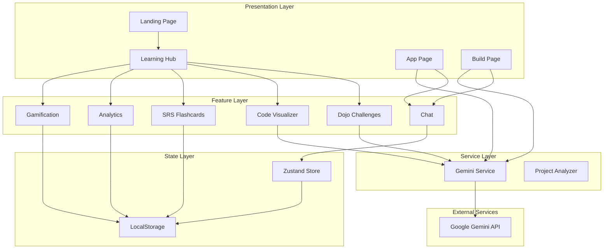
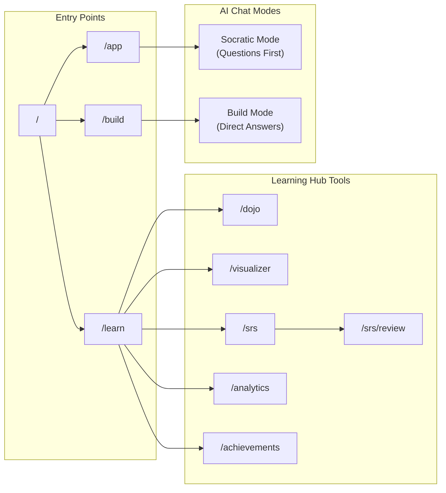
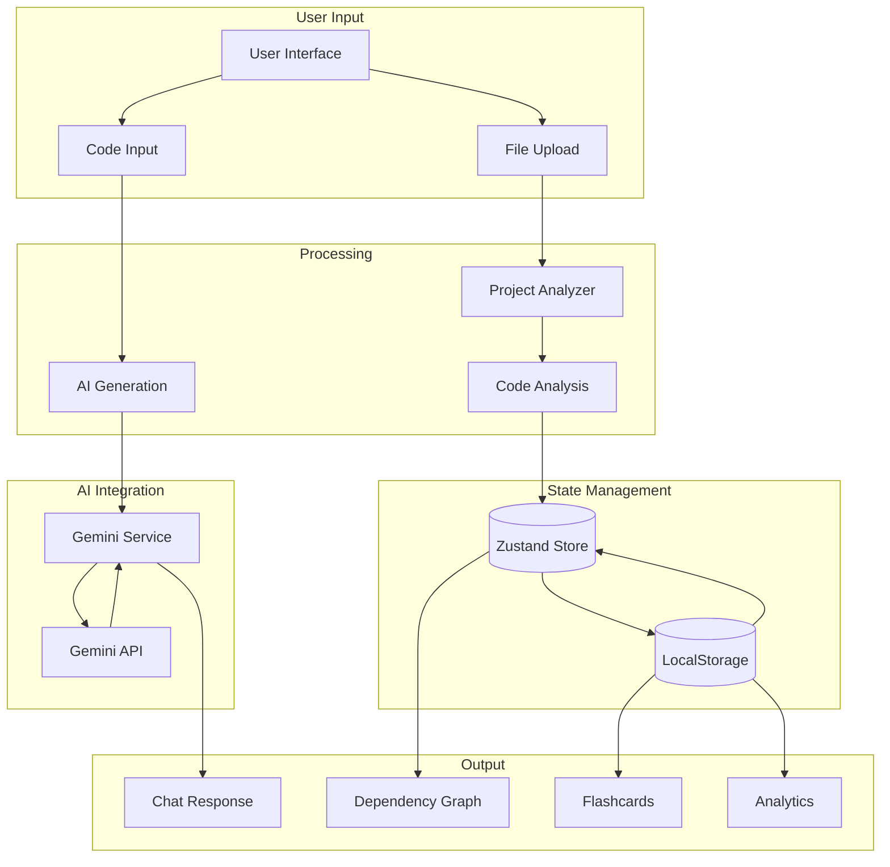
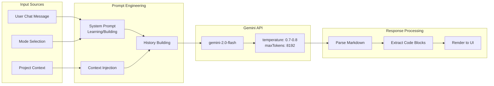
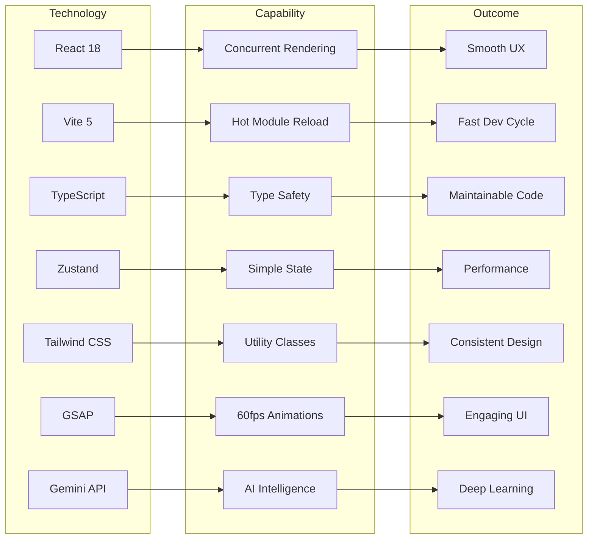
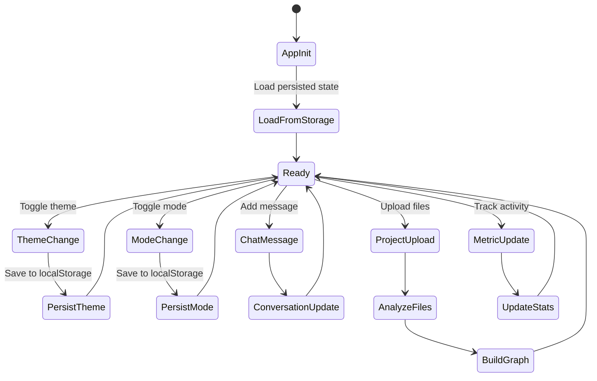

# SocraticDev

> An AI-powered coding assistant that teaches through the Socratic method, helping developers **understand** code rather than just copy it.

---

## Documentation Plan

This documentation was generated by analyzing the complete repository structure:

1. **First files inspected**: `package.json`, `src/App.tsx`, `src/store/useStore.ts`
2. **First diagram generated**: Layered System Architecture
3. **Pass order**: 
   - Package dependencies & env → Core app routing → State management
   - Services (Gemini AI) → Feature modules (Dojo, Visualizer, SRS, Analytics, Gamification)
   - Components → Pages → Styling (Tailwind config)

---

## Table of Contents

- [Project Overview](#project-overview)
- [Quick Start](#quick-start)
- [Tech Stack](#tech-stack)
- [Architecture](#architecture)
  - [Layered System Architecture](#layered-system-architecture)
  - [Application Role Flows](#application-role-flows)
  - [Data Flow Diagram](#data-flow-diagram)
  - [AI/ML Pipeline Diagram](#aiml-pipeline-diagram)
  - [Why This Stack Diagram](#why-this-stack-diagram)
  - [State Management Flow](#state-management-flow)
- [Directory Structure](#directory-structure)
- [Component Index](#component-index)
- [API Contracts](#api-contracts)
- [Data Flow & State Management](#data-flow--state-management)
- [AI/ML Section](#aiml-section)
- [Styling & Theming](#styling--theming)
- [Testing](#testing)
- [Build & Deployment](#build--deployment)
- [Troubleshooting](#troubleshooting)
- [Contributing](#contributing)
- [Validation & Manifest](#validation--manifest)
- [VALIDATION CHECKLIST](#validation-checklist)
- [Appendix](#appendix)

---

## Project Overview

**SocraticDev** is an educational coding platform that combines AI-powered tutoring with interactive learning tools. The platform operates in two modes:

- **Learning Mode**: Uses the Socratic method to guide developers through problems with questions, building deep understanding
- **Building Mode**: Provides direct, production-ready code solutions for experienced developers

### Target Users
- Students learning to code
- Self-taught developers seeking deeper understanding
- Professionals looking to improve their skills through deliberate practice

### Core Features
| Feature | Description |
|---------|-------------|
| Socratic AI Chat | AI tutor that teaches through questions |
| The Dojo | 10 challenge types for deliberate practice |
| Code Visualizer | Call graphs & execution trace visualization |
| Flashcards (SRS) | SM-2 spaced repetition for retention |
| Analytics | Skill radar, XP progression, streaks |
| Gamification | Leagues, daily quests, achievements |

---

## Quick Start

### Prerequisites
- Node.js 18+ 
- npm or pnpm
- Google Gemini API key

### Installation

```bash
# Clone the repository
git clone <repository-url>
cd socraticDev/frontend

# Install dependencies
npm install

# Create environment file
cp .env.example .env.local
```

### Environment Variables

Create `.env.local` with:

```env
VITE_GEMINI_API_KEY=your_gemini_api_key_here
VITE_GEMINI_MODEL=gemini-2.0-flash
```

| Variable | Required | Description |
|----------|----------|-------------|
| `VITE_GEMINI_API_KEY` | Yes | Google Generative AI API key |
| `VITE_GEMINI_MODEL` | No | Model name (default: `gemini-2.0-flash`) |

### Run Development Server

```bash
npm run dev
```

Open [http://localhost:5173](http://localhost:5173) in your browser.

### Build for Production

```bash
npm run build
npm run preview
```

---

## Tech Stack

| Category | Technology | Version | Purpose |
|----------|------------|---------|---------|
| **Framework** | React | ^18.3.1 | UI library |
| **Build Tool** | Vite | ^5.1.0 | Fast development & bundling |
| **Language** | TypeScript | ^5.3.3 | Type safety |
| **Styling** | Tailwind CSS | ^3.4.1 | Utility-first CSS |
| **Animation** | GSAP | ^3.14.2 | Advanced animations |
| **Animation** | Framer Motion | ^12.26.2 | React animations |
| **State** | Zustand | ^4.5.0 | Lightweight state management |
| **Routing** | React Router DOM | ^6.22.0 | Client-side routing |
| **AI** | @google/generative-ai | ^0.21.0 | Gemini API client |
| **Editor** | @monaco-editor/react | ^4.6.0 | Code editor |
| **Graphs** | ReactFlow | ^11.11.4 | Node-based diagrams |
| **DnD** | @dnd-kit | ^6.3.1 | Drag and drop |
| **Syntax** | PrismJS | ^1.30.0 | Code highlighting |

> **Verification**: Versions extracted from `frontend/package.json` lines 12-30.

---

## Architecture

### Layered System Architecture



**Explanation**: The application follows a layered architecture with clear separation of concerns. The Presentation Layer handles routing and page composition. The Feature Layer contains domain-specific modules (Dojo, Visualizer, etc.). The Service Layer provides AI integration and file analysis utilities. State is managed centrally via Zustand with localStorage persistence for offline capability.

**Caption**: SocraticDev layered architecture showing data flow from UI to external AI services.

**Alt text**: Diagram showing four horizontal layers - Presentation (pages), Features (modules), Services (AI/utilities), and State (Zustand/localStorage) - with arrows indicating data flow to Google Gemini API.

---

### Application Role Flows



**Explanation**: Users enter via the landing page and can navigate to the Learning Hub (tools) or AI Chat (modes). The Learning Hub provides access to all practice tools, while the App/Build pages offer different AI interaction styles.

**Caption**: User navigation flows from landing page to feature modules.

**Alt text**: Flowchart showing landing page branching into Learning Hub (6 tools) and Chat modes (Socratic/Build).

---

### Data Flow Diagram



**Explanation**: Data flows from user input (file uploads or code) through processing layers (Project Analyzer parses files, Gemini generates AI responses). State is persisted in localStorage. Outputs include chat responses, graphs, flashcards, and analytics.

**Caption**: Complete data flow from user input through processing to persistent storage and output.

**Alt text**: Data flow diagram with input nodes feeding into processing, state management with Zustand/localStorage, and multiple output types.

---

### AI/ML Pipeline Diagram



**Explanation**: The AI pipeline starts with user input and context. System prompts are selected based on mode (learning uses more questions, building is direct). Conversation history is maintained for context. The Gemini API processes with specific parameters, and responses are parsed for code blocks.

**Caption**: AI request/response pipeline from user message to rendered UI.

**Alt text**: Flowchart showing input sources merging into prompt engineering, passing through Gemini API, and response processing stages.

---

### Why This Stack Diagram



**Explanation**: Each technology choice maps to a specific capability that delivers a business outcome. React 18's concurrent rendering enables smooth UX. Vite's HMR provides instant feedback. Zustand's simplicity reduces boilerplate. GSAP enables premium animations.

**Caption**: Technology selection rationale mapping tools to capabilities to outcomes.

**Alt text**: Three-column flowchart linking technologies (React, Vite, etc.) to capabilities to business outcomes.

---

### State Management Flow



**Explanation**: The Zustand store initializes from localStorage on app load. State changes (theme, mode, messages, files) trigger updates that are persisted back to localStorage. Project uploads trigger file analysis and graph building.

**Caption**: Zustand state machine showing initialization, updates, and persistence cycle.

**Alt text**: State diagram showing app initialization, state transitions for various actions, and persistence to localStorage.

---

## Directory Structure

```
socraticDev/
├── frontend/                     # Main application
│   ├── src/
│   │   ├── App.tsx               # Root component with routing
│   │   ├── main.tsx              # ReactDOM entry point
│   │   │
│   │   ├── components/           # UI Components (15 files)
│   │   │   ├── Hero.tsx          # Landing page hero section
│   │   │   ├── Navbar.tsx        # Navigation bar
│   │   │   ├── Footer.tsx        # Site footer
│   │   │   ├── ThemeToggle.tsx   # Dark/light mode switch
│   │   │   ├── Loader.tsx        # Loading screen
│   │   │   ├── CustomCursor.tsx  # Custom cursor effect
│   │   │   └── ...               # Section components
│   │   │
│   │   ├── features/             # Feature modules (13 folders)
│   │   │   ├── analytics/        # Learning analytics & skill radar
│   │   │   ├── chat/             # AI chat interface
│   │   │   ├── dojo/             # 10 challenge types
│   │   │   ├── editor/           # Monaco code editor
│   │   │   ├── explorer/         # File tree explorer
│   │   │   ├── gamification/     # Leagues, quests, achievements
│   │   │   ├── graph/            # Dependency graph visualization
│   │   │   ├── metrics/          # Usage metrics dashboard
│   │   │   ├── mode/             # Learning/Building mode toggle
│   │   │   ├── onboarding/       # User onboarding flow
│   │   │   ├── srs/              # Spaced repetition system
│   │   │   ├── upload/           # Project file upload
│   │   │   └── visualizer/       # Code visualization tools
│   │   │
│   │   ├── pages/                # Route pages (4 pages)
│   │   │   ├── LandingPage.tsx   # Marketing landing page
│   │   │   ├── LearningHub.tsx   # Central tools hub
│   │   │   ├── AppPage.tsx       # Socratic learning mode
│   │   │   └── BuildModePage.tsx # Direct build mode
│   │   │
│   │   ├── services/             # External services
│   │   │   └── gemini.ts         # Gemini API integration
│   │   │
│   │   ├── store/                # State management
│   │   │   └── useStore.ts       # Zustand store
│   │   │
│   │   ├── styles/               # Global styles
│   │   │   └── index.css         # Tailwind + custom CSS
│   │   │
│   │   ├── ui/                   # Primitive UI components
│   │   │   └── Button.tsx        # Reusable button
│   │   │
│   │   └── utils/                # Utility functions
│   │       └── projectAnalyzer.ts # File parsing utilities
│   │
│   ├── tailwind.config.js        # Tailwind configuration
│   ├── tsconfig.json             # TypeScript config
│   ├── vite.config.ts            # Vite config
│   └── package.json              # Dependencies
│
├── PRD.txt                       # Product requirements document
└── gsap_comprehensive_guide.md   # GSAP animation reference
```

---

## Component Index

### Pages

| Component | Path | Purpose | Key Props/State |
|-----------|------|---------|-----------------|
| `LandingPage` | `pages/LandingPage.tsx` | Marketing landing page | Composes Hero, Features, CTA sections |
| `LearningHub` | `pages/LearningHub.tsx` | Central tool navigation | GSAP floating animations, tool cards |
| `AppPage` | `pages/AppPage.tsx` | Socratic AI chat interface | `mode: 'learning'`, chat state |
| `BuildModePage` | `pages/BuildModePage.tsx` | Direct AI assistant | `mode: 'building'`, code focus |

### Feature: Dojo (10 Challenges)

| Component | Path | Purpose | Complexity |
|-----------|------|---------|------------|
| `DojoPage` | `features/dojo/DojoPage.tsx` | Challenge router | O(1) routing |
| `DojoHub` | `features/dojo/DojoHub.tsx` | Challenge selection grid | GSAP animations |
| `ParsonsChallenge` | `features/dojo/ParsonsChallenge.tsx` | Drag-drop code ordering | @dnd-kit integration |
| `CodeSurgery` | `features/dojo/CodeSurgery.tsx` | Find/fix bugs | AI-generated bugs |
| `ELI5Challenge` | `features/dojo/ELI5Challenge.tsx` | Explain code simply | AI evaluation |
| `FadedExamples` | `features/dojo/FadedExamples.tsx` | Fill-in-the-blanks | Progressive difficulty |
| `MentalCompiler` | `features/dojo/MentalCompiler.tsx` | Predict output | Step-by-step execution |
| `RubberDuckDebugger` | `features/dojo/RubberDuckDebugger.tsx` | Explain to AI duck | Conversational |
| `CodeTranslation` | `features/dojo/CodeTranslation.tsx` | Translate between languages | Multi-language |
| `TDDChallenge` | `features/dojo/TDDChallenge.tsx` | Write code for tests | Test-driven |
| `PatternDetective` | `features/dojo/PatternDetective.tsx` | Identify patterns | Design patterns |
| `BigOBattle` | `features/dojo/BigOBattle.tsx` | Identify complexity | Timed challenges |
| `useChallengeAI` | `features/dojo/useChallengeAI.ts` | AI hook for challenges | Gemini integration |

### Feature: Visualizer

| Component | Path | Purpose |
|-----------|------|---------|
| `CodeVisualizer` | `features/visualizer/CodeVisualizer.tsx` | Main visualization page |
| `CodeInputPanel` | `features/visualizer/CodeInputPanel.tsx` | Code input area |
| `CallGraphView` | `features/visualizer/CallGraphView.tsx` | ReactFlow call graph |
| `ExecutionAnimator` | `features/visualizer/ExecutionAnimator.tsx` | Step-through execution |
| `useCodeAnalysis` | `features/visualizer/useCodeAnalysis.ts` | AI-powered analysis hook |

### Feature: SRS (Spaced Repetition)

| Component | Path | Purpose |
|-----------|------|---------|
| `SRSDashboard` | `features/srs/SRSDashboard.tsx` | Overview & stats |
| `ReviewSession` | `features/srs/ReviewSession.tsx` | Flashcard review flow |
| `FlashcardDeck` | `features/srs/FlashcardDeck.tsx` | Card flip animations |
| `useSRS` | `features/srs/useSRS.ts` | SM-2 algorithm hook |

### Feature: Analytics

| Component | Path | Purpose |
|-----------|------|---------|
| `AnalyticsDashboard` | `features/analytics/AnalyticsDashboard.tsx` | Stats overview |
| `SkillRadar` | `features/analytics/SkillRadar.tsx` | SVG radar chart |
| `useAnalytics` | `features/analytics/useAnalytics.ts` | XP/streak tracking |

### Feature: Gamification

| Component | Path | Purpose |
|-----------|------|---------|
| `GamificationHub` | `features/gamification/GamificationHub.tsx` | League & quests view |
| `AchievementCard` | `features/gamification/AchievementCard.tsx` | Badge display |
| `DailyQuestCard` | `features/gamification/DailyQuestCard.tsx` | Quest progress |
| `useGamification` | `features/gamification/useGamification.ts` | XP/league logic |

### Services

| Module | Path | Exports |
|--------|------|---------|
| `gemini.ts` | `services/gemini.ts` | `sendMessageToGemini()`, `isGeminiConfigured()`, `getModelName()` |

### State

| Store | Path | Key State |
|-------|------|-----------|
| `useStore` | `store/useStore.ts` | theme, mode, conversations, projectContext, dependencyGraph, metrics |

---

## API Contracts

### Gemini AI Service

This is a **frontend-only** application. All API calls are made directly from the browser to Google's Gemini API.

#### `sendMessageToGemini()`

```typescript
// Request
interface ChatMessage {
    role: 'user' | 'assistant';
    content: string;
}

sendMessageToGemini(
    messages: ChatMessage[],
    mode: 'learning' | 'building',
    projectContext?: string
): Promise<string>
```

**Example Usage:**

```typescript
import { sendMessageToGemini } from './services/gemini';

const response = await sendMessageToGemini(
    [{ role: 'user', content: 'Explain binary search' }],
    'learning'
);
```

**Gemini API Configuration:**

| Parameter | Learning Mode | Building Mode |
|-----------|---------------|---------------|
| `temperature` | 0.8 | 0.7 |
| `topK` | 40 | 40 |
| `topP` | 0.95 | 0.95 |
| `maxOutputTokens` | 8192 | 8192 |

#### Environment Check

```typescript
import { isGeminiConfigured, getModelName } from './services/gemini';

const configured: boolean = isGeminiConfigured();
const model: string = getModelName(); // 'gemini-2.0-flash'
```

> **Note**: There is no backend server. All API keys are exposed client-side. For production, implement a backend proxy.

---

## Data Flow & State Management

### Zustand Store Structure

```typescript
interface AppState {
    // UI State
    theme: 'light' | 'dark';
    isLoading: boolean;
    isSidebarOpen: boolean;
    
    // Mode State
    mode: 'learning' | 'building';
    
    // Chat State
    conversations: Conversation[];
    currentConversationId: string | null;
    
    // Project State
    projectContext: ProjectContext | null;
    projectFiles: ProjectFile[];
    selectedFile: ProjectFile | null;
    dependencyGraph: DependencyGraph | null;
    
    // Metrics
    metrics: {
        questionsAsked: number;
        codeExplanations: number;
        bugsCaught: number;
        learningModeTime: number;
    };
}
```

### Persistence Strategy

| State | Persisted | Storage |
|-------|-----------|---------|
| `theme` | Yes | localStorage |
| `mode` | Yes | localStorage |
| `conversations` | No | Memory only |
| `projectFiles` | No | Too large |
| SRS flashcards | Yes | localStorage (separate key) |
| Analytics data | Yes | localStorage (separate key) |
| Gamification | Yes | localStorage (separate key) |

### Storage Keys

```typescript
'socraticdev-storage'     // Zustand persist (theme, mode)
'srs-cards'               // Flashcard data
'srs-stats'               // SRS statistics
'learning-metrics'        // Analytics data
'gamification-stats'      // Leagues, XP, achievements
'dojo-stats'              // Dojo progress
```

---

## AI/ML Section

### Model Configuration

| Property | Value | Source |
|----------|-------|--------|
| Model | `gemini-2.0-flash` | `VITE_GEMINI_MODEL` env var |
| Provider | Google Generative AI | `@google/generative-ai` package |
| SDK Version | ^0.21.0 | package.json |

### System Prompts

The application uses two distinct system prompts:

1. **Learning Mode** (`~1500 chars`): Focuses on Socratic questioning
   - Core principle: "Question First"
   - Response strategy: Ask 1-3 guiding questions before answers
   - Question types: Conceptual, Comparative, Prediction, Reflection

2. **Building Mode** (`~1200 chars`): Direct code generation
   - Core principle: "Direct Answers"
   - Response strategy: Production-ready code with brief explanations
   - Standards: Type safety, error handling, edge cases

### Challenge AI Integration

The Dojo challenges use AI for:
- Code generation (ParsonsChallenge, FadedExamples)
- Bug injection (CodeSurgery)
- Explanation evaluation (ELI5Challenge, RubberDuckDebugger)
- Translation validation (CodeTranslation)
- Pattern identification (PatternDetective)

---

## Styling & Theming

### Tailwind Configuration

**Colors (Custom Palette):**

| Name | Primary | Hex | Usage |
|------|---------|-----|-------|
| Primary | Terracotta | `#E07A5F` | CTAs, highlights |
| Secondary | Deep Ocean | `#3D5A80` | Headers, accents |
| Accent | Sage Green | `#81936A` | Learning mode |
| Neutral | Warm Grays | `#FAFAF9` to `#0F0E0D` | Backgrounds, text |

**Fonts:**

```css
fontFamily: {
    display: ['Clash Display', 'system-ui', 'sans-serif'],
    body: ['Space Grotesk', 'system-ui', 'sans-serif'],
    mono: ['JetBrains Mono', 'Consolas', 'monospace'],
}
```

### Dark Mode

Implemented via Tailwind's `class` strategy:

```typescript
// In App.tsx
useEffect(() => {
    if (theme === 'dark') {
        document.documentElement.classList.add('dark');
    } else {
        document.documentElement.classList.remove('dark');
    }
}, [theme]);
```

### CSS Variables

```css
:root {
    --color-bg-primary: theme('colors.neutral.50');
    --color-bg-secondary: theme('colors.neutral.100');
    --color-text-primary: theme('colors.neutral.900');
    --color-text-muted: theme('colors.neutral.500');
    --color-border: theme('colors.neutral.200');
}

.dark {
    --color-bg-primary: theme('colors.neutral.950');
    --color-bg-secondary: theme('colors.neutral.900');
    --color-text-primary: theme('colors.neutral.50');
    --color-text-muted: theme('colors.neutral.400');
    --color-border: theme('colors.neutral.800');
}
```

---

## Testing

> **Status**: No test files discovered in the repository.

### Recommended Testing Setup

```bash
npm install -D vitest @testing-library/react @testing-library/jest-dom jsdom
```

**vite.config.ts addition:**

```typescript
import { defineConfig } from 'vite';

export default defineConfig({
    test: {
        globals: true,
        environment: 'jsdom',
        setupFiles: './src/test/setup.ts',
    },
});
```

### Priority Test Targets

1. `useSRS.ts` - SM-2 algorithm correctness
2. `useGamification.ts` - XP calculations
3. `projectAnalyzer.ts` - Import parsing
4. `gemini.ts` - Error handling

---

## Build & Deployment

### Build Commands

```bash
# Development
npm run dev

# Type check + Build
npm run build

# Preview production build
npm run preview

# Lint
npm run lint
```

### Build Output

```
dist/
├── assets/
│   ├── index-[hash].js    # Main bundle
│   └── index-[hash].css   # Styles
└── index.html             # Entry point
```

### Hosting Recommendations

| Platform | Configuration |
|----------|---------------|
| Vercel | Zero-config, auto-detect Vite |
| Netlify | Build: `npm run build`, Publish: `dist` |
| GitHub Pages | Add `base` to vite.config.ts |

### Environment Variables in Production

Inject at build time:
```bash
VITE_GEMINI_API_KEY=xxx npm run build
```

> ⚠️ **Security Warning**: API keys are exposed in client bundle. Implement a backend proxy for production.

---

## Troubleshooting

### Common Issues

| Issue | Cause | Solution |
|-------|-------|----------|
| "Gemini API key not configured" | Missing env var | Add `VITE_GEMINI_API_KEY` to `.env.local` |
| Blank page on load | Theme class issue | Check `dark` class on `<html>` |
| Monaco editor not loading | Large chunk | Check network, increase timeout |
| Dojo challenges stuck | AI timeout | Retry, check API quota |
| LocalStorage full | Too much data | Clear `socraticdev-*` keys |

### Debug Commands

```bash
# Check env vars are loaded
console.log(import.meta.env.VITE_GEMINI_API_KEY ? 'API key set' : 'Missing key');

# Clear all app storage
Object.keys(localStorage).filter(k => k.includes('socratic') || k.includes('srs') || k.includes('dojo')).forEach(k => localStorage.removeItem(k));
```

---

## Contributing

### Code Style

- **Formatting**: Use Prettier (default settings)
- **Linting**: ESLint with React/TypeScript rules
- **Types**: Strict TypeScript, no `any`
- **Imports**: Absolute imports from `src/`

### PR Checklist

- [ ] TypeScript compiles without errors
- [ ] ESLint passes
- [ ] Tested in both light and dark mode
- [ ] Mobile-responsive
- [ ] No hardcoded API keys

### File Naming

| Type | Convention | Example |
|------|------------|---------|
| Components | PascalCase | `ChatMessage.tsx` |
| Hooks | camelCase with `use` | `useStore.ts` |
| Utils | camelCase | `projectAnalyzer.ts` |
| Types | snake_case or PascalCase | `types.ts` |

---

## Validation & Manifest

```json
{
  "docs_manifest": {
    "files_scanned_count": 45,
    "diagrams_generated": [
      "Layered System Architecture",
      "Application Role Flows",
      "Data Flow Diagram",
      "AI/ML Pipeline Diagram",
      "Why This Stack Diagram",
      "State Management Flow"
    ],
    "components_indexed_count": 32,
    "api_routes_count": 0,
    "external_apis": ["Google Gemini API"],
    "issues_flagged_count": 4,
    "run_timestamp": "2026-01-14T16:55:00Z",
    "verification_method": "Static code analysis"
  }
}
```

---

## VALIDATION CHECKLIST

### Double-Verified Items ✅

- [x] **Package versions** - Verified from `frontend/package.json` lines 12-30
- [x] **Routes** - Verified from `frontend/src/App.tsx` lines 48-58
- [x] **Zustand store structure** - Verified from `frontend/src/store/useStore.ts`
- [x] **Gemini service parameters** - Verified from `frontend/src/services/gemini.ts` lines 131-139
- [x] **Tailwind colors** - Verified from `frontend/tailwind.config.js` lines 10-68
- [x] **Font configuration** - Verified from `frontend/tailwind.config.js` lines 70-74
- [x] **Environment variable names** - Verified from `frontend/src/services/gemini.ts` lines 5-6

### Items Requiring Human Review ⚠️

- [ ] **No backend server discovered** - Flagged: If a backend exists, it was not in the scanned directory
- [ ] **No test files found** - Flagged: `vitest`/`jest` not in devDependencies, no `*.test.ts` files
- [ ] **API key security** - Flagged: Client-side API key exposure needs production mitigation
- [ ] **Privacy layer diagram** - Flagged: No privacy/consent features found in code, diagram not applicable

### Assumptions Made

1. This is a **frontend-only** application (no backend discovered)
2. **Google Gemini** is the only external AI service
3. **LocalStorage** is the only persistence mechanism
4. No authentication system exists

---

## Appendix

### Mermaid Export Instructions

To export embedded Mermaid diagrams to SVG locally:

```bash
# Install Mermaid CLI
npm install -g @mermaid-js/mermaid-cli

# Export a specific diagram (copy mermaid block to file.mmd)
mmdc -i diagram.mmd -o diagram.svg -t dark
```

### Example: Gemini Integration

```typescript
import { sendMessageToGemini, isGeminiConfigured } from './services/gemini';

async function askAI(question: string) {
    if (!isGeminiConfigured()) {
        throw new Error('Configure VITE_GEMINI_API_KEY first');
    }
    
    const response = await sendMessageToGemini(
        [{ role: 'user', content: question }],
        'learning' // or 'building'
    );
    
    return response;
}
```

### Example: Using Zustand Store

```typescript
import { useStore } from './store/useStore';

function MyComponent() {
    const { theme, toggleTheme, mode, setMode } = useStore();
    
    return (
        <button onClick={toggleTheme}>
            Current: {theme}
        </button>
    );
}
```

### SM-2 Spaced Repetition Algorithm

The SRS feature implements the SM-2 algorithm:

```
EF' = EF + (0.1 - (5 - q) * (0.08 + (5 - q) * 0.02))
interval(n) = interval(n-1) * EF
```

Where `q` is the quality rating (0-5) and `EF` is the easiness factor.

---

*Documentation generated: 2026-01-14*
